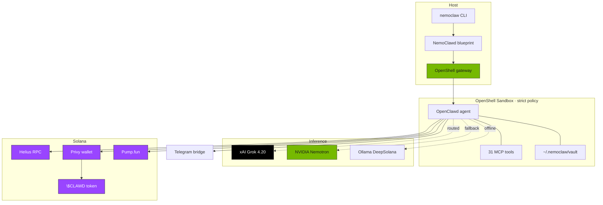

<div align="center">

# 🦀 openclawd-stack

**Solana × xAI Grok agentic trading engine —<br/>sandboxed through NVIDIA OpenShell, powered by `$CLAWD`.**

<br/>

[](https://www.npmjs.com/package/@mawdbotsonsolana/nemoclaw)
[](./LICENSE)
[](#)
[](https://solana.com)
[](https://x.ai/api)
[](./openclawd-stack/NemoClawd-main/nemoclaw-mcp)
[](https://x.ai/api)
[](https://github.com/NVIDIA/OpenShell)

<br/>

### `$CLAWD` Contract Address

```
8cHzQHUS2s2h8TzCmfqPKYiM4dSt4roa3n7MyRLApump
```

[**pump.fun**](https://pump.fun/coin/8cHzQHUS2s2h8TzCmfqPKYiM4dSt4roa3n7MyRLApump) ·
[**Solscan**](https://solscan.io/token/8cHzQHUS2s2h8TzCmfqPKYiM4dSt4roa3n7MyRLApump) ·
[**DexScreener**](https://dexscreener.com/solana/8cHzQHUS2s2h8TzCmfqPKYiM4dSt4roa3n7MyRLApump) ·
[**Birdeye**](https://birdeye.so/token/8cHzQHUS2s2h8TzCmfqPKYiM4dSt4roa3n7MyRLApump?chain=solana) ·
[**Jupiter**](https://jup.ag/swap/SOL-8cHzQHUS2s2h8TzCmfqPKYiM4dSt4roa3n7MyRLApump)

</div>

<br/>

---

## What is this?

**openclawd-stack** is an end-to-end runtime for running an autonomous Solana trading agent under hard sandbox policy. It combines:

- 🧠 **xAI Grok 4.20** for reasoning, chat, vision, voice, and 4–16-agent research swarms
- 🛡️ **NVIDIA OpenShell** sandbox with Landlock + seccomp + declarative network policy
- 🦀 **`$CLAWD`** as the native token — agent payments, creator fees, buybacks
- 💰 **Privy** agentic wallets — keys never touch the sandbox filesystem
- 📡 **Telegram** bridge — real-time wallet narration in natural language
- ⚡ **Helius + Pump.fun** — sub-second mempool visibility and first-block execution
- 🔌 **31 MCP tools** exposed to any Grok or Claude client
- 💳 **x402 on Solana** — pay-per-call agent APIs with on-chain settlement

The agent is given a funded wallet, a strict egress policy, a heartbeat loop, and a vault that logs everything it does. It can keep running unattended without becoming unbounded.

<br/>

## ⚡ Quickstart

```bash
# Install
npm install -g @mawdbotsonsolana/nemoclaw

# Validate host, run the 9-step wizard, and launch
nemoclaw doctor
nemoclaw launch

# Or drop straight into the Solana operator stack
nemoclaw solana start
```

<details>
<summary><strong>Required environment variables</strong></summary>

```bash
export XAI_API_KEY="..."          # https://x.ai/api — unlocks Grok
export HELIUS_API_KEY="..."       # https://helius.dev — free tier works
export TELEGRAM_BOT_TOKEN="..."   # https://t.me/BotFather
export PRIVY_APP_ID="..."         # https://dashboard.privy.io
export PRIVY_APP_SECRET="..."     # (optional) for server-signed policies
export NVIDIA_API_KEY="..."       # (optional) Nemotron fallback
```

</details>

📖 Full walkthrough → [**`openclawd-stack/NemoClawd-main/docs/get-started/quickstart.md`**](./openclawd-stack/NemoClawd-main/docs/get-started/quickstart.md)

<br/>

## 🗂 Repo Layout

This repo ships **two sibling projects** that share a sandbox model and the `$CLAWD` token.

### [`openclawd-stack/`](./openclawd-stack) — the runtime

| Package | What it does |
| --- | --- |
| [`NemoClawd-main/`](./openclawd-stack/NemoClawd-main) | The `nemoclaw` CLI, blueprint, sandbox image, MCP server, Pump-Fun services, and the full [📚 developer docs](./openclawd-stack/NemoClawd-main/docs). |
| [`bridge/`](./openclawd-stack/bridge) | Solana ⇄ Telegram narration bridge with heartbeat + vault logging. |
| [`gateway/`](./openclawd-stack/gateway) | OpenShell inference gateway wiring. |
| [`orchestrator/`](./openclawd-stack/orchestrator) | Runtime orchestrator — spawns sandboxes, signs payments, manages lifecycle. |
| [`payments/`](./openclawd-stack/payments) | Payment-gated agent surfaces. |
| [`template/`](./openclawd-stack/template) | Sandbox template assets. |
| [`deploy/e2b-solana-clawd/`](./openclawd-stack/deploy/e2b-solana-clawd) | One-click E2B cloud-sandbox deployment. |
| [`docs/`](./openclawd-stack/docs) | Stack-level architecture docs. |
| [`OpenShell-main/`](./openclawd-stack/OpenShell-main) | Vendored NVIDIA OpenShell source for reproducible builds. |

### [`Open-Clawd/`](./Open-Clawd) — the payment primitives

| Package | What it does |
| --- | --- |
| [`clawd-vault-master/`](./Open-Clawd/clawd-vault-master) | Clawd Vault — long-running observer runtime (the "always-on" agent brain). |
| [`solana-clawd-x402/`](./Open-Clawd/solana-clawd-x402) | Solana x402 payment worker (Cloudflare). |
| [`x402/`](./Open-Clawd/x402) | x402 reference implementation on Cloudflare Workers. |
| [`clawd-vault-program.rs`](./Open-Clawd/clawd-vault-program.rs) | On-chain vault program (Rust / Anchor). |
| [`client-sdk.ts`](./Open-Clawd/client-sdk.ts) | Client SDK for gateway consumers. |
| [`solana-x402-scheme.ts`](./Open-Clawd/solana-x402-scheme.ts) | Solana x402 scheme definition. |

<br/>

## 🏗 Architecture



<br/>

## 🧠 Inference Providers

NemoClawd ships with three swappable inference backends. Switch any time without restarting the sandbox.

| Provider | Default model | Context | When to use | Credential |
| --- | --- | ---: | --- | --- |
| **xAI** (default) | `grok-4.20-reasoning` | 256K | Production, voice, vision, multi-agent | `XAI_API_KEY` |
| **xAI multi-agent** | `grok-4.20-multi-agent` | 256K | 4–16 agents collaborating on research | `XAI_API_KEY` |
| **NVIDIA Cloud** | `nvidia/nemotron-3-super-120b-a12b` | 131K | GPU-cloud fallback | `NVIDIA_API_KEY` |
| **Ollama local** | `8bit/DeepSolana` | 32K | Offline, Solana-tuned, no API key | — |

```bash
# Swap at runtime — the sandbox keeps running
openshell inference set --provider xai --model grok-4.20-multi-agent
```

<br/>

## 🛡 Security Model

Every agent runs **closed-by-default**. Egress is declarative, not discovered:

- **Network policy** — YAML allowlist per binary + HTTP method + path. Unknown hosts are blocked and surface in the TUI for operator approval.
- **Filesystem** — `/sandbox` + `/tmp` read-write; everything else read-only.
- **Identity** — dedicated `sandbox` user with Landlock LSM enforcement.
- **Wallets** — Privy-managed. Private keys never enter the sandbox filesystem.
- **Heartbeat** — balance + funding state checked continuously. Below floor → protection mode.
- **Vault** — append-only JSONL audit trail at `~/.nemoclaw/vault/`.

📖 See [Network Policies](./openclawd-stack/NemoClawd-main/docs/reference/network-policies.md) for the full baseline.

<br/>

## 🚀 Deploy

| Target | Command | Notes |
| --- | --- | --- |
| **Local** | `nemoclaw launch` | Docker + OpenShell on your machine |
| **Brev GPU** | `nemoclaw deploy my-gpu-box` | Provisions a remote VM with GPU + sandbox |
| **E2B** | See [`deploy/e2b-solana-clawd`](./openclawd-stack/deploy/e2b-solana-clawd) | One-click cloud sandbox |
| **DGX Spark** | `sudo nemoclaw setup-spark` | Ubuntu 24.04 cgroup-v2 fixes |

<br/>

## 📚 Documentation

| | |
| --- | --- |
| 🚀 [Quickstart](./openclawd-stack/NemoClawd-main/docs/get-started/quickstart.md) | Install, launch, first prompt |
| 🧭 [How It Works](./openclawd-stack/NemoClawd-main/docs/about/how-it-works.md) | Financial runtime loop, heartbeat, vault |
| ⌨️ [CLI Commands](./openclawd-stack/NemoClawd-main/docs/reference/commands.md) | Full `nemoclaw` + `openclaw nemoclaw` reference |
| 🧠 [Inference Profiles](./openclawd-stack/NemoClawd-main/docs/reference/inference-profiles.md) | Grok, Nemotron, DeepSolana |
| 🛡 [Network Policies](./openclawd-stack/NemoClawd-main/docs/reference/network-policies.md) | Egress rules, operator approval |
| 🏗 [Architecture](./openclawd-stack/NemoClawd-main/docs/reference/architecture.md) | Plugin, blueprint, sandbox |
| ☁️ [Deploy to Remote GPU](./openclawd-stack/NemoClawd-main/docs/deployment/deploy-to-remote-gpu.md) | Brev end-to-end |
| 📨 [Telegram Bridge](./openclawd-stack/NemoClawd-main/docs/deployment/set-up-telegram-bridge.md) | Chat with the agent |
| 👀 [Monitoring](./openclawd-stack/NemoClawd-main/docs/monitoring/monitor-sandbox-activity.md) | Logs, TUI, debugging |

<br/>

## 🤝 Contributing

Contributions welcome — see [`CONTRIBUTING.md`](./openclawd-stack/NemoClawd-main/CONTRIBUTING.md) and the [docs style guide](./openclawd-stack/NemoClawd-main/docs/CONTRIBUTING.md).

Found a security issue? See [`SECURITY.md`](./openclawd-stack/NemoClawd-main/SECURITY.md). Please do **not** open a public issue for vulnerabilities.

<br/>

## 📜 License

[Apache 2.0](./LICENSE) — copyright 2025-2026 x402agent / openclawd-stack contributors.

<br/>

<div align="center">
  <sub>Built with 🦀 <code>$CLAWD</code> on Solana · Reasoned by <a href="https://x.ai/api">xAI Grok</a> · Sandboxed by <a href="https://github.com/NVIDIA/OpenShell">NVIDIA OpenShell</a></sub>
</div>
