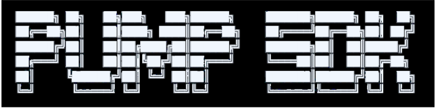

# Examples

Practical code examples for common Pump SDK operations.

<div align="center">
  
</div>

## Table of Contents

- [Create and Buy in One Transaction](#create-and-buy-in-one-transaction)
- [Buy with Slippage Protection](#buy-with-slippage-protection)
- [Sell Tokens](#sell-tokens)
- [Check Token Price](#check-token-price)
- [Read Bonding Curve State](#read-bonding-curve-state)
- [Collect Creator Fees](#collect-creator-fees)
- [Set Up Fee Sharing](#set-up-fee-sharing)
- [Track Trading Volume Rewards](#track-trading-volume-rewards)
- [Migrate a Graduated Token](#migrate-a-graduated-token)
- [AMM Trading — Buy & Sell Graduated Tokens](#amm-trading--buy--sell-graduated-tokens)
- [AMM Liquidity — Deposit & Withdraw](#amm-liquidity--deposit--withdraw)
- [Cashback — Claim Trading Rebates](#cashback--claim-trading-rebates)
- [Social Fee PDAs](#social-fee-pdas)
- [Fee Sharing Authority Management](#fee-sharing-authority-management)
- [Buy with Exact SOL Input](#buy-with-exact-sol-input)
- [Decode Account Data](#decode-account-data)
- [Sell All Tokens](#sell-all-tokens)
- [Check Graduation Status](#check-graduation-status)
- [Analytics — Price Impact](#analytics--price-impact)
- [Analytics — Graduation Progress](#analytics--graduation-progress)
- [Analytics — Bonding Curve Summary](#analytics--bonding-curve-summary)
- [Fetch Analytics Online](#fetch-analytics-online)

---

## Create and Buy in One Transaction

Launch a token and buy into it atomically:

```typescript
import { Connection, Keypair, Transaction, sendAndConfirmTransaction } from "@solana/web3.js";
import BN from "bn.js";
import {
  OnlinePumpSdk,
  PUMP_SDK,
  getBuyTokenAmountFromSolAmount,
} from "@nirholas/pump-sdk";

const connection = new Connection("https://api.devnet.solana.com", "confirmed");
const sdk = new OnlinePumpSdk(connection);
const wallet = Keypair.generate(); // your funded wallet

const mint = Keypair.generate();
const global = await sdk.fetchGlobal();
const feeConfig = await sdk.fetchFeeConfig();
const solAmount = new BN(0.5 * 1e9); // 0.5 SOL

const tokenAmount = getBuyTokenAmountFromSolAmount({
  global,
  feeConfig,
  mintSupply: null,
  bondingCurve: null, // null = new token
  amount: solAmount,
});

const instructions = await PUMP_SDK.createV2AndBuyInstructions({
  global,
  mint: mint.publicKey,
  name: "My Token",
  symbol: "MTK",
  uri: "https://example.com/metadata.json",
  creator: wallet.publicKey,
  user: wallet.publicKey,
  amount: tokenAmount,
  solAmount,
  mayhemMode: false,
});

const tx = new Transaction().add(...instructions);
const sig = await sendAndConfirmTransaction(connection, tx, [wallet, mint]);
console.log("Created & bought:", sig);
```

## Buy with Slippage Protection

```typescript
import { TOKEN_PROGRAM_ID } from "@solana/spl-token";

const mint = new PublicKey("token-mint-address");
const user = wallet.publicKey;
const solAmount = new BN(0.1 * 1e9); // 0.1 SOL

const global = await sdk.fetchGlobal();
const feeConfig = await sdk.fetchFeeConfig();
const { bondingCurveAccountInfo, bondingCurve, associatedUserAccountInfo } =
  await sdk.fetchBuyState(mint, user);

const tokenAmount = getBuyTokenAmountFromSolAmount({
  global,
  feeConfig,
  mintSupply: bondingCurve.tokenTotalSupply,
  bondingCurve,
  amount: solAmount,
});

const instructions = await PUMP_SDK.buyInstructions({
  global,
  bondingCurveAccountInfo,
  bondingCurve,
  associatedUserAccountInfo,
  mint,
  user,
  solAmount,
  amount: tokenAmount,
  slippage: 2, // 2% slippage tolerance
  tokenProgram: TOKEN_PROGRAM_ID,
});

const tx = new Transaction().add(...instructions);
await sendAndConfirmTransaction(connection, tx, [wallet]);
```

## Sell Tokens

```typescript
import { getSellSolAmountFromTokenAmount } from "@nirholas/pump-sdk";
import { TOKEN_PROGRAM_ID } from "@solana/spl-token";

const sellAmount = new BN(1_000_000); // tokens to sell

const global = await sdk.fetchGlobal();
const feeConfig = await sdk.fetchFeeConfig();
const { bondingCurveAccountInfo, bondingCurve } = await sdk.fetchSellState(mint, user);

const solReceived = getSellSolAmountFromTokenAmount({
  global,
  feeConfig,
  mintSupply: bondingCurve.tokenTotalSupply,
  bondingCurve,
  amount: sellAmount,
});

console.log("Expected SOL:", solReceived.toNumber() / 1e9);

const instructions = await PUMP_SDK.sellInstructions({
  global,
  bondingCurveAccountInfo,
  bondingCurve,
  mint,
  user,
  amount: sellAmount,
  solAmount: solReceived,
  slippage: 1,
  tokenProgram: TOKEN_PROGRAM_ID,
  mayhemMode: false,
});

const tx = new Transaction().add(...instructions);
await sendAndConfirmTransaction(connection, tx, [wallet]);
```

## Check Token Price

Quote prices without executing a trade:

```typescript
import {
  OnlinePumpSdk,
  getBuyTokenAmountFromSolAmount,
  getBuySolAmountFromTokenAmount,
  getSellSolAmountFromTokenAmount,
  bondingCurveMarketCap,
} from "@nirholas/pump-sdk";

const sdk = new OnlinePumpSdk(connection);
const global = await sdk.fetchGlobal();
const feeConfig = await sdk.fetchFeeConfig();
const bondingCurve = await sdk.fetchBondingCurve(mint);

// How many tokens for 1 SOL?
const tokensFor1Sol = getBuyTokenAmountFromSolAmount({
  global, feeConfig,
  mintSupply: bondingCurve.tokenTotalSupply,
  bondingCurve,
  amount: new BN(1e9),
});
console.log("Tokens per SOL:", tokensFor1Sol.toString());

// How much SOL for 1M tokens?
const costFor1M = getBuySolAmountFromTokenAmount({
  global, feeConfig,
  mintSupply: bondingCurve.tokenTotalSupply,
  bondingCurve,
  amount: new BN(1_000_000),
});
console.log("Cost for 1M tokens:", costFor1M.toNumber() / 1e9, "SOL");

// Current market cap
const mcap = bondingCurveMarketCap({
  mintSupply: bondingCurve.tokenTotalSupply,
  virtualSolReserves: bondingCurve.virtualSolReserves,
  virtualTokenReserves: bondingCurve.virtualTokenReserves,
});
console.log("Market cap:", mcap.toNumber() / 1e9, "SOL");
```

## Read Bonding Curve State

```typescript
const bondingCurve = await sdk.fetchBondingCurve(mint);

console.log("Token reserves:", bondingCurve.virtualTokenReserves.toString());
console.log("SOL reserves:", bondingCurve.virtualSolReserves.toString());
console.log("Creator:", bondingCurve.creator.toBase58());
console.log("Graduated:", bondingCurve.complete);
console.log("Mayhem mode:", bondingCurve.isMayhemMode);
```

## Collect Creator Fees

```typescript
// Check balance first
const balance = await sdk.getCreatorVaultBalanceBothPrograms(creator);
console.log("Fees to collect:", balance.toNumber() / 1e9, "SOL");

if (balance.gt(new BN(0))) {
  const instructions = await sdk.collectCoinCreatorFeeInstructions(creator);
  const tx = new Transaction().add(...instructions);
  await sendAndConfirmTransaction(connection, tx, [wallet]);
  console.log("Fees collected!");
}
```

## Set Up Fee Sharing

```typescript
import {
  PUMP_SDK,
  isCreatorUsingSharingConfig,
  feeSharingConfigPda,
} from "@nirholas/pump-sdk";

// 1. Create config
const createIx = await PUMP_SDK.createFeeSharingConfig({
  creator: wallet.publicKey,
  mint,
  pool: null,  // null for bonding curve tokens
});

// 2. Set shareholders
const updateIx = await PUMP_SDK.updateFeeShares({
  authority: wallet.publicKey,
  mint,
  currentShareholders: [],  // PublicKey[] — empty on first setup
  newShareholders: [
    { address: new PublicKey("addr-A"), shareBps: 7000 }, // 70%
    { address: new PublicKey("addr-B"), shareBps: 3000 }, // 30%
  ],
});

const tx = new Transaction().add(createIx, updateIx);
await sendAndConfirmTransaction(connection, tx, [wallet]);

// 3. Later, distribute accumulated fees
const { instructions } = await sdk.buildDistributeCreatorFeesInstructions(mint);
const distTx = new Transaction().add(...instructions);
await sendAndConfirmTransaction(connection, distTx, [wallet]);
```

## Track Trading Volume Rewards

```typescript
// Initialize tracking (one-time)
const initIx = await PUMP_SDK.initUserVolumeAccumulator({
  payer: wallet.publicKey,
  user: wallet.publicKey,
});

// Check rewards
const unclaimed = await sdk.getTotalUnclaimedTokensBothPrograms(user);
const today = await sdk.getCurrentDayTokensBothPrograms(user);
console.log("Unclaimed:", unclaimed.toString());
console.log("Today:", today.toString());

// Claim
if (unclaimed.gt(new BN(0))) {
  const claimIxs = await sdk.claimTokenIncentivesBothPrograms(user, wallet.publicKey);
  const tx = new Transaction().add(...claimIxs);
  await sendAndConfirmTransaction(connection, tx, [wallet]);
}
```

## Migrate a Graduated Token

When a token completes its bonding curve, migrate it to the AMM:

```typescript
const bondingCurve = await sdk.fetchBondingCurve(mint);

if (bondingCurve.complete) {
  const global = await sdk.fetchGlobal();
  const ix = await PUMP_SDK.migrateInstruction({
    withdrawAuthority: global.withdrawAuthority,
    mint,
    user: wallet.publicKey,
  });

  const tx = new Transaction().add(ix);
  await sendAndConfirmTransaction(connection, tx, [wallet]);
  console.log("Token migrated to AMM!");
}
```

## AMM Trading — Buy & Sell Graduated Tokens

After a token graduates to the AMM, trade using pool-based instructions:

```typescript
import { PUMP_SDK, canonicalPumpPoolPda } from "@nirholas/pump-sdk";
import BN from "bn.js";

const mint = new PublicKey("graduated-token-mint");
const pool = canonicalPumpPoolPda(mint);

// Buy tokens on AMM
const buyIx = await PUMP_SDK.ammBuyInstruction({
  user: wallet.publicKey,
  pool,
  mint,
  baseAmountOut: new BN(1_000_000),   // tokens to receive
  maxQuoteAmountIn: new BN(0.1 * 1e9), // max SOL to spend
});

// Sell tokens on AMM
const sellIx = await PUMP_SDK.ammSellInstruction({
  user: wallet.publicKey,
  pool,
  mint,
  baseAmountIn: new BN(1_000_000),      // tokens to sell
  minQuoteAmountOut: new BN(0.05 * 1e9), // min SOL to receive
});

// Buy by specifying exact SOL input
const exactBuyIx = await PUMP_SDK.ammBuyExactQuoteInInstruction({
  user: wallet.publicKey,
  pool,
  mint,
  quoteAmountIn: new BN(0.1 * 1e9),    // exact SOL to spend
  minBaseAmountOut: new BN(500_000),     // min tokens to receive
});

const tx = new Transaction().add(buyIx);
await sendAndConfirmTransaction(connection, tx, [wallet]);
```

## AMM Liquidity — Deposit & Withdraw

Provide or remove liquidity from an AMM pool:

```typescript
const pool = canonicalPumpPoolPda(mint);

// Deposit liquidity
const depositIx = await PUMP_SDK.ammDepositInstruction({
  user: wallet.publicKey,
  pool,
  mint,
  maxBaseAmountIn: new BN(10_000_000),   // max tokens to deposit
  maxQuoteAmountIn: new BN(1 * 1e9),     // max SOL to deposit
  minLpTokenAmountOut: new BN(1),         // min LP tokens to receive
});

// Withdraw liquidity
const withdrawIx = await PUMP_SDK.ammWithdrawInstruction({
  user: wallet.publicKey,
  pool,
  mint,
  lpTokenAmountIn: new BN(100_000),       // LP tokens to burn
  minBaseAmountOut: new BN(1),             // min tokens to receive
  minQuoteAmountOut: new BN(1),            // min SOL to receive
});

const tx = new Transaction().add(depositIx);
await sendAndConfirmTransaction(connection, tx, [wallet]);
```

## Cashback — Claim Trading Rebates

Claim cashback rewards from trading with cashback-enabled tokens:

```typescript
// Claim from Pump program
const pumpCashbackIx = await PUMP_SDK.claimCashbackInstruction({
  user: wallet.publicKey,
});

// Claim from AMM program
const ammCashbackIx = await PUMP_SDK.ammClaimCashbackInstruction({
  user: wallet.publicKey,
});

const tx = new Transaction().add(pumpCashbackIx, ammCashbackIx);
await sendAndConfirmTransaction(connection, tx, [wallet]);
```

## Social Fee PDAs

Create and claim social fee PDAs for platform integrations:

```typescript
// Create a social fee PDA for a user on a platform
const createIx = await PUMP_SDK.createSocialFeePdaInstruction({
  payer: wallet.publicKey,
  userId: "user123",
  platform: 1, // platform identifier
});

// Claim accumulated social fees
const claimIx = await PUMP_SDK.claimSocialFeePdaInstruction({
  recipient: wallet.publicKey,
  socialClaimAuthority: authorityKeypair.publicKey,
  userId: "user123",
  platform: 1,
});

const tx = new Transaction().add(createIx);
await sendAndConfirmTransaction(connection, tx, [wallet]);
```

## Fee Sharing Authority Management

Transfer, reset, or permanently revoke fee sharing authority:

```typescript
// Transfer authority to a new admin
const transferIx = await PUMP_SDK.transferFeeSharingAuthorityInstruction({
  authority: wallet.publicKey,
  mint,
  newAdmin: newAdminPublicKey,
});

// Reset fee sharing config with a new admin
const resetIx = await PUMP_SDK.resetFeeSharingConfigInstruction({
  authority: wallet.publicKey,
  mint,
  newAdmin: newAdminPublicKey,
});

// Permanently revoke authority (irreversible!)
const revokeIx = await PUMP_SDK.revokeFeeSharingAuthorityInstruction({
  authority: wallet.publicKey,
  mint,
});
```

## Buy with Exact SOL Input

An alternative to `buyInstructions` that accepts exact SOL input:

```typescript
const ix = await PUMP_SDK.buyExactSolInInstruction({
  user: wallet.publicKey,
  mint,
  creator: creatorPublicKey,
  feeRecipient: feeRecipientPublicKey,
  solAmount: new BN(0.1 * 1e9),       // exactly 0.1 SOL
  minTokenAmount: new BN(500_000),      // slippage protection
});

const tx = new Transaction().add(ix);
await sendAndConfirmTransaction(connection, tx, [wallet]);
```

## Decode Account Data

Use the offline SDK to decode raw account data:

```typescript
import { PUMP_SDK, bondingCurvePda, GLOBAL_PDA } from "@nirholas/pump-sdk";

// Fetch and decode a bonding curve
const bcAddress = bondingCurvePda(mint);
const bcInfo = await connection.getAccountInfo(bcAddress);
if (bcInfo) {
  const bc = PUMP_SDK.decodeBondingCurve(bcInfo);
  console.log("Reserves:", bc.virtualSolReserves.toString());
}

// Decode global config
const globalInfo = await connection.getAccountInfo(GLOBAL_PDA);
if (globalInfo) {
  const global = PUMP_SDK.decodeGlobal(globalInfo);
  console.log("Fee bps:", global.feeBasisPoints.toString());
}
```

## Analytics — Price Impact

Calculate how much a trade will move the price:

```typescript
import { calculateBuyPriceImpact, calculateSellPriceImpact } from "@nirholas/pump-sdk";
import BN from "bn.js";

// Buy impact
const buyImpact = calculateBuyPriceImpact({
  global,
  feeConfig,
  mintSupply: bondingCurve.tokenTotalSupply,
  bondingCurve,
  solAmount: new BN(1_000_000_000), // 1 SOL
});

console.log(`Buy impact: ${buyImpact.impactBps} bps`);
console.log(`Tokens received: ${buyImpact.outputAmount.toString()}`);
console.log(`Price before: ${buyImpact.priceBefore.toString()} lamports/token`);
console.log(`Price after: ${buyImpact.priceAfter.toString()} lamports/token`);

// Sell impact
const sellImpact = calculateSellPriceImpact({
  global,
  feeConfig,
  mintSupply: bondingCurve.tokenTotalSupply,
  bondingCurve,
  tokenAmount: new BN(1_000_000), // 1 whole token
});

console.log(`Sell impact: ${sellImpact.impactBps} bps`);
console.log(`SOL received: ${sellImpact.outputAmount.toString()} lamports`);
```

## Analytics — Graduation Progress

Check how close a token is to graduating:

```typescript
import { getGraduationProgress } from "@nirholas/pump-sdk";

const progress = getGraduationProgress(global, bondingCurve);

console.log(`Progress: ${(progress.progressBps / 100).toFixed(1)}%`);
console.log(`Graduated: ${progress.isGraduated}`);
console.log(`Tokens remaining: ${progress.tokensRemaining.toString()}`);
console.log(`SOL accumulated: ${progress.solAccumulated.toString()} lamports`);
```

## Analytics — Bonding Curve Summary

Get a comprehensive snapshot in one call:

```typescript
import { getBondingCurveSummary } from "@nirholas/pump-sdk";

const summary = getBondingCurveSummary({ global, feeConfig, mintSupply: bondingCurve.tokenTotalSupply, bondingCurve });

console.log(`Market cap: ${summary.marketCap.toString()} lamports`);
console.log(`Progress: ${(summary.progressBps / 100).toFixed(1)}%`);
console.log(`Buy price: ${summary.buyPricePerToken.toString()} lamports/token`);
console.log(`Sell price: ${summary.sellPricePerToken.toString()} lamports/token`);
console.log(`Real SOL reserves: ${summary.realSolReserves.toString()}`);
console.log(`Real token reserves: ${summary.realTokenReserves.toString()}`);
```

## Sell All Tokens

Sell a user's entire token balance and reclaim ATA rent:

```typescript
const sdk = new OnlinePumpSdk(connection);
const instructions = await sdk.sellAllInstructions({
  mint,
  user: wallet.publicKey,
  slippage: 1, // 1%
});

if (instructions.length > 0) {
  const tx = new Transaction().add(...instructions);
  await sendAndConfirmTransaction(connection, tx, [wallet]);
  console.log("Sold all tokens and closed ATA!");
} else {
  console.log("No tokens to sell.");
}
```

## Check Graduation Status

Check whether a token has graduated to the AMM pool:

```typescript
const sdk = new OnlinePumpSdk(connection);

const graduated = await sdk.isGraduated(mint);
console.log("Graduated:", graduated);

if (graduated) {
  const pool = await sdk.fetchPool(mint);
  console.log("Pool creator:", pool.creator.toBase58());
  console.log("LP supply:", pool.lpSupply.toString());
}
```

## Fetch Analytics Online

Use online SDK wrappers that fetch state and compute analytics in one call:

```typescript
const sdk = new OnlinePumpSdk(connection);

// Full summary (market cap, progress, price, reserves)
const summary = await sdk.fetchBondingCurveSummary(mint);
console.log(`Market cap: ${summary.marketCap.toNumber() / 1e9} SOL`);
console.log(`Progress: ${(summary.progressBps / 100).toFixed(1)}%`);

// Token price
const price = await sdk.fetchTokenPrice(mint);
console.log(`Buy: ${price.buyPricePerToken.toString()} lamports/token`);
console.log(`Sell: ${price.sellPricePerToken.toString()} lamports/token`);

// Price impact of a 1 SOL buy
const impact = await sdk.fetchBuyPriceImpact(mint, new BN(1e9));
console.log(`Impact: ${impact.impactBps} bps`);

// Graduation progress
const progress = await sdk.fetchGraduationProgress(mint);
console.log(`${(progress.progressBps / 100).toFixed(1)}% graduated`);

// Token balance
const balance = await sdk.getTokenBalance(mint, wallet.publicKey);
console.log(`Balance: ${balance.toString()} raw units`);
```


