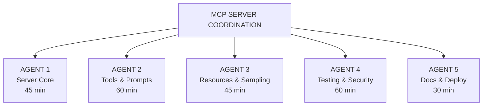

# MCP Server Integration - Master Plan

> **STATUS: NOT YET IMPLEMENTED** — These prompts describe a planned MCP server architecture.
> The `mcp-server/` directory does not exist yet. These are design documents, not references to working code.
> Do not attempt to import from or invoke tools from `mcp-server/` until it is implemented.

## Project Overview

Build a production-grade Model Context Protocol (MCP) server that exposes the Solana Wallet Toolkit functionality to AI assistants like Claude, enabling programmatic wallet generation, signing, and verification.

**Security Level**: CRITICAL - Cryptocurrency private keys  
**Quality Standard**: Production-ready, thoroughly tested  
**MCP Version**: 2024-11-05 (latest stable)

---

## 5-Agent Parallel Development Strategy



---

## Agent Assignments

| Agent | Focus | Prompt File | Est. Time |
|-------|-------|-------------|-----------|
| 1 | MCP Server Core & Transport | [agent-1-server-core.md](agent-1-server-core.md) | 45 min |
| 2 | Tools & Prompts Implementation | [agent-2-tools-prompts.md](agent-2-tools-prompts.md) | 60 min |
| 3 | Resources & Sampling | [agent-3-resources-sampling.md](agent-3-resources-sampling.md) | 45 min |
| 4 | Testing & Security Audit | [agent-4-testing-security.md](agent-4-testing-security.md) | 60 min |
| 5 | Documentation & Deployment | [agent-5-docs-deploy.md](agent-5-docs-deploy.md) | 30 min |

---

## MCP Features to Implement

### Core Protocol
- [x] JSON-RPC 2.0 message handling
- [x] Stdio transport (primary)
- [x] SSE transport (optional)
- [x] Protocol version negotiation
- [x] Capability advertisement

### Tools (Agent 2)
- `generate_keypair` - Generate new Solana keypair
- `generate_vanity` - Generate vanity address with prefix/suffix
- `restore_keypair` - Restore from seed phrase or private key
- `sign_message` - Sign arbitrary message
- `verify_signature` - Verify message signature
- `validate_address` - Validate Solana address format
- `estimate_vanity_time` - Estimate generation time

### Resources (Agent 3)
- `solana://keypair/{id}` - Access generated keypairs
- `solana://address/{pubkey}` - Address information
- `solana://config` - Current configuration

### Prompts (Agent 2)
- `create_wallet` - Guided wallet creation
- `security_audit` - Security best practices check
- `batch_generate` - Multiple keypair generation

---

## Directory Structure

```
mcp-server/
├── package.json
├── tsconfig.json
├── src/
│   ├── index.ts              # Entry point
│   ├── server.ts             # MCP server core
│   ├── transport/
│   │   ├── stdio.ts          # Stdio transport
│   │   └── sse.ts            # SSE transport (optional)
│   ├── handlers/
│   │   ├── tools.ts          # Tool handlers
│   │   ├── resources.ts      # Resource handlers
│   │   ├── prompts.ts        # Prompt handlers
│   │   └── sampling.ts       # Sampling handlers
│   ├── tools/
│   │   ├── generate.ts       # Keypair generation
│   │   ├── vanity.ts         # Vanity address
│   │   ├── sign.ts           # Message signing
│   │   ├── verify.ts         # Signature verification
│   │   └── validate.ts       # Address validation
│   ├── resources/
│   │   ├── keypair.ts        # Keypair resources
│   │   └── config.ts         # Config resources
│   ├── prompts/
│   │   ├── create-wallet.ts  # Wallet creation prompt
│   │   └── security.ts       # Security audit prompt
│   ├── types/
│   │   └── index.ts          # TypeScript types
│   └── utils/
│       ├── crypto.ts         # Crypto utilities
│       └── validation.ts     # Input validation
├── tests/
│   ├── unit/
│   ├── integration/
│   └── e2e/
├── examples/
│   ├── claude-desktop.json   # Claude Desktop config
│   └── usage.md              # Usage examples
└── README.md
```

---

## Security Requirements

### Non-Negotiable
1. **Never persist private keys** - Memory only, zeroized after use
2. **No key logging** - Never log secrets
3. **Input validation** - Strict schema validation on all inputs
4. **Official libraries only** - @solana/web3.js, @modelcontextprotocol/sdk
5. **Secure defaults** - Safe configuration out of the box

### MCP-Specific Security
1. **Tool confirmation** - Dangerous operations require confirmation
2. **Rate limiting** - Prevent abuse
3. **Capability restrictions** - Minimal required capabilities
4. **Audit logging** - Log operations (not secrets)

---

## Quality Gates

Before release:
- [ ] All MCP protocol tests pass
- [ ] Tool tests pass 10+ times
- [ ] Security audit completed
- [ ] No dependency vulnerabilities
- [ ] Claude Desktop integration verified
- [ ] Documentation complete
- [ ] npm package ready

---

## Expected Timeline

| Phase | Duration | Description |
|-------|----------|-------------|
| Phase 1 | 45-60 min | Agents 1-3 parallel (core, tools, resources) |
| Phase 2 | 60 min | Agent 4 testing & security |
| Phase 3 | 30 min | Agent 5 docs & deployment |
| **Total** | **~2.5 hours** | Complete MCP server |

---

## Success Criteria

1. ✅ MCP server starts and responds to initialize
2. ✅ All 7 tools work correctly
3. ✅ Resources return valid data
4. ✅ Prompts guide users effectively
5. ✅ Works with Claude Desktop
6. ✅ Security audit passes
7. ✅ Published to npm (optional)


