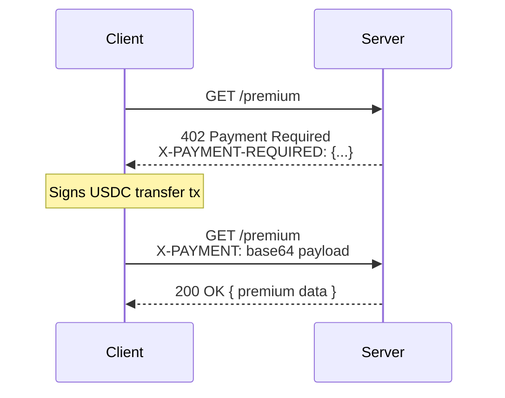

# x402 — HTTP 402 Payment Protocol for Solana

> Gate any API or resource behind micropayments using USDC on Solana. Built for AI agents, automated clients, and programmatic access.

## What is x402?

**x402** implements the [HTTP 402 Payment Required](https://developer.mozilla.org/en-US/docs/Web/HTTP/Status/402) status code as a real protocol. When a server returns `402`, it tells the client exactly how to pay — and the client pays automatically using a Solana USDC transfer.



## Installation

```bash
npm install @pump-fun/x402
```

## Quick Start

### Server — Protect an endpoint

```typescript
import express from 'express';
import { x402Paywall } from '@pump-fun/x402/server';

const app = express();

// Gate /premium behind a $0.01 USDC payment
app.get('/premium',
  x402Paywall({
    payTo: 'YourSolanaAddressHere',
    amount: '10000',  // 0.01 USDC (6 decimals)
    network: 'solana-devnet',
    description: 'Premium API access',
  }),
  (req, res) => {
    res.json({ data: 'This is premium content!' });
  }
);

app.listen(3000, () => console.log('Server running on :3000'));
```

### Client — Auto-pay for access

```typescript
import { X402Client } from '@pump-fun/x402/client';
import { Keypair } from '@solana/web3.js';

const client = new X402Client({
  signer: Keypair.generate(), // Use your funded keypair
  network: 'solana-devnet',
  maxPaymentAmount: '1000000', // Max $1 USDC per request
});

// Automatically handles 402 → pays → retries
const response = await client.fetch('http://localhost:3000/premium');
const data = await response.json();
console.log(data); // { data: 'This is premium content!' }
```

## API Reference

### Types

#### `PaymentRequiredResponse`
The 402 response body:
```typescript
{
  x402Version: 1,
  accepts: [{
    scheme: 'exact',
    network: 'solana-devnet',
    maxAmountRequired: '10000',
    resource: '/premium',
    payTo: 'RecipientAddress',
    token: 'USDCMintAddress',
    description: 'Premium API access',
  }],
  nonce: 'random-nonce',
  expiresAt: '2026-02-26T12:00:00.000Z',
}
```

#### `PaymentPayload`
What the client sends back:
```typescript
{
  x402Version: 1,
  scheme: 'exact',
  network: 'solana-devnet',
  transaction: 'base64-encoded-signed-tx',
  amount: '10000',
  token: 'USDCMintAddress',
  payer: 'PayerAddress',
  payTo: 'RecipientAddress',
  resource: '/premium',
  nonce: 'random-nonce',
}
```

### Client (`@pump-fun/x402/client`)

#### `X402Client`

```typescript
const client = new X402Client({
  signer: keypair,           // Solana Keypair (payer)
  network: 'solana-devnet',  // Network to use
  rpcUrl: '...',             // Custom RPC endpoint (optional)
  maxPaymentAmount: '...',   // Max spend per request (optional)
  autoRetry: true,           // Auto-retry on 402 (default: true)
});

// Standard fetch with 402 handling
const res = await client.fetch(url, init);

// Convenience methods
const res = await client.get(url, headers);
const res = await client.post(url, body, headers);

// Event listener
const unsubscribe = client.on((event) => {
  console.log(event.type, event.amount);
});
```

### Server (`@pump-fun/x402/server`)

#### `x402Paywall(options)`

Express middleware:

```typescript
x402Paywall({
  payTo: string,              // Recipient Solana address
  amount: string,             // Amount in token base units
  token?: string,             // SPL token mint (default: USDC)
  network?: SolanaNetwork,    // Network (default: solana-mainnet)
  description?: string,       // Human-readable description
  mimeType?: string,          // Resource MIME type
  facilitatorUrl?: string,    // External facilitator URL
  verify?: (payment) => ...,  // Custom verification function
  expiresInSeconds?: number,  // Payment offer TTL (default: 300)
});
```

#### `createPaywalls(config)`

Batch create middleware for multiple routes:

```typescript
const paywalls = createPaywalls({
  payTo: 'RecipientAddress',
  network: 'solana-devnet',
  routes: [
    { path: '/api/basic', amount: '10000', description: 'Basic' },
    { path: '/api/premium', amount: '100000', description: 'Premium' },
    { path: '/api/enterprise', amount: '1000000', description: 'Enterprise' },
  ],
});

for (const { path, middleware } of paywalls) {
  app.use(path, middleware);
}
```

### Facilitator (`@pump-fun/x402/facilitator`)

#### `X402Facilitator`

Verifies and settles payments on-chain:

```typescript
const facilitator = new X402Facilitator({
  network: 'solana-devnet',
  waitForConfirmation: true,
});

// Verify only (no on-chain submission)
const result = await facilitator.verify(paymentPayload);
// { valid: true, amount: '10000', payer: '...', payTo: '...' }

// Verify + submit on-chain
const settlement = await facilitator.settle(paymentPayload);
// { success: true, txSignature: '...', network: '...' }

// Check settlement status
const status = await facilitator.getSettlementStatus(txSignature);
// { confirmed: true, slot: 12345 }
```

#### `verifyPaymentLocal(payment, network)`

Standalone verification function (used internally by the middleware):

```typescript
import { verifyPaymentLocal } from '@pump-fun/x402/facilitator';

const result = await verifyPaymentLocal(payment, 'solana-devnet');
```

### Payment Utilities

```typescript
import {
  usdcToBaseUnits,
  baseUnitsToUsdc,
  encodePayment,
  decodePayment,
  generateNonce,
} from '@pump-fun/x402';

usdcToBaseUnits('1.50');     // '1500000'
baseUnitsToUsdc('1500000');  // '1.5'

const encoded = encodePayment(payload);  // Base64 string
const decoded = decodePayment(encoded);  // PaymentPayload

const nonce = generateNonce(); // Random Base58 string
```

### Constants

```typescript
import {
  USDC_MINT_MAINNET,  // EPjFWdd5AufqSSqeM2qN1xzybapC8G4wEGGkZwyTDt1v
  USDC_MINT_DEVNET,   // 4zMMC9srt5Ri5X14GAgXhaHii3GnPAEERYPJgZJDncDU
  USDC_DECIMALS,      // 6
  getUsdcMint,        // (network) => PublicKey
  getDefaultRpcUrl,   // (network) => string
} from '@pump-fun/x402';
```

## Architecture

```
x402/
  src/
    index.ts         — Re-exports everything
    types.ts         — Protocol types & constants
    constants.ts     — Token mints, program IDs, defaults
    payment.ts       — Payment creation & encoding
    client.ts        — x402-aware HTTP client
    server.ts        — Express middleware
    facilitator.ts   — Payment verification & settlement
```

### Payment Flow

1. **Server** returns HTTP 402 with `PaymentRequiredResponse` (JSON body + `X-PAYMENT-REQUIRED` header)
2. **Client** parses the response, finds a compatible payment option
3. **Client** builds a USDC transfer transaction, signs it, serialises it
4. **Client** retries the request with `X-PAYMENT` header containing the Base64-encoded `PaymentPayload`
5. **Server** (or facilitator) deserialises the transaction, verifies it, and optionally submits it on-chain
6. **Server** returns the gated resource

### Security

- Transactions are signed by the payer's keypair — cannot be forged
- Nonce-based replay protection
- Payment offers expire (default 5 minutes)
- Amount and recipient are verified against the original 402 requirements
- Client-side spending limits (`maxPaymentAmount`)
- SPL token transfer instructions are verified in the transaction

## Networks

| Network | USDC Mint | RPC |
|---------|-----------|-----|
| `solana-mainnet` | `EPjFWdd5AufqSSqeM2qN1xzybapC8G4wEGGkZwyTDt1v` | `https://api.mainnet-beta.solana.com` |
| `solana-devnet` | `4zMMC9srt5Ri5X14GAgXhaHii3GnPAEERYPJgZJDncDU` | `https://api.devnet.solana.com` |
| `solana-testnet` | `4zMMC9srt5Ri5X14GAgXhaHii3GnPAEERYPJgZJDncDU` | `https://api.testnet.solana.com` |

## License

MIT


