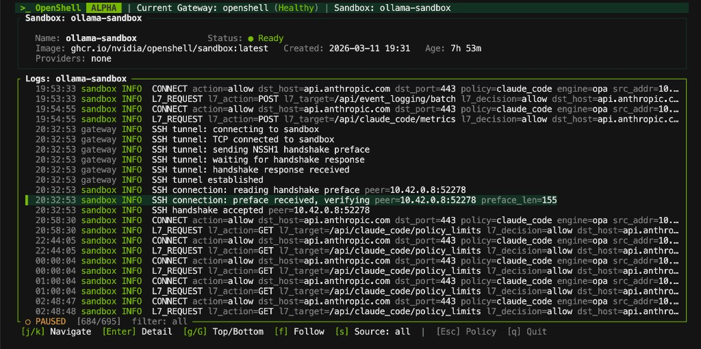

# NVIDIA OpenShell

[](https://github.com/NVIDIA/OpenShell/blob/main/LICENSE)
[](https://pypi.org/project/openshell/)
[](SECURITY.md)
[](https://docs.nvidia.com/openshell/latest/index.html)
[](https://docs.nvidia.com/openshell/latest/about/release-notes.html)

OpenShell is the safe, private runtime for autonomous AI agents. It provides sandboxed execution environments that protect your data, credentials, and infrastructure — governed by declarative YAML policies that prevent unauthorized file access, data exfiltration, and uncontrolled network activity.

OpenShell is built agent-first. The project ships with agent skills for everything from cluster debugging to policy generation, and we expect contributors to use them.

> **Alpha software — single-player mode.** OpenShell is proof-of-life: one developer, one environment, one gateway. We are building toward multi-tenant enterprise deployments, but the starting point is getting your own environment up and running. Expect rough edges. Bring your agent.

## Quickstart

### Prerequisites

- **Docker** — Docker Desktop (or a Docker daemon) must be running.

### Install

**Binary (recommended):**

```bash
curl -LsSf https://raw.githubusercontent.com/NVIDIA/OpenShell/main/install.sh | sh
```

**From PyPI (requires [uv](https://docs.astral.sh/uv/)):**

```bash
uv tool install -U openshell
```

Both methods install the latest stable release by default. To install a specific version, set `OPENSHELL_VERSION` (binary) or pin the version with `uv tool install openshell==<version>`. A [`dev` release](https://github.com/NVIDIA/OpenShell/releases/tag/dev) is also available that tracks the latest commit on `main`.

### Create a sandbox

```bash
openshell sandbox create -- claude  # or opencode, codex, copilot
```

A gateway is created automatically on first use. To deploy on a remote host instead, pass `--remote user@host` to the create command.

The sandbox container includes the following tools by default:

| Category   | Tools                                                    |
| ---------- | -------------------------------------------------------- |
| Agent      | `claude`, `opencode`, `codex`, `copilot`                 |
| Language   | `python` (3.13), `node` (22)                             |
| Developer  | `gh`, `git`, `vim`, `nano`                               |
| Networking | `ping`, `dig`, `nslookup`, `nc`, `traceroute`, `netstat` |

For more details see https://github.com/NVIDIA/OpenShell-Community/tree/main/sandboxes/base.

### See network policy in action

Every sandbox starts with **minimal outbound access**. You open additional access with a short YAML policy that the proxy enforces at the HTTP method and path level, without restarting anything.

```bash
# 1. Create a sandbox (starts with minimal outbound access)
openshell sandbox create

# 2. Inside the sandbox — blocked
sandbox$ curl -sS https://api.github.com/zen
curl: (56) Received HTTP code 403 from proxy after CONNECT

# 3. Back on the host — apply a read-only GitHub API policy
sandbox$ exit
openshell policy set demo --policy examples/sandbox-policy-quickstart/policy.yaml --wait

# 4. Reconnect — GET allowed, POST blocked by L7
openshell sandbox connect demo
sandbox$ curl -sS https://api.github.com/zen
Anything added dilutes everything else.

sandbox$ curl -sS -X POST https://api.github.com/repos/octocat/hello-world/issues -d '{"title":"oops"}'
{"error":"policy_denied","detail":"POST /repos/octocat/hello-world/issues not permitted by policy"}
```

See the [full walkthrough](examples/sandbox-policy-quickstart/) or run the automated demo:

```bash
bash examples/sandbox-policy-quickstart/demo.sh
```

## How It Works

OpenShell isolates each sandbox in its own container with policy-enforced egress routing. A lightweight gateway coordinates sandbox lifecycle, and every outbound connection is intercepted by the policy engine, which does one of three things:

- **Allows** — the destination and binary match a policy block.
- **Routes for inference** — strips caller credentials, injects backend credentials, and forwards to the managed model.
- **Denies** — blocks the request and logs it.

| Component          | Role                                                                                         |
| ------------------ | -------------------------------------------------------------------------------------------- |
| **Gateway**        | Control-plane API that coordinates sandbox lifecycle and acts as the auth boundary.          |
| **Sandbox**        | Isolated runtime with container supervision and policy-enforced egress routing.              |
| **Policy Engine**  | Enforces filesystem, network, and process constraints from application layer down to kernel. |
| **Privacy Router** | Privacy-aware LLM routing that keeps sensitive context on sandbox compute.                   |

Under the hood, all these components run as a [K3s](https://k3s.io/) Kubernetes cluster inside a single Docker container — no separate K8s install required. The `openshell gateway` commands take care of provisioning the container and cluster.

## Protection Layers

OpenShell applies defense in depth across four policy domains:

| Layer      | What it protects                                    | When it applies             |
| ---------- | --------------------------------------------------- | --------------------------- |
| Filesystem | Prevents reads/writes outside allowed paths.        | Locked at sandbox creation. |
| Network    | Blocks unauthorized outbound connections.           | Hot-reloadable at runtime.  |
| Process    | Blocks privilege escalation and dangerous syscalls. | Locked at sandbox creation. |
| Inference  | Reroutes model API calls to controlled backends.    | Hot-reloadable at runtime.  |

Policies are declarative YAML files. Static sections (filesystem, process) are locked at creation; dynamic sections (network, inference) can be hot-reloaded on a running sandbox with `openshell policy set`.

## Providers

Agents need credentials — API keys, tokens, service accounts. OpenShell manages these as **providers**: named credential bundles that are injected into sandboxes at creation. The CLI auto-discovers credentials for recognized agents (Claude, Codex, OpenCode, Copilot) from your shell environment, or you can create providers explicitly with `openshell provider create`. Credentials never leak into the sandbox filesystem; they are injected as environment variables at runtime.

## GPU Support (Experimental)

> **Experimental** — GPU passthrough works on supported hosts but is under active development. Expect rough edges and breaking changes.

OpenShell can pass host GPUs into sandboxes for local inference, fine-tuning, or any GPU workload. Add `--gpu` when creating a sandbox:

```bash
openshell sandbox create --gpu --from [gpu-enabled-sandbox] -- claude
```

The CLI auto-bootstraps a GPU-enabled gateway on first use, auto-selecting CDI when available and otherwise falling back to Docker's NVIDIA GPU request path (`--gpus all`). GPU intent is also inferred automatically for community images with `gpu` in the name.

**Requirements:** NVIDIA drivers and the [NVIDIA Container Toolkit](https://docs.nvidia.com/datacenter/cloud-native/container-toolkit/latest/install-guide.html) must be installed on the host. The sandbox image itself must include the appropriate GPU drivers and libraries for your workload — the default `base` image does not. See the [BYOC example](https://github.com/NVIDIA/OpenShell/tree/main/examples/bring-your-own-container) for building a custom sandbox image with GPU support.

## Supported Agents

| Agent                                                         | Source                                                                           | Notes                                                                         |
| ------------------------------------------------------------- | -------------------------------------------------------------------------------- | ----------------------------------------------------------------------------- |
| [Claude Code](https://docs.anthropic.com/en/docs/claude-code) | [`base`](https://github.com/NVIDIA/OpenShell-Community/tree/main/sandboxes/base) | Works out of the box. Provider uses `ANTHROPIC_API_KEY`.                      |
| [OpenCode](https://opencode.ai/)                              | [`base`](https://github.com/NVIDIA/OpenShell-Community/tree/main/sandboxes/base) | Works out of the box. Provider uses `OPENAI_API_KEY` or `OPENROUTER_API_KEY`. |
| [Codex](https://developers.openai.com/codex)                  | [`base`](https://github.com/NVIDIA/OpenShell-Community/tree/main/sandboxes/base) | Works out of the box. Provider uses `OPENAI_API_KEY`.                         |
| [GitHub Copilot CLI](https://docs.github.com/en/copilot/github-copilot-in-the-cli) | [`base`](https://github.com/NVIDIA/OpenShell-Community/tree/main/sandboxes/base) | Works out of the box. Provider uses `GITHUB_TOKEN` or `COPILOT_GITHUB_TOKEN`. |
| [OpenClaw](https://openclaw.ai/)                              | [Community](https://github.com/NVIDIA/OpenShell-Community)                       | Launch with `openshell sandbox create --from openclaw`.                       |
| [Ollama](https://ollama.com/)                                 | [Community](https://github.com/NVIDIA/OpenShell-Community)                       | Launch with `openshell sandbox create --from ollama`.                         |

## Key Commands

| Command                                                    | Description                                     |
| ---------------------------------------------------------- | ----------------------------------------------- |
| `openshell sandbox create -- <agent>`                      | Create a sandbox and launch an agent.           |
| `openshell sandbox connect [name]`                         | SSH into a running sandbox.                     |
| `openshell sandbox list`                                   | List all sandboxes.                             |
| `openshell provider create --type [type]] --from-existing` | Create a credential provider from env vars.     |
| `openshell policy set <name> --policy file.yaml`           | Apply or update a policy on a running sandbox.  |
| `openshell policy get <name>`                              | Show the active policy.                         |
| `openshell inference set --provider <p> --model <m>`       | Configure the `inference.local` endpoint.       |
| `openshell logs [name] --tail`                             | Stream sandbox logs.                            |
| `openshell term`                                           | Launch the real-time terminal UI for debugging. |

See the [full documentation](https://docs.nvidia.com/openshell/latest) for command guides, tutorials, and reference material.

## Terminal UI

OpenShell includes a real-time terminal dashboard for monitoring gateways, sandboxes, and providers — inspired by [k9s](https://k9scli.io/).

```bash
openshell term
```

<p align="center">
  
</p>

The TUI gives you a live, keyboard-driven view of your cluster. Navigate with `Tab` to switch panels, `j`/`k` to move through lists, `Enter` to select, and `:` for command mode. Cluster health and sandbox status auto-refresh every two seconds.

## Community Sandboxes and BYOC

Use `--from` to create sandboxes from the [OpenShell Community](https://github.com/NVIDIA/OpenShell-Community) catalog, a local directory, or a container image:

```bash
openshell sandbox create --from openclaw           # community catalog
openshell sandbox create --from ./my-sandbox-dir   # local Dockerfile
openshell sandbox create --from registry.io/img:v1 # container image
```

See the [community sandboxes](https://docs.nvidia.com/openshell/latest/sandboxes/community-sandboxes) catalog and the [BYOC example](https://github.com/NVIDIA/OpenShell/tree/main/examples/bring-your-own-container) for details.

## Explore with Your Agent

Clone the repo and point your coding agent at it. The project includes agent skills that can answer questions, walk you through workflows, and diagnose problems — no issue filing required.

```bash
git clone https://github.com/NVIDIA/OpenShell.git   # or git@github.com:NVIDIA/OpenShell.git
cd OpenShell
# Point your agent here — it will discover the skills in .agents/skills/ automatically
```

Your agent can load skills for CLI usage (`openshell-cli`), cluster troubleshooting (`debug-openshell-cluster`), inference troubleshooting (`debug-inference`), policy generation (`generate-sandbox-policy`), and more. See [CONTRIBUTING.md](CONTRIBUTING.md) for the full skills table.

## Built With Agents

OpenShell is developed using the same agent-driven workflows it enables. The `.agents/skills/` directory contains workflow automation that powers the project's development cycle:

- **Spike and build:** Investigate a problem with `create-spike`, then implement it with `build-from-issue` once a human approves.
- **Triage and route:** Community issues are assessed with `triage-issue`, classified, and routed into the spike-build pipeline.
- **Security review:** `review-security-issue` produces a severity assessment and remediation plan. `fix-security-issue` implements it.
- **Policy authoring:** `generate-sandbox-policy` creates YAML policies from plain-language requirements or API documentation.

All implementation work is human-gated — agents propose plans, humans approve, agents build. See [AGENTS.md](AGENTS.md) for the full workflow chain documentation.

## Getting Help

- **Questions and discussion:** [GitHub Discussions](https://github.com/NVIDIA/OpenShell/discussions)
- **Bug reports:** [GitHub Issues](https://github.com/NVIDIA/OpenShell/issues) — use the bug report template
- **Security vulnerabilities:** See [SECURITY.md](SECURITY.md) — do not use GitHub Issues
- **Agent-assisted help:** Clone the repo and use the agent skills in `.agents/skills/` for self-service diagnostics

## Learn More

- [Full Documentation](https://docs.nvidia.com/openshell/latest/index.html) — overview, architecture, tutorials, and reference
- [Quickstart](https://docs.nvidia.com/openshell/latest/get-started/quickstart) — detailed install and first sandbox walkthrough
- [GitHub Sandbox Tutorial](https://docs.nvidia.com/openshell/latest/tutorials/github-sandbox) — end-to-end scoped GitHub repo access
- [Architecture](https://github.com/NVIDIA/OpenShell/tree/main/architecture) — detailed architecture docs and design decisions
- [Support Matrix](https://docs.nvidia.com/openshell/latest/reference/support-matrix) — platforms, versions, and kernel requirements
- [Brev Launchable](https://brev.nvidia.com/launchable/deploy/now?launchableID=env-3Ap3tL55zq4a8kew1AuW0FpSLsg) — try OpenShell on cloud compute without local setup
- [Agent Instructions](AGENTS.md) — system prompt and workflow documentation for agent contributors

## Contributing

OpenShell is built agent-first — your agent is your first collaborator. Before opening issues or submitting code, point your agent at the repo and let it use the skills in `.agents/skills/` to investigate, diagnose, and prototype. See [CONTRIBUTING.md](CONTRIBUTING.md) for the full agent skills table, contribution workflow, and development setup.

## Notice and Disclaimer

This software automatically retrieves, accesses or interacts with external materials. Those retrieved materials are not distributed with this software and are governed solely by separate terms, conditions and licenses. You are solely responsible for finding, reviewing and complying with all applicable terms, conditions, and licenses, and for verifying the security, integrity and suitability of any retrieved materials for your specific use case. This software is provided "AS IS", without warranty of any kind. The author makes no representations or warranties regarding any retrieved materials, and assumes no liability for any losses, damages, liabilities or legal consequences from your use or inability to use this software or any retrieved materials. Use this software and the retrieved materials at your own risk.

## License

This project is licensed under the [Apache License 2.0](https://github.com/NVIDIA/OpenShell/blob/main/LICENSE).
