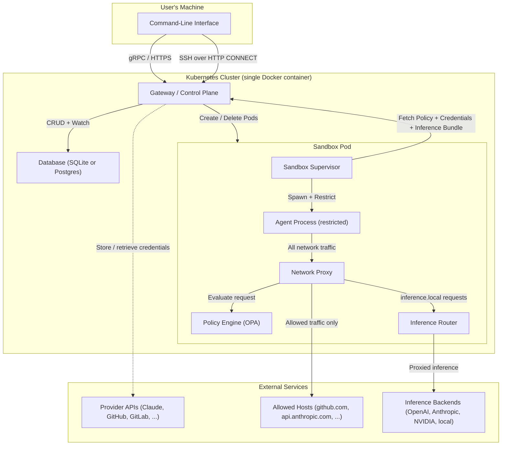

# System Overview

## What This Project Does

This project is a platform for securely running AI agents in isolated sandbox environments. AI agents -- tools that can read, write, and execute code on a user's behalf -- need to operate with real system access to be useful, but granting that access without guardrails poses serious security risks. An unconstrained agent could read sensitive files, exfiltrate data over the network, or execute dangerous system calls.

This platform solves that problem by creating sandboxed execution environments where agents run with exactly the permissions they need and nothing more. Every sandbox is governed by a policy that defines which files the agent can access, which network hosts it can reach, and which system operations it can perform. All outbound network traffic is forced through a controlled proxy that inspects and enforces access rules in real time.

The platform packages the entire infrastructure -- orchestration gateway, sandbox runtime, networking, and Kubernetes cluster -- into a single deployable unit. A user can go from zero to a running, secured sandbox in two commands. The system handles cluster provisioning, credential management, policy enforcement, and secure remote access without requiring the user to configure Kubernetes, networking, or security policies manually.

## How the Subsystems Fit Together

The following diagram shows how the major subsystems interact at a high level. Users interact through the CLI, which communicates with a central gateway. The gateway manages sandbox lifecycle in Kubernetes, and each sandbox enforces its own policy locally. Inference API calls to `inference.local` are routed locally within the sandbox by an embedded inference router, without traversing the gateway at request time.



## Major Subsystems

### Sandbox Execution Environment

The sandbox is the core of the platform. It creates a restricted environment where an AI agent can run code without being able to harm the host system or access resources it should not.

Each sandbox runs inside a container as two processes: a privileged **supervisor** and a restricted **child process** (the agent). The supervisor sets up the isolation environment, then launches the child with reduced privileges. The child process runs as a separate, unprivileged user account.

Isolation is enforced through multiple independent mechanisms that work together as layers of defense:

- **Filesystem restrictions** control which directories the agent can read and write. The platform uses a Linux kernel feature called Landlock to enforce these rules. If the policy says the agent can only write to `/sandbox`, any attempt to write elsewhere is blocked by the kernel itself -- not by the application.

- **System call filtering** prevents the agent from performing dangerous low-level operations. A filter (seccomp) blocks the agent from creating raw network sockets, which prevents it from bypassing the network proxy.

- **Network namespace isolation** places the agent in a separate network environment where the only reachable destination is the proxy. The agent literally cannot send packets to the internet directly; every connection must go through the proxy, which enforces the access policy.

- **Process privilege separation** ensures the supervisor retains enough privileges to manage the sandbox while the agent process runs with minimal permissions.

All of these restrictions are driven by a **policy** -- a configuration that defines what a specific sandbox is allowed to do. Policies are written in YAML and evaluated by an embedded policy engine (OPA/Rego). This means security rules are declarative, auditable, and can vary per sandbox.

For more detail, see [Sandbox Architecture](sandbox.md).

### Network Proxy and Access Control

Every sandbox forces all outbound network traffic through an HTTP CONNECT proxy. The proxy sits between the agent and the internet, acting as a gatekeeper that decides which connections are permitted.

When the agent (or any tool running inside the sandbox) tries to connect to a remote host, the proxy:

1. **Identifies the requesting program** by inspecting the Linux process table (`/proc`) to determine which binary opened the connection.
2. **Verifies the program's integrity** using a trust-on-first-use model: the first time a binary makes a network request, its cryptographic hash (SHA256) is recorded. If the binary changes later (indicating possible tampering), subsequent requests are denied.
3. **Evaluates the request against policy** using the OPA engine. The policy can allow or deny connections based on the destination hostname, port, and the identity of the requesting program.
4. **Rejects connections to internal IP addresses** as a defense against SSRF (Server-Side Request Forgery). Even if the policy allows a hostname, the proxy resolves DNS before connecting and blocks any result that points to a private network address (e.g., cloud metadata endpoints, localhost, or RFC 1918 ranges). This prevents an attacker from redirecting an allowed hostname to internal infrastructure.
5. **Performs protocol-aware inspection (L7)** for configured endpoints. The proxy can terminate TLS, inspect the underlying HTTP traffic, and enforce rules on individual API requests -- not just connection-level allow/deny. This operates in either audit mode (log violations but allow traffic) or enforce mode (block violations).
6. **Intercepts inference API calls** to `inference.local`. When the agent sends an HTTPS CONNECT request to `inference.local`, the proxy bypasses OPA evaluation entirely and handles the connection through a dedicated inference interception path. It TLS-terminates the connection, parses the HTTP request, detects known inference API patterns (OpenAI, Anthropic, model discovery), and routes matching requests locally through the sandbox's embedded inference router (`openshell-router`). Non-inference requests to `inference.local` are denied with 403.

The proxy generates an ephemeral certificate authority at startup and injects it into the sandbox's trust store. This allows it to transparently inspect HTTPS traffic when L7 inspection is configured for an endpoint, and to serve TLS for `inference.local` interception.

For more detail, see [Sandbox Architecture](sandbox.md) (Proxy Routing section).

### Gateway / Control Plane

The gateway is the central orchestration service. It provides the API that the CLI talks to and manages the lifecycle of sandboxes in Kubernetes.

Key responsibilities:

- **Sandbox lifecycle management**: Creating, deleting, and monitoring sandboxes. When a user creates a sandbox, the gateway provisions a Kubernetes pod with the correct container image, policy, and environment configuration.
- **gRPC and HTTP APIs**: The gateway exposes a gRPC API for structured operations (sandbox CRUD, provider management, SSH session creation) and HTTP endpoints for health checks. Both protocols share a single network port through protocol multiplexing.
- **Data persistence**: Sandbox records, provider credentials, SSH sessions, and inference routes are stored in a database (SQLite by default, Postgres as an option).
- **TLS termination**: The gateway supports TLS with automatic protocol negotiation, so gRPC and HTTP clients can connect securely on the same port.
- **SSH tunnel gateway**: The gateway provides the entry point for SSH connections into sandboxes (see Sandbox Connect below).
- **Real-time updates**: The gateway streams sandbox status changes to the CLI, so users see live progress when a sandbox is starting up.
- **Inference bundle resolution**: The gateway stores cluster-level inference configuration (provider name + model ID) and resolves it into bundles containing endpoint URLs, API keys, supported protocols, provider type, and auth metadata. Sandboxes fetch these bundles at startup and refresh them periodically. The gateway does not proxy inference traffic at request time -- it only provides configuration.

For more detail, see [Gateway Architecture](gateway.md).

### Cluster Bootstrap and Infrastructure

The entire platform -- Kubernetes, the gateway, networking, and pre-loaded container images -- is packaged into a single Docker container. This means the only dependency a user needs is Docker.

The bootstrap system handles:

- **Provisioning**: Creating the Docker container with an embedded Kubernetes (k3s) cluster, pre-loaded with all required images and Helm charts.
- **Local and remote deployment**: The same bootstrap flow works for local development (Docker on the user's machine) and remote deployment (Docker on a remote host, accessed via SSH).
- **Health monitoring**: After starting the cluster, the system polls for readiness -- waiting for Kubernetes to start, for components to deploy, and for health checks to pass.
- **Credential management**: If TLS is enabled, the bootstrap process automatically extracts client certificates and stores them locally for the CLI to use.
- **Idempotent operation**: Running the deploy command again is safe. It reuses existing infrastructure or recreates only what changed.

The target onboarding experience is two commands:

```bash
pip install <package>
openshell sandbox create --remote user@host -- claude
```

The first command installs the CLI. The second command bootstraps the cluster on the remote host (if needed) and launches a sandbox running the specified agent.

For more detail, see [Cluster Bootstrap Architecture](cluster-single-node.md).

### Sandbox Connect (SSH Tunneling)

Users can open interactive terminal sessions into running sandboxes. SSH traffic is tunneled through the gateway rather than exposing sandbox pods directly on the network.

The connection flow works as follows:

1. The CLI requests a session token from the gateway.
2. The CLI opens an HTTP CONNECT tunnel to the gateway's SSH tunnel endpoint, passing the token and sandbox identifier.
3. The gateway validates the token, confirms the sandbox is running, resolves the pod's network address, and establishes a TCP connection to the sandbox's embedded SSH server.
4. A cryptographic handshake (HMAC-verified) confirms the gateway's identity to the sandbox.
5. The CLI and sandbox exchange SSH traffic bidirectionally through the tunnel.

This design provides several benefits:
- Sandbox pods are never directly accessible from outside the cluster.
- All access is authenticated and auditable through the gateway.
- Session tokens can be revoked to immediately cut off access.
- The same mechanism supports both interactive shells and file synchronization (rsync).

For more detail, see [Sandbox Connect Architecture](sandbox-connect.md).

### Provider System

AI agents typically need credentials to access external services -- an API key for the AI model provider, a token for GitHub or GitLab, and so on. The platform manages these credentials as first-class entities called **providers**.

The provider system handles:

- **Automatic discovery**: The CLI scans the user's local machine for existing credentials (environment variables, configuration files) and offers to upload them to the gateway. Supported providers include Claude, Codex, OpenCode, OpenAI, Anthropic, NVIDIA, GitHub, GitLab, and others.
- **Secure storage**: Credentials are stored on the gateway, separate from sandbox definitions. They never appear in Kubernetes pod specifications.
- **Runtime injection**: When a sandbox starts, the supervisor process fetches the credentials from the gateway via gRPC and injects them as environment variables into every process it spawns (both the initial agent process and any SSH sessions).
- **CLI management**: Users can create, update, list, and delete providers through standard CLI commands.

This approach means users configure credentials once, and every sandbox that needs them receives them automatically at runtime.

For more detail, see [Providers](sandbox-providers.md).

### Inference Routing

The inference routing system transparently intercepts AI inference API calls from sandboxed agents and routes them to configured backends. Routing happens locally within the sandbox -- the proxy intercepts connections to `inference.local`, and the embedded `openshell-router` forwards requests directly to the backend without traversing the gateway at request time.

**How it works end-to-end:**

1. An operator configures cluster-level inference via `openshell cluster inference set --provider <name> --model <id>`. This stores a reference to the named provider and model on the gateway.
2. When a sandbox starts, the supervisor fetches an inference bundle from the gateway via the `GetInferenceBundle` RPC. The gateway resolves the stored provider reference into a complete route: endpoint URL, API key, supported protocols, provider type, and auth metadata. The sandbox refreshes this bundle eagerly in the background every 5 seconds by default (override with `OPENSHELL_ROUTE_REFRESH_INTERVAL_SECS`).
3. The agent sends requests to `https://inference.local` using standard OpenAI or Anthropic SDK calls.
4. The sandbox proxy intercepts the HTTPS CONNECT to `inference.local` (bypassing OPA policy evaluation), TLS-terminates the connection using the sandbox's ephemeral CA, and parses the HTTP request.
5. Known inference API patterns are detected (e.g., `POST /v1/chat/completions` for OpenAI, `POST /v1/messages` for Anthropic, `GET /v1/models` for model discovery). Matching requests are forwarded to the first compatible route by the `openshell-router`, which rewrites the auth header, injects provider-specific default headers (e.g., `anthropic-version` for Anthropic), and overrides the model field in the request body.
6. Non-inference requests to `inference.local` are denied with 403.

**Key design properties:**

- Agents need zero code changes -- standard OpenAI/Anthropic SDK calls work transparently when pointed at `inference.local`.
- The sandbox never sees the real API key for the backend -- credential isolation is maintained through the gateway's bundle resolution.
- Routing is explicit via `inference.local`; OPA network policy is not involved in inference routing.
- Provider-specific behavior (auth header style, default headers, supported protocols) is centralized in `InferenceProviderProfile` definitions in `openshell-core`. Supported inference provider types are openai, anthropic, and nvidia.
- Cluster inference is managed via CLI (`openshell cluster inference set/get`).

**Inference routes** are stored on the gateway as protobuf objects (`InferenceRoute` in `proto/inference.proto`). Cluster inference uses a managed singleton route entry keyed by `inference.local` and configured from provider + model settings. Endpoint, credentials, and protocols are resolved from the referenced provider record at bundle fetch time, so rotating a provider's API key takes effect on the next bundle refresh without reconfiguring the route.

**Components involved:**

| Component | Location | Role |
|---|---|---|
| Proxy inference interception | `crates/openshell-sandbox/src/proxy.rs` | Intercepts `inference.local` CONNECT requests, TLS-terminates, dispatches to router |
| Inference pattern detection | `crates/openshell-sandbox/src/l7/inference.rs` | Matches HTTP method + path against known inference API patterns |
| Local inference router | `crates/openshell-router/src/lib.rs` | Selects a compatible route by protocol and proxies to the backend |
| Provider profiles | `crates/openshell-core/src/inference.rs` | Centralized auth, headers, protocols, and endpoint defaults per provider type |
| Gateway inference service | `crates/openshell-server/src/inference.rs` | Stores cluster inference config, resolves bundles with credentials from provider records |
| Proto definitions | `proto/inference.proto` | `ClusterInferenceConfig`, `ResolvedRoute`, bundle RPCs |


### Container and Build System

The platform produces three container images:

| Image | Purpose |
|---|---|
| **Sandbox** | Runs inside each sandbox pod. Contains the sandbox supervisor binary, Python runtime, and agent tooling. Uses a multi-user setup (privileged supervisor, restricted agent user). |
| **Gateway** | Runs the control plane. Contains the gateway binary, database migrations, and an embedded SSH client for sandbox management. |
| **Cluster** | An airgapped Kubernetes image with k3s, pre-loaded sandbox and gateway images, Helm charts, and an API gateway. This is the single container that users deploy. |

Builds use multi-stage Dockerfiles with caching to keep rebuild times fast. A Helm chart handles Kubernetes-level configuration (service ports, health checks, security contexts, resource limits). Build automation is managed through mise tasks.

For more detail, see [Container Management](build-containers.md).

### Policy Language

Sandbox behavior is governed by policies written in YAML and evaluated by an embedded OPA (Open Policy Agent) engine using the Rego policy language. Policies define:

- **Filesystem access**: Which directories are readable, which are writable.
- **Network access**: Which remote hosts each program in the sandbox can connect to, with per-binary granularity.
- **Process privileges**: What user/group the agent runs as.
- **L7 inspection rules**: Protocol-level constraints on HTTP API calls for specific endpoints.

Inference routing to `inference.local` is configured separately at the cluster level and does not require network policy entries. The OPA engine evaluates only explicit network policies; `inference.local` connections bypass OPA entirely and are handled by the proxy's dedicated inference interception path.

Policies are not intended to be hand-edited by end users in normal operation. They are associated with sandboxes at creation time and fetched by the sandbox supervisor at startup via gRPC. For development and testing, policies can also be loaded from local files. A gateway-global policy can override all sandbox policies via `openshell policy set --global`.

In addition to policy, the gateway delivers runtime **settings** -- typed key-value pairs (e.g., `log_level`) that can be configured per-sandbox or globally. Settings and policy are delivered together through the `GetSandboxSettings` RPC and tracked by a single `config_revision` fingerprint. See [Gateway Settings Channel](gateway-settings.md) for details.

For more detail on the policy language, see [Policy Language](security-policy.md).

### Command-Line Interface

The CLI is the primary way users interact with the platform. It provides commands organized into four groups:

- **Gateway management** (`openshell gateway`): Deploy, stop, destroy, and inspect clusters. Supports both local and remote (SSH) targets.
- **Sandbox management** (`openshell sandbox`): Create sandboxes (with optional file upload and provider auto-discovery), connect to sandboxes via SSH, and delete sandboxes.
- **Top-level commands**: `openshell status` (cluster health), `openshell logs` (sandbox logs), `openshell forward` (port forwarding), `openshell policy` (sandbox policy management), `openshell settings` (effective sandbox settings and global/sandbox key updates).
- **Provider management** (`openshell provider`): Create, update, list, and delete external service credentials.
- **Inference management** (`openshell cluster inference`): Configure cluster-level inference by specifying a provider and model. The gateway resolves endpoint and credential details from the named provider record.

The CLI resolves which gateway to operate on through a priority chain: explicit `--gateway` flag, then the `OPENSHELL_GATEWAY` environment variable, then the active gateway set by `openshell gateway select`. Gateway names are exposed to shell completion from local metadata, and `openshell gateway select` opens an interactive chooser on a TTY while falling back to a printed list in non-interactive use. The CLI supports TLS client certificates for mutual authentication with the gateway.

## How Users Get Started

The onboarding flow is designed to require minimal setup. Docker is the only prerequisite.

**Step 1: Install the CLI.**

```bash
pip install <package>
```

**Step 2: Create a sandbox.**

```bash
openshell sandbox create -- claude
```

If no cluster exists, the CLI automatically bootstraps one. It provisions a local Kubernetes cluster inside a Docker container, waits for it to become healthy, discovers the user's AI provider credentials from local configuration files, uploads them to the gateway, and launches a sandbox running the specified agent -- all from a single command.

For remote deployment (running the sandbox on a different machine):

```bash
openshell sandbox create --remote user@hostname -- claude
```

This performs the same bootstrap flow on the remote host via SSH.

For development and testing against the current checkout, use
`scripts/remote-deploy.sh` instead. That helper syncs the local repository to
an SSH-reachable machine, builds the CLI and Docker images on the remote host,
and then runs `openshell gateway start` there. It defaults to secure gateway
startup and only enables `--plaintext`, `--disable-gateway-auth`, or
`--recreate` when explicitly requested.

**Step 3: Connect to a running sandbox.**

```bash
openshell sandbox connect <sandbox-name>
```

This opens an interactive SSH session into the sandbox, with all provider credentials available as environment variables.

## Architecture Documents Index

| Document | Description |
|---|---|
| [Cluster Bootstrap](cluster-single-node.md) | How the platform bootstraps a Kubernetes cluster from a single Docker container, for local and remote targets. |
| [Gateway Architecture](gateway.md) | The control plane gateway: API multiplexing, gRPC services, persistence, TLS, and sandbox orchestration. |
| [Gateway Communication](gateway-deploy-connect.md) | How the CLI resolves a gateway and communicates with it over mTLS, plaintext HTTP/2, or an edge-authenticated WebSocket tunnel. |
| [Gateway Security](gateway-security.md) | mTLS enforcement, PKI bootstrap, certificate hierarchy, and the gateway trust model. |
| [Sandbox Architecture](sandbox.md) | The sandbox execution environment: policy enforcement, Landlock, seccomp, network namespaces, and the network proxy. |
| [Container Management](build-containers.md) | Container images, Dockerfiles, Helm charts, build tasks, and CI/CD. |
| [Sandbox Connect](sandbox-connect.md) | SSH tunneling into sandboxes through the gateway. |
| [Sandbox Custom Containers](sandbox-custom-containers.md) | Building and using custom container images for sandboxes. |
| [Providers](sandbox-providers.md) | External credential management, auto-discovery, and runtime injection. |
| [Docs Site Architecture](docs-site.md) | Documentation source layout, navigation structure, local validation and preview workflow, and publish pipeline. |
| [Policy Language](security-policy.md) | The YAML/Rego policy system that governs sandbox behavior. |
| [Inference Routing](inference-routing.md) | Transparent interception and sandbox-local routing of AI inference API calls to configured backends. |
| [System Architecture](system-architecture.md) | Top-level system architecture diagram with all deployable components and communication flows. |
| [Gateway Settings Channel](gateway-settings.md) | Runtime settings channel: two-tier key-value configuration, global policy override, settings registry, CLI/TUI commands. |
| [TUI](tui.md) | Terminal user interface for sandbox interaction. |
