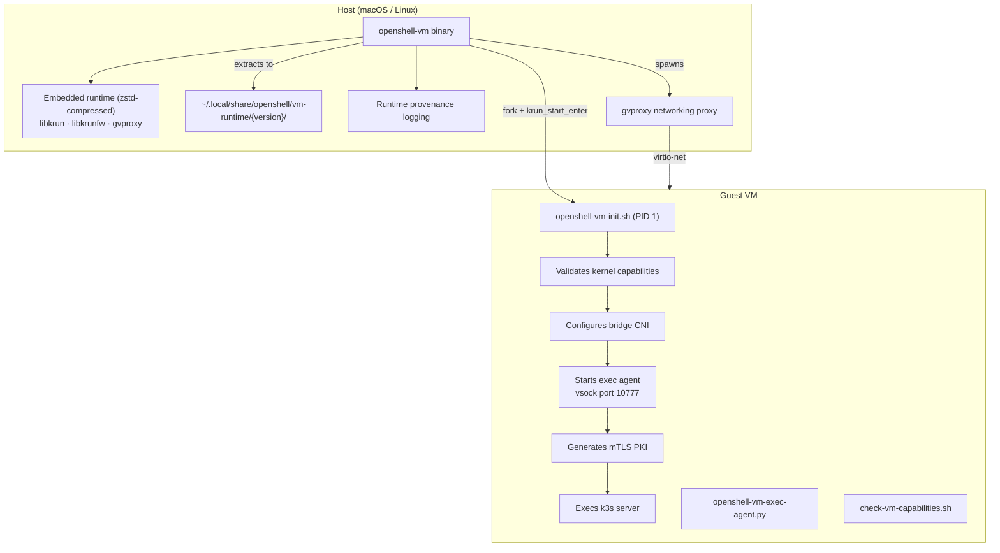
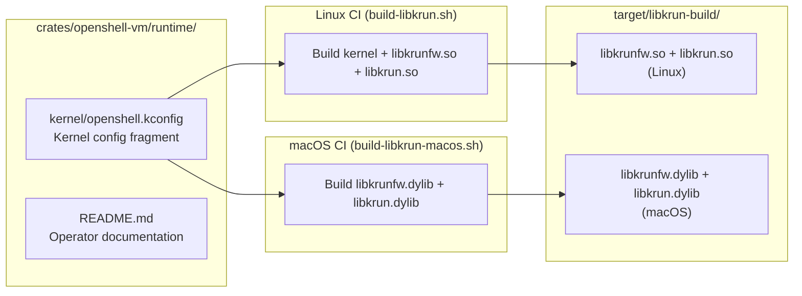
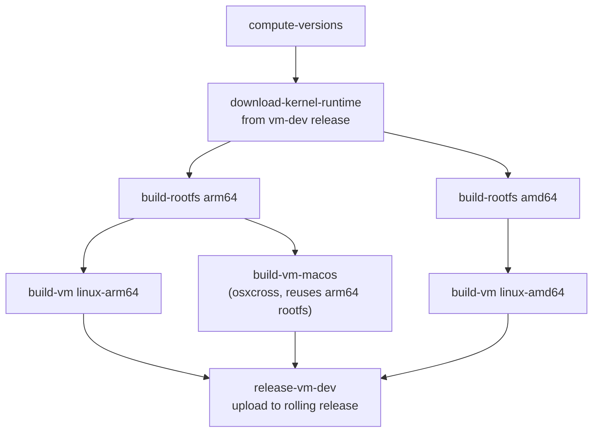

# Custom libkrunfw VM Runtime

> Status: Experimental and work in progress (WIP). VM support is under active development and may change.

## Overview

The OpenShell gateway VM uses [libkrun](https://github.com/containers/libkrun) to boot a
lightweight microVM with Apple Hypervisor.framework (macOS) or KVM (Linux). The kernel
is embedded inside `libkrunfw`, a companion library that packages a pre-built Linux kernel.

The stock `libkrunfw` from Homebrew ships a minimal kernel without bridge, netfilter, or
conntrack support. This is insufficient for Kubernetes pod networking.

The custom libkrunfw runtime adds bridge CNI, iptables/nftables, and conntrack support to
the VM kernel, enabling standard Kubernetes networking.

## Architecture



## Embedded Runtime

The openshell-vm binary is fully self-contained, embedding both the VM runtime libraries
and a minimal rootfs as zstd-compressed byte arrays. On first use, the binary extracts
these to XDG cache directories with progress bars:

```
~/.local/share/openshell/vm-runtime/{version}/
├── libkrun.{dylib,so}
├── libkrunfw.{5.dylib,so.5}
└── gvproxy

~/.local/share/openshell/openshell-vm/{version}/instances/<name>/rootfs/
├── usr/local/bin/k3s
├── opt/openshell/bin/openshell-sandbox
├── opt/openshell/manifests/
└── ...
```

This eliminates the need for separate bundles or downloads - a single ~120MB binary
provides everything needed to run the VM. Old cache versions are automatically
cleaned up when a new version is extracted.

### Hybrid Approach

The embedded rootfs uses a "minimal" configuration:
- Includes: Base Ubuntu, k3s binary, supervisor binary, helm charts, manifests
- Excludes: Pre-loaded container images (~1GB savings)

Container images are pulled on demand when sandboxes are created. First boot takes
~30-60s as k3s initializes; subsequent boots use cached state for ~3-5s startup.

For the VM compute driver, the same embedded rootfs is rewritten into a
supervisor-only sandbox guest before boot:

- removes k3s state and Kubernetes manifests from the extracted rootfs
- installs `/srv/openshell-vm-sandbox-init.sh`
- boots directly into `openshell-sandbox` instead of `openshell-vm-init.sh`
- keeps the same embedded libkrun/libkrunfw kernel/runtime bundle

`openshell-driver-vm` now embeds the sandbox rootfs tarball independently so it can
prepare sandbox guests without linking against the `openshell-vm` Rust crate.
It now also embeds the minimal libkrun/libkrunfw bundle it needs for sandbox
boots and launches sandbox guests via a hidden helper mode in the
`openshell-driver-vm` binary itself, without depending on the `openshell-vm`
binary. The helper still starts its own embedded `gvproxy` instance to provide
virtio-net guest egress plus the single inbound SSH port forward used by the
compute driver.

For fully air-gapped environments requiring pre-loaded images, build with:
```bash
mise run vm:rootfs                 # Full rootfs (~2GB, includes images)
mise run vm:build                  # Rebuild binary with full rootfs
```

## Network Profile

The VM uses the bridge CNI profile, which requires a custom libkrunfw with bridge and
netfilter kernel support. The init script validates these capabilities at boot and fails
fast with an actionable error if they are missing.

### Bridge Profile

- CNI: bridge plugin with `cni0` interface
- IP masquerade: enabled (iptables-legacy via CNI bridge plugin)
- kube-proxy: enabled (nftables mode)
- Service VIPs: functional (ClusterIP, NodePort)
- hostNetwork workarounds: not required

## Runtime Provenance

At boot, the openshell-vm binary logs provenance metadata about the loaded runtime bundle:

- Library paths and SHA-256 hashes
- Whether the runtime is custom-built or stock
- For custom runtimes: libkrunfw commit, kernel version, build timestamp

This information is sourced from `provenance.json` (generated by the build script)
and makes it straightforward to correlate VM behavior with a specific runtime artifact.

## Build Pipeline



## Kernel Config Fragment

The `openshell.kconfig` fragment enables these kernel features on top of the stock
libkrunfw kernel:

| Feature | Key Configs | Purpose |
|---------|-------------|---------|
| Network namespaces | `CONFIG_NET_NS`, `CONFIG_NAMESPACES` | Pod isolation |
| veth | `CONFIG_VETH` | Pod network namespace pairs |
| Bridge device | `CONFIG_BRIDGE`, `CONFIG_BRIDGE_NETFILTER` | cni0 bridge for pod networking, kube-proxy bridge traffic visibility |
| Netfilter framework | `CONFIG_NETFILTER`, `CONFIG_NETFILTER_ADVANCED`, `CONFIG_NETFILTER_XTABLES` | iptables/nftables framework |
| xtables match modules | `CONFIG_NETFILTER_XT_MATCH_CONNTRACK`, `_COMMENT`, `_MULTIPORT`, `_MARK`, `_STATISTIC`, `_ADDRTYPE`, `_RECENT`, `_LIMIT` | kube-proxy and kubelet iptables rules |
| Connection tracking | `CONFIG_NF_CONNTRACK`, `CONFIG_NF_CT_NETLINK` | NAT state tracking |
| NAT | `CONFIG_NF_NAT` | Service VIP DNAT/SNAT |
| iptables | `CONFIG_IP_NF_IPTABLES`, `CONFIG_IP_NF_FILTER`, `CONFIG_IP_NF_NAT`, `CONFIG_IP_NF_MANGLE` | CNI bridge masquerade and compat |
| nftables | `CONFIG_NF_TABLES`, `CONFIG_NFT_CT`, `CONFIG_NFT_NAT`, `CONFIG_NFT_MASQ`, `CONFIG_NFT_NUMGEN`, `CONFIG_NFT_FIB_IPV4` | kube-proxy nftables mode (primary) |
| IP forwarding | `CONFIG_IP_ADVANCED_ROUTER`, `CONFIG_IP_MULTIPLE_TABLES` | Pod-to-pod routing |
| IPVS | `CONFIG_IP_VS`, `CONFIG_IP_VS_RR`, `CONFIG_IP_VS_NFCT` | kube-proxy IPVS mode (optional) |
| Traffic control | `CONFIG_NET_SCH_HTB`, `CONFIG_NET_CLS_CGROUP` | Kubernetes QoS |
| Cgroups | `CONFIG_CGROUPS`, `CONFIG_CGROUP_DEVICE`, `CONFIG_MEMCG`, `CONFIG_CGROUP_PIDS` | Container resource limits |
| TUN/TAP | `CONFIG_TUN` | CNI plugin support |
| Dummy interface | `CONFIG_DUMMY` | Fallback networking |
| Landlock | `CONFIG_SECURITY_LANDLOCK` | Filesystem sandboxing support |
| Seccomp filter | `CONFIG_SECCOMP_FILTER` | Syscall filtering support |

See `crates/openshell-vm/runtime/kernel/openshell.kconfig` for the full fragment with
inline comments explaining why each option is needed.

## Verification

One verification tool is provided:

1. **Capability checker** (`check-vm-capabilities.sh`): Runs inside the VM to verify
   kernel capabilities. Produces pass/fail results for each required feature.

## Running Commands In A Live VM

The standalone `openshell-vm` binary supports `openshell-vm exec -- <command...>` for a running VM.

- Each VM instance stores local runtime state next to its instance rootfs
- libkrun maps a per-instance host Unix socket into the guest on vsock port `10777`
- `openshell-vm-init.sh` starts `openshell-vm-exec-agent.py` during boot
- `openshell-vm exec` connects to the host socket, which libkrun forwards into the guest exec agent
- The guest exec agent spawns the command, then streams stdout, stderr, and exit status back
- The host-side bootstrap also uses the exec agent to read PKI cert files from the guest
  (via `cat /opt/openshell/pki/<file>`) instead of requiring a separate vsock server

`openshell-vm exec` also injects `KUBECONFIG=/etc/rancher/k3s/k3s.yaml` by default so kubectl-style
commands work the same way they would inside the VM shell.

## Build Commands

```bash
# One-time setup: download pre-built runtime (~30s)
mise run vm:setup

# Build and run
mise run vm

# Build embedded binary with base rootfs (~120MB, recommended)
mise run vm:rootfs -- --base              # Build base rootfs tarball
mise run vm:build                          # Build binary with embedded rootfs

# Build with full rootfs (air-gapped, ~2GB+)
mise run vm:rootfs                         # Build full rootfs tarball
mise run vm:build                          # Rebuild binary

# With custom kernel (optional, adds ~20 min)
FROM_SOURCE=1 mise run vm:setup            # Build runtime from source
mise run vm:build                          # Then build embedded binary

# Wipe everything and start over
mise run vm:clean
```

## CI/CD

The openshell-vm build is split into two GitHub Actions workflows that publish to a
rolling `vm-dev` GitHub Release:

### Kernel Runtime (`release-vm-kernel.yml`)

Builds the custom libkrunfw (kernel firmware), libkrun (VMM), and gvproxy for all
supported platforms. Runs on-demand or when the kernel config / pinned versions change.

| Platform | Runner | Build Method |
|----------|--------|-------------|
| Linux ARM64 | `build-arm64` (self-hosted) | Native `build-libkrun.sh` |
| Linux x86_64 | `build-amd64` (self-hosted) | Native `build-libkrun.sh` |
| macOS ARM64 | `macos-latest-xlarge` (GitHub-hosted) | `build-libkrun-macos.sh` |

Artifacts: `vm-runtime-{platform}.tar.zst` containing libkrun, libkrunfw, gvproxy, and
provenance metadata.

Each platform builds its own libkrunfw and libkrun natively. The kernel inside
libkrunfw is always Linux regardless of host platform.

### VM Binary (`release-vm-dev.yml`)

Builds the self-extracting openshell-vm binary for all platforms. Runs on every push
to `main` that touches VM-related crates.



The macOS binary is cross-compiled via osxcross (no macOS runner needed for the binary
build — only for the kernel build). The macOS VM guest is always Linux ARM64, so it
reuses the arm64 rootfs.

macOS binaries produced via osxcross are not codesigned. Users must self-sign:
```bash
codesign --entitlements crates/openshell-vm/entitlements.plist --force -s - ./openshell-vm
```

## Rollout Strategy

1. Custom runtime is embedded by default when building with `mise run vm:build`.
2. The init script validates kernel capabilities at boot and fails fast if missing.
3. For development, override with `OPENSHELL_VM_RUNTIME_DIR` to use a local directory.
4. In CI, kernel runtime is pre-built and cached in the `vm-dev` release. The binary
   build downloads it via `download-kernel-runtime.sh`.
