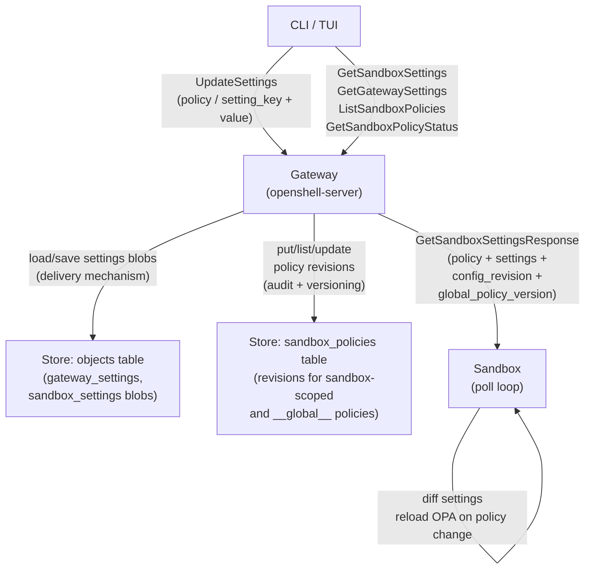
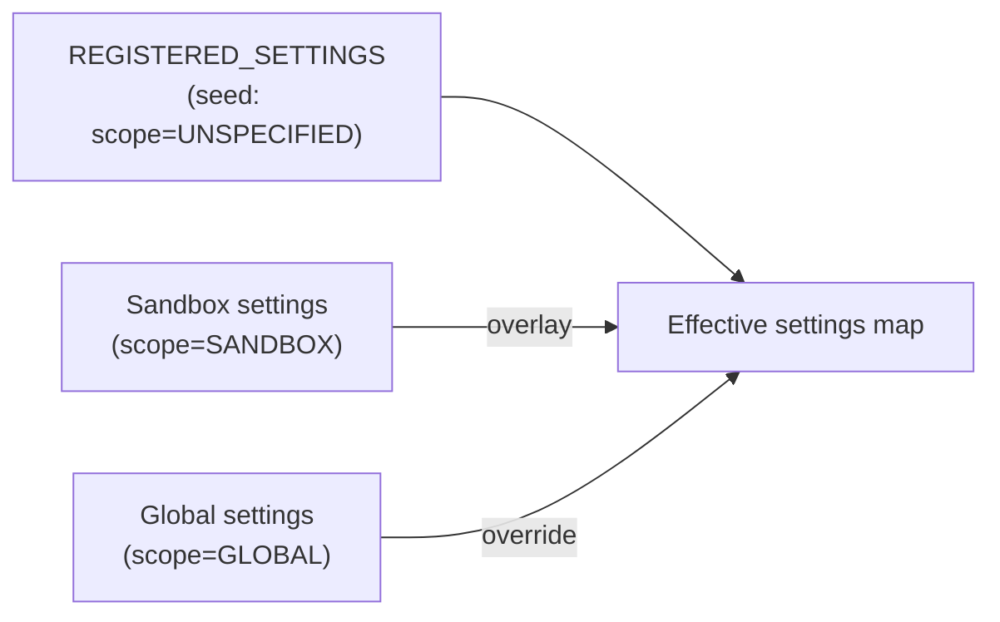
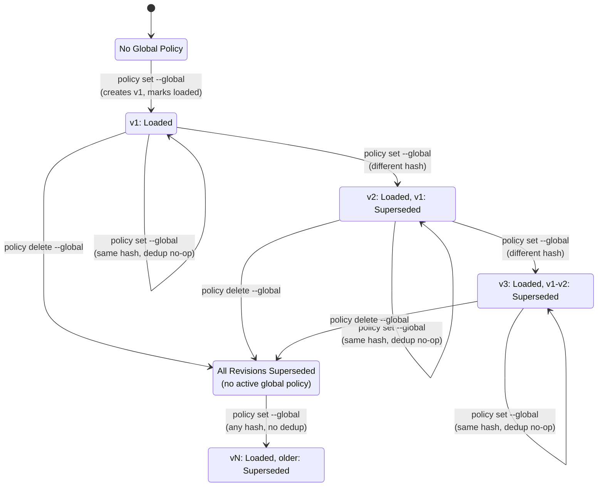
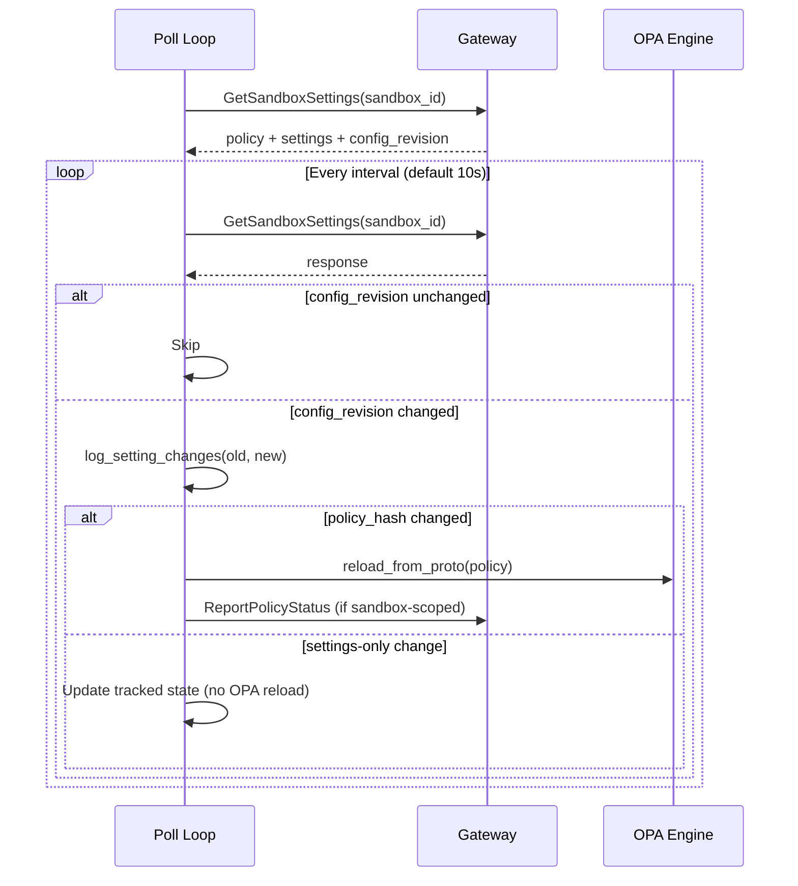

# Gateway Settings Channel

## Overview

The settings channel provides a two-tier key-value configuration system that the gateway delivers to sandboxes alongside policy. Settings are runtime-mutable name-value pairs (e.g., `log_level`, feature flags) that flow from the gateway to sandboxes through the existing `GetSandboxSettings` poll loop. The system supports two scopes -- sandbox-level and global -- with a deterministic merge strategy and per-key mutual exclusion to prevent conflicting ownership.

## Architecture



## Settings Registry

**File:** `crates/openshell-core/src/settings.rs`

The `REGISTERED_SETTINGS` static array defines the allowed setting keys and their value types. The registry is the source of truth for both client-side validation (CLI, TUI) and server-side enforcement.

```rust
pub const REGISTERED_SETTINGS: &[RegisteredSetting] = &[
    RegisteredSetting { key: "log_level", kind: SettingValueKind::String },
    RegisteredSetting { key: "dummy_int", kind: SettingValueKind::Int },
    RegisteredSetting { key: "dummy_bool", kind: SettingValueKind::Bool },
];
```

| Type | Proto variant | Description |
|------|---------------|-------------|
| `String` | `SettingValue.string_value` | Arbitrary UTF-8 string |
| `Int` | `SettingValue.int_value` | 64-bit signed integer |
| `Bool` | `SettingValue.bool_value` | Boolean; CLI accepts `true/false/yes/no/1/0/on/off` via `parse_bool_like()` |

The reserved key `policy` is excluded from the registry. It is handled by dedicated policy commands and stored as a hex-encoded protobuf `SandboxPolicy` in the global settings' `Bytes` variant. Attempts to set or delete the `policy` key through settings commands are rejected.

Helper functions:
- `setting_for_key(key)` -- look up a `RegisteredSetting` by name, returns `None` for unknown keys
- `registered_keys_csv()` -- comma-separated list of valid keys for error messages
- `parse_bool_like(raw)` -- flexible bool parsing from CLI string input

## Proto Layer

**File:** `proto/sandbox.proto`

### New Message Types

| Message | Fields | Purpose |
|---------|--------|---------|
| `SettingValue` | `oneof value { string_value, bool_value, int_value, bytes_value }` | Type-aware setting value |
| `EffectiveSetting` | `SettingValue value`, `SettingScope scope` | A resolved setting with its controlling scope |
| `SettingScope` enum | `UNSPECIFIED`, `SANDBOX`, `GLOBAL` | Which tier controls the current value |
| `PolicySource` enum | `UNSPECIFIED`, `SANDBOX`, `GLOBAL` | Origin of the policy in a settings response |

### New RPCs

**File:** `proto/openshell.proto`

| RPC | Request | Response | Called by |
|-----|---------|----------|-----------|
| `GetSandboxSettings` | `GetSandboxSettingsRequest { sandbox_id }` | `GetSandboxSettingsResponse { policy, version, policy_hash, settings, config_revision, policy_source, global_policy_version }` | Sandbox poll loop, CLI `settings get` |
| `GetGatewaySettings` | `GetGatewaySettingsRequest {}` | `GetGatewaySettingsResponse { settings, settings_revision }` | CLI `settings get --global`, TUI dashboard |

### `UpdateSettingsRequest`

The `UpdateSettings` RPC multiplexes policy and setting mutations through a single request message:

| Field | Type | Description |
|-------|------|-------------|
| `setting_key` | `string` | Key to mutate (mutually exclusive with `policy` payload) |
| `setting_value` | `SettingValue` | Value to set (for upsert operations) |
| `delete_setting` | `bool` | Delete the key from the specified scope |
| `global` | `bool` | Target gateway-global scope instead of sandbox scope |

Validation rules:
- `policy` and `setting_key` cannot both be present
- At least one of `policy` or `setting_key` must be present
- `delete_setting` cannot be combined with a `policy` payload
- The reserved `policy` key requires the `policy` field (not `setting_key`) for set operations
- `name` is required for sandbox-scoped updates but not for global updates

## Server Implementation

**File:** `crates/openshell-server/src/grpc.rs`

### Storage Model

The settings channel uses two storage mechanisms: the `objects` table for settings blobs (fast delivery) and the `sandbox_policies` table for versioned policy revisions (audit/history).

#### Settings blobs (`objects` table)

Settings are persisted using the existing generic `objects` table with two object types:

| Object type string | Record ID | Record name | Purpose |
|--------------------|-----------|-------------|---------|
| `gateway_settings` | `"global"` | `"global"` | Singleton global settings (includes reserved `policy` key for delivery) |
| `sandbox_settings` | `"settings:{sandbox_uuid}"` | sandbox name | Per-sandbox settings |

The sandbox settings ID is prefixed with `settings:` to avoid a primary key collision with the sandbox's own record in the `objects` table. The `sandbox_settings_id()` function computes this key.

The payload is a JSON-encoded `StoredSettings` struct:

```rust
struct StoredSettings {
    revision: u64,                                   // Monotonically increasing
    settings: BTreeMap<String, StoredSettingValue>,   // Sorted for determinism
}

enum StoredSettingValue {
    String(String),
    Bool(bool),
    Int(i64),
    Bytes(String),  // Hex-encoded binary (used for global policy)
}
```

#### Policy revisions (`sandbox_policies` table)

Global policy revisions are stored in the `sandbox_policies` table using the sentinel `sandbox_id = "__global__"` (`GLOBAL_POLICY_SANDBOX_ID` constant). This reuses the same schema as sandbox-scoped policy revisions:

| Column | Type | Description |
|--------|------|-------------|
| `id` | `TEXT` | UUID primary key |
| `sandbox_id` | `TEXT` | `"__global__"` for global revisions, sandbox UUID for sandbox-scoped |
| `version` | `INTEGER` | Monotonically increasing per `sandbox_id` |
| `policy_payload` | `BLOB` | Protobuf-encoded `SandboxPolicy` |
| `policy_hash` | `TEXT` | Deterministic SHA-256 hash of the policy |
| `status` | `TEXT` | `pending`, `loaded`, `failed`, or `superseded` |
| `load_error` | `TEXT` | Error message (populated on `failed` status) |
| `created_at_ms` | `INTEGER` | Epoch milliseconds when the revision was created |
| `loaded_at_ms` | `INTEGER` | Epoch milliseconds when the revision was marked loaded |

The `sandbox_policies` table provides history and audit trail (queried by `policy list --global` and `policy get --global`). The `gateway_settings` blob's `policy` key is the authoritative source that `GetSandboxSettings` reads for fast poll resolution. Both are written on `policy set --global` -- this dual-write is intentional.

### Two-Tier Resolution (`merge_effective_settings`)

The `GetSandboxSettings` handler resolves the effective settings map by merging sandbox and global tiers:

1. **Seed registered keys**: All keys from `REGISTERED_SETTINGS` are inserted with `scope: UNSPECIFIED` and `value: None`. This ensures registered keys always appear in the response even when unset.
2. **Apply sandbox values**: Sandbox-scoped settings overlay the registered defaults. Scope becomes `SANDBOX`.
3. **Apply global values**: Global settings override sandbox values. Scope becomes `GLOBAL`.
4. **Exclude reserved keys**: The `policy` key is excluded from the merged settings map (it is delivered as the top-level `policy` field in the response).



### Global Policy as a Setting

The reserved `policy` key in global settings stores a hex-encoded protobuf `SandboxPolicy`. When present, `GetSandboxSettings` uses the global policy instead of the sandbox's own policy:

1. `decode_policy_from_global_settings()` checks for the `policy` key in global settings
2. If present, the global policy replaces the sandbox policy in the response
3. `policy_source` is set to `GLOBAL`
4. The sandbox policy version counter is preserved for status APIs
5. The `global_policy_version` field is populated from the latest `__global__` revision in the `sandbox_policies` table

This allows operators to push a single policy that applies to all sandboxes via `openshell policy set --global --policy FILE`.

### Global Policy Lifecycle

Global policies are versioned through a full revision lifecycle stored alongside sandbox policies. The sentinel `sandbox_id = "__global__"` (constant `GLOBAL_POLICY_SANDBOX_ID`) distinguishes global revisions from sandbox-scoped revisions in the same `sandbox_policies` table.

#### State Machine



#### Key behaviors

- **Dedup on set**: When the latest global revision has status `loaded` and its hash matches the submitted policy, no new revision is created. The settings blob is still ensured to have the `policy` key (reconciliation against potential data loss from a pod restart while the `sandbox_policies` table retained the revision). See `crates/openshell-server/src/grpc.rs` -- `update_settings()`, lines around the `current.policy_hash == hash && current.status == "loaded"` check.

- **No dedup against superseded**: If the latest revision has status `superseded` (e.g., after a `policy delete --global`), the same hash creates a new revision. This supports the toggle pattern: delete the global policy, then re-set the same policy. The dedup check explicitly requires `status == "loaded"`.

- **Immediate load**: Global policy revisions are marked `loaded` immediately upon creation (no sandbox confirmation needed). The gateway calls `update_policy_status(GLOBAL_POLICY_SANDBOX_ID, next_version, "loaded", ...)` right after `put_policy_revision()`. Sandboxes pick up changes via the 10-second poll loop.

- **Supersede on set**: When a new global revision is created, `supersede_older_policies(GLOBAL_POLICY_SANDBOX_ID, next_version)` marks all older revisions with `pending` or `loaded` status as `superseded`.

- **Delete supersedes all**: `policy delete --global` removes the `policy` key from the `gateway_settings` blob and calls `supersede_older_policies()` with `latest.version + 1` to mark ALL `__global__` revisions as `superseded`. This restores sandbox-level policy control.

- **Dual-write**: `policy set --global` writes to BOTH the `sandbox_policies` revision table (for audit/listing via `policy list --global`) AND the `gateway_settings` blob (for fast delivery via `GetSandboxSettings`). The revision table provides history; the settings blob is the authoritative source that sandboxes poll.

- **Concurrency**: All global mutations acquire `ServerState.settings_mutex` (a `tokio::sync::Mutex<()>`) for the duration of the read-modify-write cycle. This prevents races between concurrent global policy set/delete operations and global setting mutations.

#### Global policy effects on sandboxes

When a global policy is active (the `policy` key exists in `gateway_settings`):

| Operation | Effect |
|-----------|--------|
| `GetSandboxSettings` | Returns the global policy payload instead of the sandbox's own policy. `policy_source = GLOBAL`. `global_policy_version` set to the active revision's version number. |
| `policy set <sandbox>` | Rejected with `FailedPrecondition: "policy is managed globally; delete global policy before sandbox policy update"` |
| `rule approve <chunk>` | Rejected with `FailedPrecondition: "cannot approve rules while a global policy is active; delete the global policy to manage per-sandbox rules"` |
| `rule approve-all` | Rejected with same `FailedPrecondition` as `rule approve` |
| Revoking an approved chunk (via `rule reject` on an `approved` chunk) | Rejected with same `FailedPrecondition` -- revoking would modify the sandbox policy which is not in use |
| Rejecting a `pending` chunk | Allowed -- rejection does not modify the sandbox policy |
| `settings set/delete` at sandbox scope | Allowed -- settings and policy are independent channels |
| Draft chunk collection | Continues normally -- sandbox proxy still generates proposals. Chunks are visible but cannot be approved. |

The blocking logic is implemented by `require_no_global_policy()` in `crates/openshell-server/src/grpc.rs`, which checks for the `policy` key in global settings and returns `FailedPrecondition` if present.

### `config_revision` and `global_policy_version`

**`config_revision`** (`u64`): Content hash of the merged effective config. Computed by `compute_config_revision()` from three inputs: `policy_source` (as 4 LE bytes), the deterministic policy hash (if policy present), and sorted settings entries (key bytes + scope as 4 LE bytes + type tag byte + value bytes). The SHA-256 digest is truncated to 8 bytes and interpreted as `u64` (little-endian). Changes when the global policy, sandbox policy, settings, or policy source changes. Used by the sandbox poll loop for change detection.

**`global_policy_version`** (`u32`): The version number of the active global policy revision. Populated in `GetSandboxSettingsResponse` when `policy_source == GLOBAL` by looking up the latest revision for `GLOBAL_POLICY_SANDBOX_ID`. Zero when no global policy is active or when `policy_source == SANDBOX`. Displayed in the TUI dashboard and sandbox metadata pane, and logged by the sandbox on reload.

### Per-Key Mutual Exclusion

Global and sandbox scopes cannot both control the same key simultaneously:

| Operation | Global key exists | Behavior |
|-----------|-------------------|----------|
| Sandbox set | Yes | `FailedPrecondition`: "setting '{key}' is managed globally; delete the global setting before sandbox update" |
| Sandbox delete | Yes | `FailedPrecondition`: "setting '{key}' is managed globally; delete the global setting first" |
| Sandbox set | No | Allowed |
| Sandbox delete | No | Allowed |
| Global set | (any) | Always allowed (global overrides) |
| Global delete | (any) | Allowed; unlocks sandbox control for the key |

This prevents conflicting values at different scopes. An operator must delete a global key before a sandbox-level value can be set for the same key.

### Sandbox-Scoped Policy Update Interaction

When a global policy is set, sandbox-scoped policy updates via `UpdateSettings` are rejected with `FailedPrecondition`:

```
policy is managed globally; delete global policy before sandbox policy update
```

Deleting the global policy (`openshell policy delete --global`) removes the `policy` key from global settings and restores sandbox-level policy control.

## Sandbox Implementation

### Poll Loop Changes

**File:** `crates/openshell-sandbox/src/lib.rs` (`run_policy_poll_loop`)

The poll loop uses `GetSandboxSettings` (not a policy-specific RPC) and tracks `config_revision` as the change-detection signal:

1. **Fetch initial state**: Call `poll_settings(sandbox_id)` to establish baseline `current_config_revision`, `current_policy_hash`, and `current_settings`.
2. **On each tick**: Compare `result.config_revision` against `current_config_revision`. If unchanged, skip.
3. **Determine what changed**:
   - Compare `result.policy_hash` against `current_policy_hash` to detect policy changes
   - Call `log_setting_changes()` to diff the settings map and log individual changes
4. **Conditional OPA reload**: Only call `opa_engine.reload_from_proto()` when `policy_hash` changes. Settings-only changes update the tracked state without touching the OPA engine.
5. **Status reporting**: Report policy load status only for sandbox-scoped revisions (`policy_source == SANDBOX` and `version > 0`). Global policy overrides trigger a reload but do not write per-sandbox policy status history.



### Per-Setting Diff Logging

**File:** `crates/openshell-sandbox/src/lib.rs` (`log_setting_changes`)

When `config_revision` changes, the sandbox logs each individual setting change:

- **Changed**: `info!(key, old, new, "Setting changed")` -- logs old and new values
- **Added**: `info!(key, value, "Setting added")` -- new key not in previous snapshot
- **Removed**: `info!(key, "Setting removed")` -- key in previous snapshot but not in new

Values are formatted by `format_setting_value()`: strings as-is, bools and ints as their string representation, bytes as `<bytes>`, unset as `<unset>`.

### `SettingsPollResult`

**File:** `crates/openshell-sandbox/src/grpc_client.rs`

```rust
pub struct SettingsPollResult {
    pub policy: Option<ProtoSandboxPolicy>,
    pub version: u32,
    pub policy_hash: String,
    pub config_revision: u64,
    pub policy_source: PolicySource,
    pub settings: HashMap<String, EffectiveSetting>,
    pub global_policy_version: u32,
}
```

The `poll_settings()` method maps the full `GetSandboxSettingsResponse` into this struct. The `settings` field carries the effective settings map for diff logging. The `global_policy_version` field is propagated from the response and used for logging when the sandbox reloads a global policy.

## CLI Commands

**File:** `crates/openshell-cli/src/main.rs` (`SettingsCommands`), `crates/openshell-cli/src/run.rs`

### `settings get [name] [--global]`

Display effective settings for a sandbox or the gateway-global scope.

```bash
# Sandbox-scoped effective settings
openshell settings get my-sandbox

# Gateway-global settings
openshell settings get --global
```

Sandbox output includes: sandbox name, config revision, policy source (sandbox/global), policy hash, and a table of settings with key, value, and scope (sandbox/global/unset).

Global output includes: scope label, settings revision, and a table of settings with key and value. Registered keys without a configured value display as `<unset>`.

### `settings set [name] --key K --value V [--global] [--yes]`

Set a single setting key at sandbox or global scope.

```bash
# Sandbox-scoped
openshell settings set my-sandbox --key log_level --value debug

# Global (requires confirmation)
openshell settings set --global --key log_level --value warn
openshell settings set --global --key dummy_bool --value yes
openshell settings set --global --key dummy_int --value 42

# Skip confirmation
openshell settings set --global --key log_level --value info --yes
```

Value parsing is type-aware: bool keys accept `true/false/yes/no/1/0/on/off` via `parse_bool_like()`. Int keys parse as base-10 `i64`. String keys accept any value.

### `settings delete [name] --key K [--global] [--yes]`

Delete a setting key from the specified scope.

```bash
# Global delete (unlocks sandbox control)
openshell settings delete --global --key log_level --yes
```

### `policy set --global --policy FILE [--yes]`

Set a gateway-global policy that overrides all sandbox policies. Creates a versioned revision in the `sandbox_policies` table and writes the policy to the `gateway_settings` blob for delivery.

```bash
openshell policy set --global --policy policy.yaml --yes
```

The `--wait` flag is rejected for global policy updates with: `"--wait is not supported for global policies; global policies are effective immediately"`. See `crates/openshell-cli/src/main.rs`.

### `policy delete --global [--yes]`

Delete the gateway-global policy, restoring sandbox-level policy control. Removes the `policy` key from the `gateway_settings` blob and supersedes all `__global__` revisions.

```bash
openshell policy delete --global --yes
```

Note: `policy delete` without `--global` is not supported (sandbox policies are managed through versioned updates, not deletion). The CLI returns: `"sandbox policy delete is not supported; use --global to remove global policy lock"`.

### `policy list --global [--limit N]`

List global policy revision history. Uses `ListSandboxPolicies` with `global: true`, which routes to the `__global__` sentinel in the `sandbox_policies` table.

```bash
openshell policy list --global
openshell policy list --global --limit 10
```

### `policy get --global [--rev N] [--full]`

Show a specific global policy revision (or the latest). Uses `GetSandboxPolicyStatus` with `global: true`.

```bash
# Latest global revision
openshell policy get --global

# Specific version
openshell policy get --global --rev 3

# Full policy payload as YAML
openshell policy get --global --full
```

### HITL Confirmation

All `--global` mutations require human-in-the-loop confirmation via an interactive prompt. The `--yes` flag bypasses the prompt for scripted/CI usage. In non-interactive mode (no TTY), `--yes` is required -- otherwise the command fails with an error.

The confirmation message varies:
- **Global setting set**: warns that this will override sandbox-level values for the key
- **Global setting delete**: warns that this re-enables sandbox-level management
- **Global policy set**: warns that this overrides all sandbox policies
- **Global policy delete**: warns that this restores sandbox-level control

## TUI Integration

**File:** `crates/openshell-tui/src/`

### Dashboard: Global Policy Indicator

**File:** `crates/openshell-tui/src/ui/dashboard.rs`

The gateway row in the dashboard shows a yellow `Global Policy Active (vN)` indicator when a global policy is active. The TUI detects this by calling `ListSandboxPolicies` with `global: true, limit: 1` on each polling tick and checking if the latest revision has `PolicyStatus::Loaded`. The version number and active flag are tracked in `App.global_policy_active` and `App.global_policy_version`.

### Dashboard: Global Settings Tab

The dashboard's middle pane has a tabbed interface: **Providers** | **Global Settings**. Press `Tab` to switch.

The Global Settings tab displays registered keys with their current values, fetched via `GetGatewaySettings`. Features:

- **Navigate**: `j`/`k` or arrow keys to select a setting
- **Edit** (`Enter`): Opens a type-aware editor:
  - Bool keys: toggle between true/false
  - String/Int keys: text input field
- **Delete** (`d`): Remove the selected key's value
- **Confirmation modals**: Both edit and delete operations show a confirmation dialog before applying
- **Scope indicators**: Each key shows its current value or `<unset>`

### Sandbox Metadata Pane: Global Policy Indicator

**File:** `crates/openshell-tui/src/ui/sandbox_detail.rs`

When the sandbox's policy source is `GLOBAL` (detected via `policy_source` in the `GetSandboxSettings` response), the metadata pane shows `Policy: managed globally (vN)` in yellow. The version comes from `global_policy_version` in the response. Tracked in `App.sandbox_policy_is_global` and `App.sandbox_global_policy_version`.

### Network Rules Pane: Global Policy Warning

**File:** `crates/openshell-tui/src/ui/sandbox_draft.rs`

When `sandbox_policy_is_global` is true, the Network Rules pane displays a yellow bottom title: `" Cannot approve rules while global policy is active "`. Draft chunks are still rendered but their status styles are greyed out (`t.muted`). Keyboard actions for approve (`a`), reject/revoke (`x`), and approve-all are intercepted client-side with status messages like `"Cannot approve rules while a global policy is active"` and `"Cannot modify rules while a global policy is active"`. See `crates/openshell-tui/src/app.rs` -- draft key handling.

### Sandbox Screen: Settings Tab

The sandbox detail view's bottom pane has a tabbed interface: **Policy** | **Settings**. Press `l` to switch tabs.

The Settings tab shows effective settings for the selected sandbox, fetched as part of the `GetSandboxSettings` response. Features:

- Same navigation and editing as the global settings tab
- **Scope indicators**: Each key shows `(sandbox)`, `(global)`, or `(unset)` to indicate the controlling tier
- Sandbox-scoped edits are blocked for globally-managed keys (server returns `FailedPrecondition`)

### Data Refresh

Settings are refreshed on each 2-second polling tick alongside the sandbox list and health status. The global settings revision is tracked to detect changes. Sandbox settings are refreshed when viewing a specific sandbox. Global policy active status is detected on each tick via `ListSandboxPolicies` with `global: true`.

## Data Flow: Setting a Global Key

End-to-end trace for `openshell settings set --global --key log_level --value debug --yes`:

1. **CLI** (`crates/openshell-cli/src/run.rs` -- `gateway_setting_set()`):
   - `parse_cli_setting_value("log_level", "debug")` -- looks up `SettingValueKind::String` in the registry, wraps as `SettingValue { string_value: "debug" }`
   - `confirm_global_setting_takeover()` -- skipped because `--yes`
   - Sends `UpdateSettingsRequest { setting_key: "log_level", setting_value: Some(...), global: true }`

2. **Gateway** (`crates/openshell-server/src/grpc.rs` -- `update_settings()`):
   - Acquires `settings_mutex` for the duration of the operation
   - Detects `global=true`, `has_setting=true`
   - `validate_registered_setting_key("log_level")` -- passes (key is in registry)
   - `load_global_settings()` -- reads `gateway_settings` record from store
   - `proto_setting_to_stored()` -- converts proto value to `StoredSettingValue::String("debug")`
   - `upsert_setting_value()` -- inserts into `BTreeMap`, returns `true` (changed)
   - Increments `revision`, calls `save_global_settings()`
   - Returns `UpdateSettingsResponse { settings_revision: N }`

3. **Sandbox** (next poll tick in `run_policy_poll_loop()`):
   - `poll_settings(sandbox_id)` returns new `config_revision`
   - `log_setting_changes()` logs: `Setting changed key="log_level" old="<unset>" new="debug"`
   - `policy_hash` unchanged -- no OPA reload
   - Updates tracked `current_config_revision` and `current_settings`

## Data Flow: Setting a Global Policy

End-to-end trace for `openshell policy set --global --policy policy.yaml --yes`:

1. **CLI** (`crates/openshell-cli/src/main.rs`, `crates/openshell-cli/src/run.rs` -- `sandbox_policy_set_global()`):
   - Rejects `--wait` flag with `"--wait is not supported for global policies; global policies are effective immediately"`
   - Loads and parses the YAML policy file into a `SandboxPolicy` protobuf
   - Sends `UpdateSettingsRequest { policy: Some(sandbox_policy), global: true }`

2. **Gateway** (`crates/openshell-server/src/grpc.rs` -- `update_settings()`):
   - Acquires `settings_mutex`
   - Detects `global=true`, `has_policy=true`
   - `ensure_sandbox_process_identity()` -- ensures process identity defaults to "sandbox"
   - `validate_policy_safety()` -- rejects unsafe policies (e.g., root process)
   - `deterministic_policy_hash()` -- computes SHA-256 hash of the policy
   - **Dedup check**: Fetches `get_latest_policy(GLOBAL_POLICY_SANDBOX_ID)`
     - If latest exists with `status == "loaded"` and same hash → no-op (ensures settings blob has `policy` key, returns existing version)
     - If no latest, or latest is `superseded`, or hash differs → create new revision
   - `put_policy_revision(id, "__global__", next_version, payload, hash)` -- persists revision
   - `update_policy_status("__global__", next_version, "loaded")` -- marks loaded immediately
   - `supersede_older_policies("__global__", next_version)` -- marks all older revisions as superseded
   - Stores hex-encoded payload in `gateway_settings` blob under `policy` key via `upsert_setting_value()`
   - Returns `UpdateSettingsResponse { version: N, policy_hash: "..." }`

3. **Sandbox** (next poll tick, ~10 seconds):
   - `poll_settings(sandbox_id)` returns response with `policy_source: GLOBAL`, `global_policy_version: N`
   - `config_revision` changed → enters change processing
   - `policy_hash` changed → calls `opa_engine.reload_from_proto(global_policy)`
   - Logs `"Policy reloaded successfully (global)"` with `global_version=N`
   - Does NOT call `ReportPolicyStatus` (global policies skip per-sandbox status reporting)

## Cross-References

- [Gateway Architecture](gateway.md) -- Persistence layer, gRPC service, object types
- [Sandbox Architecture](sandbox.md) -- Poll loop, `CachedOpenShellClient`, OPA reload lifecycle
- [Policy Language](security-policy.md) -- Live policy updates, global policy CLI commands
- [TUI](tui.md) -- Settings tabs in dashboard and sandbox views
