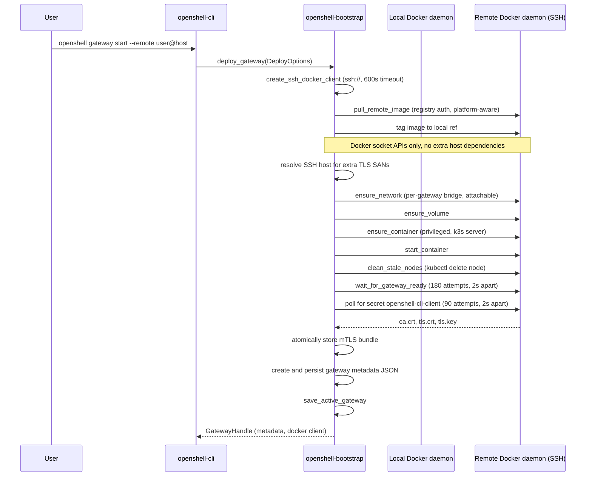
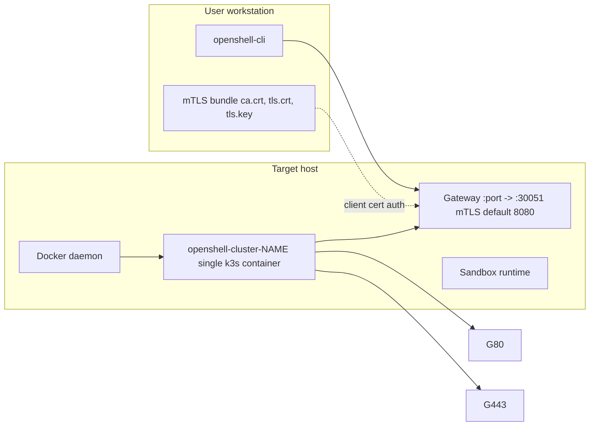
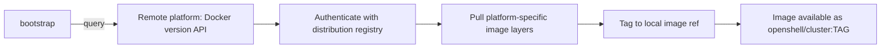

# Gateway Bootstrap Architecture

This document describes how OpenShell bootstraps a single-node k3s gateway inside a Docker container, for both local and remote (SSH) targets.

## Goals and Scope

- Provide a single bootstrap flow through `openshell-bootstrap` for local and remote gateway lifecycle.
- Keep Docker as the only runtime dependency for provisioning and lifecycle operations.
- Package the OpenShell gateway as one container image, transferred to the target host via registry pull.
- Support idempotent `deploy` behavior (safe to re-run).
- Persist gateway access artifacts (metadata, mTLS certs) in the local XDG config directory.
- Track the active gateway so most CLI commands resolve their target automatically.

Out of scope:

- Multi-node orchestration.

## Components

- `crates/openshell-cli/src/main.rs`: CLI entry point; `clap`-based command parsing.
- `crates/openshell-cli/src/run.rs`: CLI command implementations (`gateway_start`, `gateway_stop`, `gateway_destroy`, `gateway_info`, `doctor_logs`).
- `crates/openshell-cli/src/bootstrap.rs`: Auto-bootstrap helpers for `sandbox create` (offers to deploy a gateway when one is unreachable).
- `crates/openshell-bootstrap/src/lib.rs`: Gateway lifecycle orchestration (`deploy_gateway`, `deploy_gateway_with_logs`, `gateway_handle`, `check_existing_deployment`).
- `crates/openshell-bootstrap/src/docker.rs`: Docker API wrappers (per-gateway network, volume, container, image operations).
- `crates/openshell-bootstrap/src/image.rs`: Remote image registry pull with XOR-obfuscated distribution credentials.
- `crates/openshell-bootstrap/src/runtime.rs`: In-container operations via `docker exec` (health polling, stale node cleanup, deployment restart).
- `crates/openshell-bootstrap/src/metadata.rs`: Gateway metadata creation, storage, and active gateway tracking.
- `crates/openshell-bootstrap/src/mtls.rs`: Gateway TLS detection and CLI mTLS bundle extraction.
- `crates/openshell-bootstrap/src/push.rs`: Local development image push into k3s containerd.
- `crates/openshell-bootstrap/src/paths.rs`: XDG path resolution.
- `crates/openshell-bootstrap/src/constants.rs`: Shared constants (image name, container/volume/network naming).
- `deploy/docker/Dockerfile.images` (target `cluster`): Container image definition (k3s base + Helm charts + manifests + entrypoint).
- `deploy/docker/cluster-entrypoint.sh`: Container entrypoint (DNS proxy, registry config, manifest injection).
- `deploy/docker/cluster-healthcheck.sh`: Docker HEALTHCHECK script.
- Docker daemon(s):
  - Local daemon for local deploys.
  - Remote daemon over SSH for remote deploy container operations.

## CLI Commands

All gateway lifecycle commands live under `openshell gateway`:

| Command | Description |
|---|---|
| `openshell gateway start [--name NAME] [--remote user@host] [--ssh-key PATH]` | Provision or update a gateway |
| `openshell gateway stop [--name NAME] [--remote user@host]` | Stop the container (preserves state) |
| `openshell gateway destroy [--name NAME] [--remote user@host]` | Destroy container, attached volumes, per-gateway network, and metadata |
| `openshell gateway info [--name NAME]` | Show deployment details (endpoint, SSH host) |
| `openshell status` | Show gateway health via gRPC/HTTP |
| `openshell doctor logs [--name NAME] [--remote user@host] [--tail N]` | Fetch gateway container logs |
| `openshell doctor exec [--name NAME] [--remote user@host] -- <command>` | Run a command inside the gateway container |
| `openshell gateway select <name>` | Set the active gateway |
| `openshell gateway select` | Open an interactive chooser on a TTY, or list all gateways in non-interactive mode |

The `--name` flag defaults to `"openshell"`. When omitted on commands that accept it, the CLI resolves the active gateway via: `--gateway` flag, then `OPENSHELL_GATEWAY` env, then `~/.config/openshell/active_gateway` file.

For remote dev/test deploys from a local checkout, `scripts/remote-deploy.sh`
wraps a different workflow: it rsyncs the repository to a remote host, builds
the release CLI plus cluster/server/sandbox images on that machine, and then
invokes `openshell gateway start` with explicit flags such as `--recreate`,
`--plaintext`, or `--disable-gateway-auth` only when requested.

## Local Task Flows (`mise`)

Development task entrypoints split bootstrap behavior:

| Task | Behavior |
|---|---|
| `mise run cluster` | Bootstrap or incremental deploy: creates gateway if needed (fast recreate), then detects changed files and rebuilds/pushes only impacted components |

For `mise run cluster`, `.env` acts as local source-of-truth for `GATEWAY_NAME`, `GATEWAY_PORT`, and `OPENSHELL_GATEWAY`. Missing keys are appended; existing values are preserved. If `GATEWAY_PORT` is missing, the task selects a free local port and persists it.
Fast mode ensures a local registry (`127.0.0.1:5000`) is running and configures k3s to mirror pulls via `host.docker.internal:5000`, so the cluster task can push/pull local component images consistently.

## Bootstrap Sequence Diagram



## End-State Connectivity Diagram



## Deploy Flow

### 1) Entry and client selection

`deploy_gateway(DeployOptions)` in `crates/openshell-bootstrap/src/lib.rs` chooses execution mode:

- `DeployOptions` fields: `name: String`, `image_ref: Option<String>`, `remote: Option<RemoteOptions>`, `port: u16` (default 8080).
- `RemoteOptions` fields: `destination: String`, `ssh_key: Option<String>`.
- **Local deploy**: Create one Docker client with `Docker::connect_with_local_defaults()`.
- **Remote deploy**: Create SSH Docker client via `Docker::connect_with_ssh()` with a 600-second timeout (for large image transfers). The destination is prefixed with `ssh://` if not already present.

The `deploy_gateway_with_logs` variant accepts an `FnMut(String)` callback for progress reporting. The CLI wraps this in a `GatewayDeployLogPanel` for interactive terminals.

**Pre-deploy check** (CLI layer in `gateway_start`): In interactive terminals, `check_existing_deployment` inspects whether a container or volume already exists. If found, the user is prompted to destroy and recreate or reuse the existing gateway.

### 2) Image readiness

Image ref resolution in `default_gateway_image_ref()`:

1. If `OPENSHELL_CLUSTER_IMAGE` is set and non-empty, use it verbatim.
2. Otherwise, use the published distribution image base (`<distribution-registry>/openshell/cluster`) with its default tag behavior.

- **Local deploy**: `ensure_image()` inspects the image on the local daemon and pulls from the configured registry if missing (using built-in distribution credentials when pulling from the default distribution host).
- **Remote deploy**: `pull_remote_image()` queries the remote daemon's architecture via `Docker::version()`, pulls the matching platform variant from the distribution registry (with XOR-decoded credentials), and tags the pulled image to the expected local ref (for example `openshell/cluster:dev` when an explicit local tag is requested).

### 3) Runtime infrastructure

For the target daemon (local or remote):

1. **Ensure bridge network** `openshell-cluster-{name}` (attachable, bridge driver) via `ensure_network()`. Each gateway gets its own isolated Docker network.
2. **Ensure volume** `openshell-cluster-{name}` via `ensure_volume()`.
3. **Compute extra TLS SANs**:
   - For **local deploys**: Check `DOCKER_HOST` for a non-loopback `tcp://` endpoint (e.g., `tcp://docker:2375` in CI). If found, extract the host as an extra SAN. The function `local_gateway_host_from_docker_host()` skips `localhost`, `127.0.0.1`, and `::1`.
   - For **remote deploys**: Extract the host from the SSH destination (handles `user@host`, `ssh://user@host`), resolve via `ssh -G` to get the canonical hostname/IP. Include both the resolved host and original SSH host (if different) as extra SANs.
4. **Ensure container** `openshell-cluster-{name}` via `ensure_container()`:
   - k3s server command: `server --disable=traefik --tls-san=127.0.0.1 --tls-san=localhost --tls-san=host.docker.internal` plus computed extra SANs.
   - Privileged mode.
   - Volume bind mount: `openshell-cluster-{name}:/var/lib/rancher/k3s`.
    - Network: `openshell-cluster-{name}` (per-gateway bridge network).
   - Extra host: `host.docker.internal:host-gateway`.
   - The cluster entrypoint prefers the resolved IPv4 for `host.docker.internal` when populating sandbox pod `hostAliases`, then falls back to the container default gateway. This keeps sandbox host aliases working on Docker Desktop, where the host-reachable IP differs from the bridge gateway.
   - Port mappings:

      | Container Port | Host Port | Purpose |
      |---|---|---|
      | 30051/tcp | configurable (default 8080) | OpenShell service NodePort (mTLS) |

   - Container environment variables (see [Container Environment Variables](#container-environment-variables) below).
   - If the container exists with a different image ID (compared by inspecting the content-addressable ID), it is stopped, force-removed, and recreated. If the image matches, the existing container is reused.
5. **Start container** via `start_container()`. Tolerates already-running 409 conflict.

### 4) Readiness and artifact extraction

After the container starts:

1. **Clean stale nodes**: `clean_stale_nodes()` finds nodes whose name does not match the deterministic k3s `--node-name` and deletes them. That node name is derived from the gateway name but normalized to a Kubernetes-safe lowercase form so existing gateway names that contain `_`, `.`, or uppercase characters still produce a valid node identity. This cleanup is needed when a container is recreated but reuses the persistent volume -- old node entries can persist in etcd. Non-fatal on error; returns the count of removed nodes.
2. **Push local images** (optional, local deploy only): If `OPENSHELL_PUSH_IMAGES` is set, the comma-separated image refs are exported from the local Docker daemon as a single tar, uploaded into the container via `docker put_archive`, and imported into containerd via `ctr images import` in the `k8s.io` namespace. After import, `kubectl rollout restart deployment/openshell openshell` is run, followed by `kubectl rollout status --timeout=180s` to wait for completion. See `crates/openshell-bootstrap/src/push.rs`.
3. **Wait for gateway health**: `wait_for_gateway_ready()` polls the Docker HEALTHCHECK status up to 180 times, 2 seconds apart (6 min total). A background task streams container logs during this wait. Failure modes:
    - Container exits during polling: error includes recent log lines.
    - Container has no HEALTHCHECK instruction: fails immediately.
    - HEALTHCHECK reports unhealthy on final attempt: error includes recent logs.

The gateway StatefulSet also uses a Kubernetes `startupProbe` on the gRPC port before steady-state liveness and readiness checks begin. This gives single-node k3s boots extra time to absorb early networking and flannel initialization delay without restarting the gateway pod too aggressively.

### 5) mTLS bundle capture

TLS is always required. `fetch_and_store_cli_mtls()` polls for Kubernetes secret `openshell-cli-client` in namespace `openshell` (90 attempts, 2 seconds apart, 3 min total). Each attempt checks the container is still running. The secret's base64-encoded `ca.crt`, `tls.crt`, and `tls.key` fields are decoded and stored.

Storage location: `~/.config/openshell/gateways/{name}/mtls/`

Write is atomic: write to `.tmp` directory, validate all three files are non-empty, rename existing directory to `.bak`, rename `.tmp` to final path, then remove `.bak`.

### 6) Metadata persistence

`create_gateway_metadata()` produces a `GatewayMetadata` struct:

- **Local**: endpoint `https://127.0.0.1:{port}` by default, or `https://{docker_host}:{port}` when `DOCKER_HOST` is a non-loopback `tcp://` endpoint. `is_remote=false`.
- **Remote**: endpoint `https://{resolved_host}:{port}`, `is_remote=true`, plus SSH destination and resolved host.

Metadata fields:

| Field | Type | Description |
|---|---|---|
| `name` | `String` | Gateway name |
| `gateway_endpoint` | `String` | HTTPS endpoint with port (e.g., `https://127.0.0.1:8080`) |
| `is_remote` | `bool` | Whether gateway is remote |
| `gateway_port` | `u16` | Host port mapped to the gateway NodePort |
| `remote_host` | `Option<String>` | SSH destination (e.g., `user@host`) |
| `resolved_host` | `Option<String>` | Resolved hostname/IP from `ssh -G` |

Metadata location: `~/.config/openshell/gateways/{name}_metadata.json`

Note: metadata is stored at the `gateways/` level (not nested inside `{name}/` like mTLS).

After deploy, the CLI calls `save_active_gateway(name)`, writing the gateway name to `~/.config/openshell/active_gateway`. Subsequent commands that don't specify `--gateway` or `OPENSHELL_GATEWAY` resolve to this active gateway.

## Container Image

The cluster image is defined by target `cluster` in `deploy/docker/Dockerfile.images`:

```
Base:  rancher/k3s:v1.35.2-k3s1
```

Layers added:

1. Custom entrypoint: `deploy/docker/cluster-entrypoint.sh` -> `/usr/local/bin/cluster-entrypoint.sh`
2. Healthcheck script: `deploy/docker/cluster-healthcheck.sh` -> `/usr/local/bin/cluster-healthcheck.sh`
3. Packaged Helm charts: `deploy/docker/.build/charts/*.tgz` -> `/var/lib/rancher/k3s/server/static/charts/`
4. Kubernetes manifests: `deploy/kube/manifests/*.yaml` -> `/opt/openshell/manifests/`

Bundled manifests include:
- `openshell-helmchart.yaml` (OpenShell Helm chart auto-deploy)
- `envoy-gateway-helmchart.yaml` (Envoy Gateway for Gateway API)
- `agent-sandbox.yaml`

The HEALTHCHECK is configured as: `--interval=5s --timeout=5s --start-period=20s --retries=60`.

## Entrypoint Script

`deploy/docker/cluster-entrypoint.sh` runs before k3s starts. It performs:

### DNS proxy setup

On Docker custom networks, `/etc/resolv.conf` contains `127.0.0.11` (Docker's internal DNS). k3s detects this loopback and falls back to `8.8.8.8`, which does not work on Docker Desktop. The entrypoint solves this by:

1. Discovering Docker's real DNS listener ports from the `DOCKER_OUTPUT` iptables chain.
2. Getting the container's `eth0` IP as a routable address.
3. Adding DNAT rules in PREROUTING to forward DNS from pod namespaces through to Docker's DNS.
4. Writing a custom resolv.conf pointing to the container IP.
5. Passing `--kubelet-arg=resolv-conf=/etc/rancher/k3s/resolv.conf` to k3s.

Falls back to `8.8.8.8` / `8.8.4.4` if iptables detection fails.

### Registry configuration

Writes `/etc/rancher/k3s/registries.yaml` from `REGISTRY_HOST`, `REGISTRY_ENDPOINT`, `REGISTRY_USERNAME`, `REGISTRY_PASSWORD`, and `REGISTRY_INSECURE` environment variables so that k3s/containerd can authenticate when pulling component images at runtime. When no explicit credentials are provided (the default for public GHCR repos), the auth block is omitted and images are pulled anonymously.

### Manifest injection

Copies bundled manifests from `/opt/openshell/manifests/` to `/var/lib/rancher/k3s/server/manifests/`. This is needed because the volume mount on `/var/lib/rancher/k3s` overwrites any files baked into that path at image build time.

### Image configuration overrides

When environment variables are set, the entrypoint modifies the HelmChart manifest at `/var/lib/rancher/k3s/server/manifests/openshell-helmchart.yaml`:

- `IMAGE_REPO_BASE`: Rewrites `repository:`, `sandboxImage:`, and `jobImage:` in the HelmChart.
- `PUSH_IMAGE_REFS`: In push mode, parses comma-separated image refs and rewrites the exact gateway, sandbox, and pki-job image references (matching on path component `/gateway:`, `/sandbox:`, `/pki-job:`).
- `IMAGE_TAG`: Replaces `:latest` tags with the specified tag on gateway, sandbox, and pki-job images. Handles both quoted and unquoted `tag: latest` formats.
- `IMAGE_PULL_POLICY`: Replaces `pullPolicy: Always` with the specified policy (e.g., `IfNotPresent`).
- `SSH_GATEWAY_HOST` / `SSH_GATEWAY_PORT`: Replaces `__SSH_GATEWAY_HOST__` and `__SSH_GATEWAY_PORT__` placeholders.
- `EXTRA_SANS`: Builds a YAML flow-style list from the comma-separated SANs and replaces `extraSANs: []`.

## Healthcheck Script

`deploy/docker/cluster-healthcheck.sh` validates cluster readiness through a series of checks:

1. **Kubernetes API**: `kubectl get --raw='/readyz'`
2. **OpenShell StatefulSet**: Checks that `statefulset/openshell` in namespace `openshell` exists and has 1 ready replica.
3. **Gateway**: Checks that `gateway/openshell-gateway` in namespace `openshell` has the `Programmed` condition.
4. **mTLS secret** (conditional): If `NAV_GATEWAY_TLS_ENABLED` is true (or inferred from the HelmChart manifest using the same two-path detection logic as the bootstrap code), checks that secret `openshell-cli-client` exists with non-empty `ca.crt`, `tls.crt`, and `tls.key` data.

## GPU Enablement

GPU support is part of the single-node gateway bootstrap path rather than a separate architecture.

- `openshell gateway start --gpu` threads GPU device options through `crates/openshell-cli`, `crates/openshell-bootstrap`, and `crates/openshell-bootstrap/src/docker.rs`.
- When enabled, the cluster container is created with Docker `DeviceRequests`. The injection mechanism is selected based on whether CDI is enabled on the daemon (`SystemInfo.CDISpecDirs` via `GET /info`):
  - **CDI enabled** (daemon reports non-empty `CDISpecDirs`): CDI device injection — `driver="cdi"` with `nvidia.com/gpu=all`. Specs are expected to be pre-generated on the host (e.g. automatically by the `nvidia-cdi-refresh.service` or manually via `nvidia-ctk generate`).
  - **CDI not enabled**: `--gpus all` device request — `driver="nvidia"`, `count=-1`, which relies on the NVIDIA Container Runtime hook.
- `deploy/docker/Dockerfile.images` installs NVIDIA Container Toolkit packages in a dedicated Ubuntu stage and copies the runtime binaries, config, and `libnvidia-container` shared libraries into the final Ubuntu-based cluster image.
- `deploy/docker/cluster-entrypoint.sh` checks `GPU_ENABLED=true` and copies GPU-only manifests from `/opt/openshell/gpu-manifests/` into k3s's manifests directory.
- `deploy/kube/gpu-manifests/nvidia-device-plugin-helmchart.yaml` installs the NVIDIA device plugin chart, currently pinned to `0.18.2`. NFD and GFD are disabled; the device plugin's default `nodeAffinity` (which requires `feature.node.kubernetes.io/pci-10de.present=true` or `nvidia.com/gpu.present=true` from NFD/GFD) is overridden to empty so the DaemonSet schedules on the single-node cluster without requiring those labels. The chart is configured with `deviceListStrategy: cdi-cri` so the device plugin injects devices via direct CDI device requests in the CRI.
- k3s auto-detects `nvidia-container-runtime` on `PATH`, registers the `nvidia` containerd runtime, and creates the `nvidia` `RuntimeClass` automatically.
- The OpenShell Helm chart grants the gateway service account cluster-scoped read access to `node.k8s.io/runtimeclasses` and core `nodes` so GPU sandbox admission can verify both the `nvidia` `RuntimeClass` and allocatable GPU capacity before creating a sandbox.

The runtime chain is:

```text
Host GPU drivers & NVIDIA Container Toolkit
    └─ Docker: DeviceRequests (CDI when enabled, --gpus all otherwise)
        └─ k3s/containerd: nvidia-container-runtime on PATH -> auto-detected
            └─ k8s: nvidia-device-plugin DaemonSet advertises nvidia.com/gpu
                └─ Pods: request nvidia.com/gpu in resource limits (CDI injection — no runtimeClassName needed)
```

### `--gpu` flag

The `--gpu` flag on `gateway start` enables GPU passthrough. OpenShell auto-selects CDI when enabled on the daemon and falls back to Docker's NVIDIA GPU request path (`--gpus all`) otherwise.

Device injection uses CDI (`deviceListStrategy: cdi-cri`): the device plugin injects devices via direct CDI device requests in the CRI. Sandbox pods only need `nvidia.com/gpu: 1` in their resource limits, and GPU pods do not set `runtimeClassName`.

The expected smoke test is a plain pod requesting `nvidia.com/gpu: 1` without `runtimeClassName` and running `nvidia-smi`.

## Remote Image Transfer



- Remote platform is queried via `Docker::version()` and normalized (e.g., `x86_64` -> `amd64`, `aarch64` -> `arm64`).
- Distribution registry credentials are XOR-encoded in the binary (lightweight obfuscation, not a security boundary).
- If the image ref looks local (no `/` in repository), the `latest` tag is used from the distribution registry regardless of the local `IMAGE_TAG`.

## Access Model

### Gateway endpoint exposure

- Local: `https://127.0.0.1:{port}` (or `https://{docker_host}:{port}` when `DOCKER_HOST` is a non-loopback TCP endpoint). Default port is 8080.
- Remote: `https://<resolved-remote-host>:{port}`.
- The host port (configurable via `--port`, default 8080) maps to container port 30051 (OpenShell service NodePort).

## Lifecycle Operations

### stop

`GatewayHandle::stop()` calls `stop_container()`, which tolerates 404 (not found) and 409 (already stopped).

### destroy

**Bootstrap layer** (`GatewayHandle::destroy()` -> `destroy_gateway_resources()`):

1. Stop the container.
2. Remove the container (`force=true`). Tolerates 404.
3. Remove the volume (`force=true`). Tolerates 404.
4. Force-remove the per-gateway network via `force_remove_network()`, disconnecting any stale endpoints first.

**CLI layer** (`gateway_destroy()` in `run.rs` additionally):

6. Remove the metadata JSON file via `remove_gateway_metadata()`.
7. Clear the active gateway reference if it matches the destroyed gateway.

## Idempotency and Error Behavior

- Re-running deploy is safe:
  - Network is recreated on each deploy to guarantee a clean state; volume is reused (inspect before create).
  - If a container exists with the same image ID, it is reused; if the image changed, the container is recreated.
  - `start_container` tolerates already-running state (409).
- In interactive terminals, the CLI prompts the user to optionally destroy and recreate an existing gateway before redeploying.
- Error handling surfaces:
  - Docker API failures from inspect/create/start/remove.
  - SSH connection failures when creating the remote Docker client.
  - Health check timeout (6 min) with recent container logs.
   - Container exit during any polling phase (health, mTLS) with diagnostic information (exit code, OOM status, recent logs).
   - mTLS secret polling timeout (3 min).
  - Local image ref without registry prefix: clear error with build instructions rather than a failed Docker Hub pull.

## Auto-Bootstrap from `sandbox create`

When `openshell sandbox create` cannot connect to a gateway (connection refused, DNS error, missing default TLS certs), the CLI offers to bootstrap one automatically:

1. `should_attempt_bootstrap()` in `crates/openshell-cli/src/bootstrap.rs` checks the error type. It returns `true` for connectivity errors and missing default TLS materials, but `false` for TLS handshake/auth errors.
2. If running in a terminal, the user is prompted to confirm.
3. `run_bootstrap()` deploys a gateway named `"openshell"`, sets it as active, and returns fresh `TlsOptions` pointing to the newly-written mTLS certs.
4. When `sandbox create` requests GPU explicitly (`--gpu`) or infers it from an image whose final name component contains `gpu` (such as `nvidia-gpu`), the bootstrap path enables gateway GPU support before retrying sandbox creation, using the same CDI-or-fallback selection as `gateway start --gpu`.

## Container Environment Variables

Variables set on the container by `ensure_container()` in `docker.rs`:

| Variable | Value | When Set |
|---|---|---|
| `REGISTRY_MODE` | `"external"` | Always |
| `REGISTRY_HOST` | Distribution registry host (or `OPENSHELL_REGISTRY_HOST` override) | Always |
| `REGISTRY_INSECURE` | `"true"` or `"false"` | Always |
| `IMAGE_REPO_BASE` | `{registry_host}/{namespace}` (or `IMAGE_REPO_BASE`/`OPENSHELL_IMAGE_REPO_BASE` override) | Always |
| `REGISTRY_ENDPOINT` | Custom endpoint URL | When `OPENSHELL_REGISTRY_ENDPOINT` is set |
| `REGISTRY_USERNAME` | Registry auth username | When explicit credentials provided via `--registry-username`/`--registry-token` or env vars |
| `REGISTRY_PASSWORD` | Registry auth password | When explicit credentials provided via `--registry-username`/`--registry-token` or env vars |
| `EXTRA_SANS` | Comma-separated extra TLS SANs | When extra SANs computed |
| `SSH_GATEWAY_HOST` | Resolved remote hostname/IP | Remote deploys only |
| `SSH_GATEWAY_PORT` | Configured host port (default `8080`) | Remote deploys only |
| `IMAGE_TAG` | Image tag (e.g., `"dev"`) | When `IMAGE_TAG` env is set or push mode |
| `IMAGE_PULL_POLICY` | `"IfNotPresent"` | Push mode only |
| `PUSH_IMAGE_REFS` | Comma-separated image refs | Push mode only |

## Host-Side Environment Variables

Environment variables that affect bootstrap behavior when set on the host:

| Variable | Effect |
|---|---|
| `OPENSHELL_CLUSTER_IMAGE` | Overrides entire image ref if set and non-empty |
| `IMAGE_TAG` | Sets image tag (default: `"dev"`) when `OPENSHELL_CLUSTER_IMAGE` is not set |
| `NAV_GATEWAY_TLS_ENABLED` | Overrides HelmChart manifest for TLS enabled check (`true`/`1`/`yes`/`false`/`0`/`no`) |
| `XDG_CONFIG_HOME` | Base config directory (default: `$HOME/.config`) |
| `DOCKER_HOST` | When `tcp://` and non-loopback, the host is added as a TLS SAN and used as the gateway endpoint |
| `OPENSHELL_PUSH_IMAGES` | Comma-separated image refs to push into the gateway's containerd (local deploy only) |
| `OPENSHELL_REGISTRY_HOST` | Override the distribution registry host |
| `OPENSHELL_REGISTRY_NAMESPACE` | Override the registry namespace (default: `"openshell"`) |
| `IMAGE_REPO_BASE` / `OPENSHELL_IMAGE_REPO_BASE` | Override the image repository base path |
| `OPENSHELL_REGISTRY_INSECURE` | Use HTTP instead of HTTPS for registry mirror |
| `OPENSHELL_REGISTRY_ENDPOINT` | Custom registry mirror endpoint |
| `OPENSHELL_REGISTRY_USERNAME` | Override registry auth username |
| `OPENSHELL_REGISTRY_PASSWORD` | Override registry auth password |
| `OPENSHELL_GATEWAY` | Set the active gateway name for CLI commands |

## File System Layout

Artifacts stored under `$XDG_CONFIG_HOME/openshell/` (default `~/.config/openshell/`):

```
openshell/
  active_gateway                           # plain text: active gateway name
  gateways/
    {name}_metadata.json                   # GatewayMetadata JSON
    {name}/
      mtls/                                # mTLS bundle (when TLS enabled)
        ca.crt
        tls.crt
        tls.key
```

## Implementation References

- `crates/openshell-bootstrap/src/lib.rs` -- public API, deploy orchestration
- `crates/openshell-bootstrap/src/docker.rs` -- Docker API wrappers
- `crates/openshell-bootstrap/src/image.rs` -- registry pull, XOR credentials
- `crates/openshell-bootstrap/src/runtime.rs` -- exec, health polling, stale node cleanup
- `crates/openshell-bootstrap/src/metadata.rs` -- metadata CRUD, active gateway, SSH resolution
- `crates/openshell-bootstrap/src/mtls.rs` -- TLS detection, secret extraction, atomic write
- `crates/openshell-bootstrap/src/push.rs` -- local image push into k3s containerd
- `crates/openshell-bootstrap/src/constants.rs` -- naming conventions
- `crates/openshell-bootstrap/src/paths.rs` -- XDG path helpers
- `crates/openshell-cli/src/main.rs` -- CLI command definitions
- `crates/openshell-cli/src/run.rs` -- CLI command implementations
- `crates/openshell-cli/src/bootstrap.rs` -- auto-bootstrap from sandbox create
- `deploy/docker/Dockerfile.images` -- shared image build definition (cluster target)
- `deploy/docker/cluster-entrypoint.sh` -- container entrypoint script
- `deploy/docker/cluster-healthcheck.sh` -- Docker HEALTHCHECK script
- `deploy/kube/manifests/openshell-helmchart.yaml` -- OpenShell Helm chart manifest
- `deploy/kube/manifests/envoy-gateway-helmchart.yaml` -- Envoy Gateway manifest
