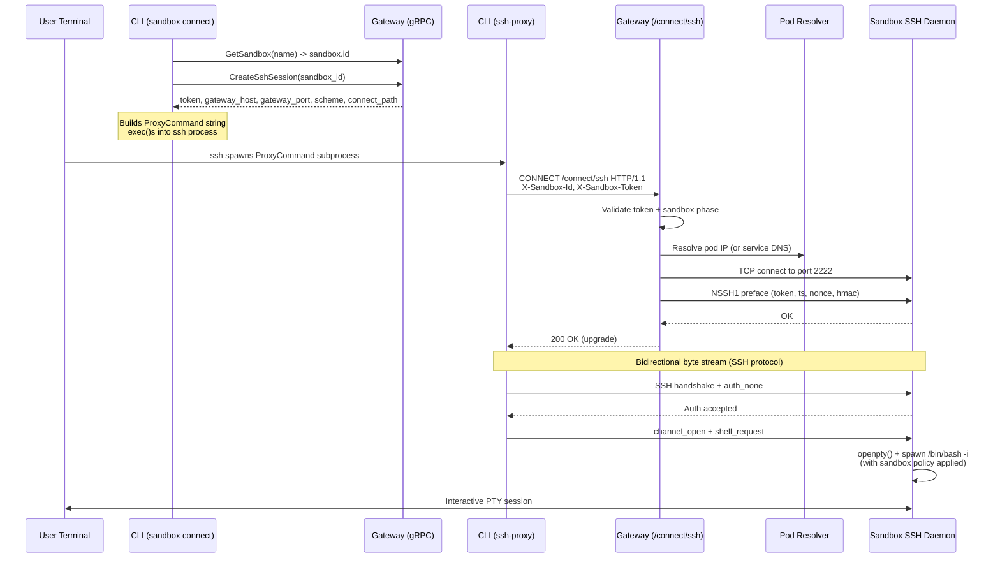
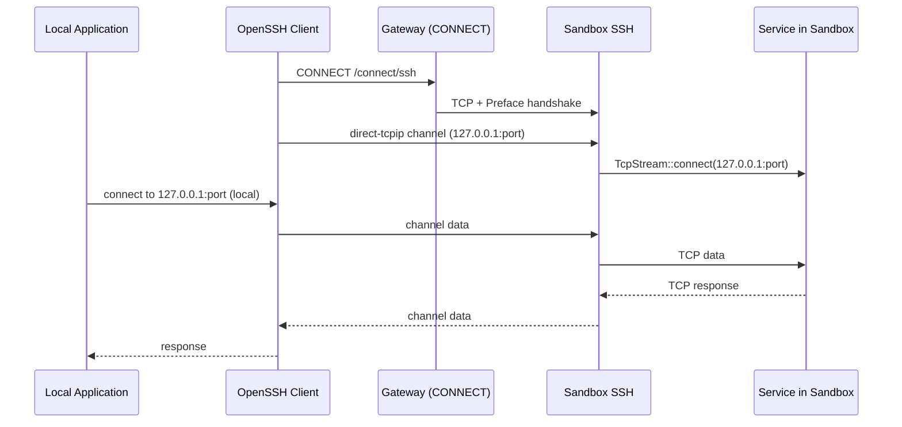
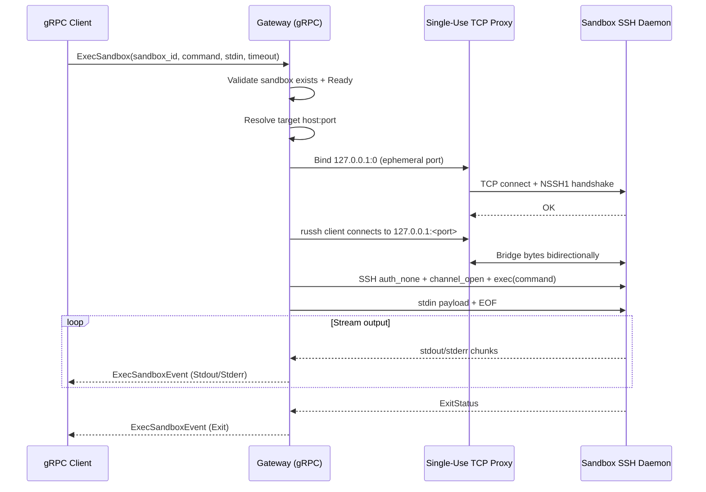

# Sandbox Connect Architecture

## Overview

Sandbox connect provides secure remote access into running sandbox environments. It supports three modes of interaction:

1. **Interactive shell** (`sandbox connect`) -- opens a PTY-backed SSH session for interactive use
2. **Command execution** (`sandbox create -- <cmd>`) -- runs a command over SSH with stdout/stderr piped back
3. **File sync** (`sandbox create --upload`) -- uploads local files into the sandbox before command execution

All three modes tunnel SSH traffic through the gateway's multiplexed port using HTTP CONNECT. The gateway authenticates each connection with a short-lived session token, then performs a custom NSSH1 handshake with the sandbox's embedded SSH daemon before bridging raw bytes between client and sandbox.

There is also a gateway-side `ExecSandbox` gRPC RPC that executes commands inside sandboxes without requiring an external SSH client. This is used for programmatic execution.

## Components

### CLI SSH module

**File**: `crates/openshell-cli/src/ssh.rs`

Contains the client-side SSH and editor-launch helpers for sandbox connectivity:

- `sandbox_connect()` -- interactive SSH shell session
- `sandbox_exec()` -- non-interactive command execution via SSH
- `sandbox_rsync()` -- file synchronization via rsync over SSH
- `sandbox_ssh_proxy()` -- the `ProxyCommand` process that bridges stdin/stdout to the gateway
- OpenShell-managed SSH config helpers -- install a single `Include` entry in
  `~/.ssh/config` and maintain generated `Host openshell-<name>` blocks in a
  separate OpenShell-owned config file for editor workflows

These are re-exported from `crates/openshell-cli/src/run.rs` for backward compatibility.

### CLI `ssh-proxy` subcommand

**File**: `crates/openshell-cli/src/main.rs` (line ~139, `Commands::SshProxy`)

A top-level CLI subcommand (`ssh-proxy`) that the SSH `ProxyCommand` invokes. It receives `--gateway`, `--sandbox-id`, and `--token` flags, then delegates to `sandbox_ssh_proxy()`. This process has no TTY of its own -- it pipes stdin/stdout directly to the gateway tunnel.

### gRPC session bootstrap

**Files**: `proto/openshell.proto`, `crates/openshell-server/src/grpc.rs`

Two RPCs manage SSH session tokens:

- `CreateSshSession(sandbox_id)` -- validates the sandbox exists and is `Ready`, generates a UUID token, persists an `SshSession` record, and returns the token plus gateway connection details (host, port, scheme, connect path).
- `RevokeSshSession(token)` -- marks the session's `revoked` flag to `true` in the persistence layer.

### Gateway tunnel handler

**File**: `crates/openshell-server/src/ssh_tunnel.rs`

An Axum route at `/connect/ssh` on the shared gateway port. Handles HTTP CONNECT requests by:
1. Validating the session token and sandbox readiness
2. Resolving the sandbox pod's network address
3. Opening a TCP connection to the sandbox SSH port
4. Performing the NSSH1 handshake
5. Bridging bytes bidirectionally between the HTTP-upgraded connection and the sandbox TCP stream

### Gateway multiplexing

**File**: `crates/openshell-server/src/multiplex.rs`

The gateway runs a single listener that multiplexes gRPC and HTTP on the same port. `MultiplexedService` routes based on the `content-type` header: requests with `application/grpc` go to the gRPC router; all others (including HTTP CONNECT) go to the HTTP router. The HTTP router (`crates/openshell-server/src/http.rs`) merges health endpoints with the SSH tunnel router.

### Sandbox SSH daemon

**File**: `crates/openshell-sandbox/src/ssh.rs`

An embedded SSH server built on `russh` that runs inside each sandbox pod. It:
- Generates an ephemeral Ed25519 host key on startup (no persistent key material)
- Validates the NSSH1 handshake preface before starting the SSH protocol
- Accepts any SSH authentication (none or public key) since authorization is handled by the gateway
- Spawns shell processes on a PTY with full sandbox policy enforcement (Landlock, seccomp, network namespace, privilege dropping)
- Supports interactive shells, exec commands, PTY resize, and window change events

### Gateway-side exec (gRPC)

**File**: `crates/openshell-server/src/grpc.rs` (functions `stream_exec_over_ssh`, `start_single_use_ssh_proxy`, `run_exec_with_russh`)

The `ExecSandbox` gRPC RPC provides programmatic command execution without requiring an external SSH client. It:
1. Spins up a single-use local TCP proxy that performs the NSSH1 handshake
2. Connects a `russh` client through that proxy
3. Authenticates with `none` auth, opens a channel, sends the command
4. Streams stdout/stderr chunks and exit status back to the gRPC caller

## Connection Flows

### Interactive Connect (CLI)

The `sandbox connect` command opens an interactive SSH session.



**Code trace for `sandbox connect`:**

1. `crates/openshell-cli/src/main.rs` -- `SandboxCommands::Connect { name }` dispatches to `run::sandbox_connect()`
2. `crates/openshell-cli/src/ssh.rs` -- `sandbox_connect()` calls `ssh_session_config()`:
   - Resolves sandbox name to ID via `GetSandbox` gRPC
   - Creates an SSH session via `CreateSshSession` gRPC
   - Builds a `ProxyCommand` string: `<openshell-exe> ssh-proxy --gateway <url> --sandbox-id <id> --token <token>`
   - If the gateway host is loopback but the cluster endpoint is not, `resolve_ssh_gateway()` overrides the host with the cluster endpoint's host
3. `sandbox_connect()` builds an `ssh` command with:
   - `-o ProxyCommand=...` (the proxy command from step 2)
   - `-o StrictHostKeyChecking=no -o UserKnownHostsFile=/dev/null -o GlobalKnownHostsFile=/dev/null` (ephemeral host keys)
   - `-tt -o RequestTTY=force` (force PTY allocation)
   - `-o SetEnv=TERM=xterm-256color` (terminal type)
   - `sandbox` as the SSH user
4. If stdin is a terminal (interactive), the CLI calls `exec()` (Unix) to replace itself with the `ssh` process, giving SSH direct terminal ownership. Otherwise it spawns and waits.
5. When SSH starts, it spawns the `ssh-proxy` subprocess as its `ProxyCommand`.
6. `crates/openshell-cli/src/ssh.rs` -- `sandbox_ssh_proxy()`:
   - Parses the gateway URL, connects via TCP (plain) or TLS (mTLS)
   - Sends a raw HTTP CONNECT request with `X-Sandbox-Id` and `X-Sandbox-Token` headers
   - Reads the response status line; proceeds if 200
   - Spawns two `tokio::spawn` tasks for bidirectional copy between stdin/stdout and the gateway stream
   - When the remote-to-stdout direction completes, aborts the stdin-to-remote task (SSH has all the data it needs)

### Command Execution (CLI)

The `sandbox exec` path is identical to interactive connect except:
- The SSH command uses `-T -o RequestTTY=no` (no PTY) when `tty=false`
- The command string is passed as the final SSH argument
- The sandbox daemon routes it through `exec_request()` instead of `shell_request()`, spawning `/bin/bash -lc <command>`

When `openshell sandbox create` launches a `--no-keep` command or shell, it keeps the CLI process alive instead of `exec()`-ing into SSH so it can delete the sandbox after SSH exits. The default create flow, along with `--forward`, keeps the sandbox running.

### Port Forwarding (`forward start`)

`openshell forward start <port> <name>` opens a local SSH tunnel so connections to `127.0.0.1:<port>`
on the host are forwarded to `127.0.0.1:<port>` inside the sandbox.

#### CLI

- Reuses the same `ProxyCommand` path as `sandbox connect`.
- Invokes OpenSSH with `-N -o ExitOnForwardFailure=yes -L <port>:127.0.0.1:<port> sandbox`.
- By default stays attached in foreground until interrupted (Ctrl+C), and prints an early startup
  confirmation after SSH stays up through its initial forward-setup checks.
- With `-d`/`--background`, SSH forks after auth and the CLI exits. The PID is
  tracked in `~/.config/openshell/forwards/<name>-<port>.pid` along with sandbox id metadata.
- `openshell forward stop <port> <name>` validates PID ownership and then kills a background forward.
- `openshell forward list` shows all tracked forwards.
- `openshell forward stop` and `openshell forward list` are local operations and do not require
  resolving an active cluster.
- `openshell sandbox create --forward <port>` starts a background forward before connect/exec, including
  when no trailing command is provided.
- `openshell sandbox delete` auto-stops any active forwards for the deleted sandbox.

#### TUI

The TUI (`crates/openshell-tui/`) supports port forwarding through the create sandbox modal. Users
specify comma-separated ports in the **Ports** field. After sandbox creation:

1. The TUI polls for `Ready` state (up to 30 attempts at 2-second intervals).
2. Creates an SSH session via `CreateSshSession` gRPC.
3. Spawns background SSH tunnels (`ssh -N -f -L <port>:127.0.0.1:<port>`) for each port.
4. Sends a `ForwardResult` event back to the main loop with the outcome.

Active forwards are displayed in the sandbox table's NOTES column (e.g., `fwd:8080,3000`) and in
the sandbox detail view's Forwards row.

When deleting a sandbox, the TUI calls `stop_forwards_for_sandbox()` before sending the delete
request. PID tracking uses the same `~/.config/openshell/forwards/` directory as the CLI.

#### Shared forward module

**File**: `crates/openshell-core/src/forward.rs`

Port forwarding PID management and SSH utility functions are shared between the CLI and TUI:

- `forward_dir()` -- returns `~/.config/openshell/forwards/`, creating it if needed
- `save_forward_pid()` / `read_forward_pid()` / `remove_forward_pid()` -- PID file I/O
- `list_forwards()` -- lists all active forwards from PID files
- `stop_forward()` / `stop_forwards_for_sandbox()` -- kills forwarding processes by PID
- `resolve_ssh_gateway()` -- loopback gateway resolution (see Gateway Loopback Resolution)
- `shell_escape()` -- safe shell argument escaping for SSH commands
- `build_sandbox_notes()` -- builds notes strings (e.g., `fwd:8080,3000`) from active forwards

#### Supervisor `direct-tcpip` handling

The sandbox SSH server (`crates/openshell-sandbox/src/ssh.rs`) implements
`channel_open_direct_tcpip` from the russh `Handler` trait.

- **Loopback-only**: only `127.0.0.1`, `localhost`, and `::1` destinations are accepted.
  Non-loopback destinations are rejected (`Ok(false)`) to prevent the sandbox from being
  used as a generic proxy.
- **Bridge**: accepted channels spawn a tokio task that connects a `TcpStream` to the
  target address and uses `copy_bidirectional` between the SSH channel stream and the
  TCP stream.
- No additional state is stored on `SshHandler` — the `Channel<Msg>` object from russh is
  self-contained, so forwarding channels are fully independent of session channels.

#### Flow



### Gateway-side Exec (gRPC)

The `ExecSandbox` gRPC RPC bypasses the external SSH client entirely.



The `start_single_use_ssh_proxy()` function creates a one-shot TCP listener on localhost, accepts a single connection, performs the NSSH1 handshake with the sandbox, then bridges bytes. The `run_exec_with_russh()` function connects through this local proxy, authenticates, executes the command, and streams channel messages to the gRPC response stream.

If `timeout_seconds > 0`, the exec is wrapped in `tokio::time::timeout`. On timeout, exit code 124 is sent (matching the `timeout` command convention).

### File Sync

File sync uses **tar-over-SSH**: the CLI streams a tar archive through the existing SSH proxy tunnel. No external dependencies (like `rsync`) are required on the client side. The sandbox image provides GNU `tar` for extraction.

**Files**: `crates/openshell-cli/src/ssh.rs`, `crates/openshell-cli/src/run.rs`

#### `sandbox create --upload`

When `--upload` is passed to `sandbox create`, the CLI pushes local files into `/sandbox` (or a specified destination) after the sandbox reaches `Ready` and before any command runs.

1. `git_repo_root()` determines the repository root via `git rev-parse --show-toplevel`
2. `git_sync_files()` lists files with `git ls-files -co --exclude-standard -z` (tracked + untracked, respecting gitignore, null-delimited)
3. `sandbox_sync_up_files()` creates an SSH session config, spawns `ssh <proxy> sandbox "tar xf - -C /sandbox"`, and streams a tar archive of the file list to the SSH child's stdin using the `tar` crate
4. Files land in `/sandbox` inside the container

#### `openshell sandbox upload` / `openshell sandbox download`

Standalone commands support bidirectional file transfer:

```bash
# Push local files up to sandbox
openshell sandbox upload <name> <local-path> [<sandbox-path>]

# Pull sandbox files down to local
openshell sandbox download <name> <sandbox-path> [<local-path>]
```

- **Upload**: `sandbox_upload()` streams a tar archive of the local path to `ssh ... tar xf - -C <dest>` on the sandbox side. Default destination: `/sandbox`.
- **Download**: `sandbox_download()` runs `ssh ... tar cf - -C <dir> <path>` on the sandbox side and extracts the output locally via `tar::Archive`. Default destination: `.` (current directory).
- No compression for v1 — the SSH tunnel is local-network; compression adds CPU cost with marginal bandwidth savings.

#### Why tar-over-SSH instead of rsync

| | tar-over-SSH | rsync |
|---|---|---|
| **Client dependency** | None — `tar` crate is compiled into the CLI | Requires `rsync` installed on the client machine |
| **Sandbox dependency** | GNU `tar` (present in every base image) | Requires `rsync` installed in the container |
| **Bidirectional** | Same pipe pattern reversed for push/pull | Needs different invocation or rsync daemon for pull |
| **Transport complexity** | Single process (`ssh ... tar xf -`) | Two processes coordinating a delta-transfer protocol through the proxy tunnel |
| **Incremental sync** | Re-sends everything every time | Only transfers changed blocks (faster for repeated syncs of large repos) |
| **Compression** | Uncompressed (can add gzip via `flate2` later) | Built-in `-z` flag |

For OpenShell's use case — one-shot or on-demand pushes of project files over a local network tunnel — the incremental sync advantage of rsync is marginal. Eliminating the external dependency and getting clean bidirectional support outweigh the delta-transfer benefit. If repeated rapid re-syncs of large repos become a need (e.g., a watch mode), revisit by adding content-hash-based skip lists or gzip compression.

## NSSH1 Handshake Protocol

The NSSH1 ("OpenShell SSH v1") handshake authenticates the gateway to the sandbox daemon, preventing direct pod access from outside the gateway.

### Wire Format

A single newline-terminated text line:

```
NSSH1 <token> <timestamp> <nonce> <hmac>\n
```

| Field       | Type   | Description |
|-------------|--------|-------------|
| `NSSH1`     | string | Magic prefix (protocol version identifier) |
| `token`     | string | UUID session token (from `CreateSshSession` for interactive; freshly generated for gateway-side exec) |
| `timestamp` | i64    | Unix epoch seconds at time of generation |
| `nonce`     | string | UUID v4, unique per handshake attempt |
| `hmac`      | string | Hex-encoded HMAC-SHA256 of `token\|timestamp\|nonce` keyed on the shared secret |

### Validation (sandbox side)

**File**: `crates/openshell-sandbox/src/ssh.rs` -- `verify_preface()`

1. Split line on whitespace; reject if not exactly 5 fields or magic is not `NSSH1`
2. Parse timestamp; compute absolute clock skew `|now - timestamp|`
3. Reject if skew exceeds `ssh_handshake_skew_secs` (default: 300 seconds)
4. Recompute HMAC-SHA256 over `token|timestamp|nonce` with the shared secret
5. Compare computed signature against the received signature (constant-time via `hmac` crate)
6. Check nonce against the replay cache; reject if the nonce has been seen before within the skew window
7. Insert the nonce into the replay cache on success
8. Respond with `OK\n` on success or `ERR\n` on failure

### Nonce replay detection

The SSH server maintains a per-process `NonceCache` (`HashMap<String, Instant>` behind `Arc<Mutex<...>>`) that tracks nonces seen within the handshake skew window. A background tokio task reaps expired entries every 60 seconds. If a valid preface is presented with a previously-seen nonce, the handshake is rejected. This prevents replay attacks within the timestamp validity window.

### HMAC computation

Both the gateway (`crates/openshell-server/src/ssh_tunnel.rs` -- `build_preface()`) and the gRPC exec path (`crates/openshell-server/src/grpc.rs` -- `build_preface()`) use identical logic:

```rust
let payload = format!("{token}|{timestamp}|{nonce}");
let signature = hmac_sha256(secret.as_bytes(), payload.as_bytes());
// hmac_sha256 returns hex::encode(Hmac::<Sha256>::finalize())
```

### Read-line safety

Both sides cap the preface line at 1024 bytes and stop reading at `\n` or EOF. This prevents a misbehaving peer from consuming unbounded memory.

## Sandbox SSH Daemon Internals

### Startup

`run_ssh_server()` in `crates/openshell-sandbox/src/ssh.rs`:

1. Generates an ephemeral Ed25519 host key using `OsRng`
2. Configures `russh::server::Config` with 1-second auth rejection delay
3. Binds a `TcpListener` on the configured address (default: `0.0.0.0:2222`)
4. Enters an accept loop; each connection is handled in a `tokio::spawn` task

### Connection handling

`handle_connection()`:

1. Reads and validates the NSSH1 preface (rejects with `ERR\n` on failure)
2. Responds `OK\n` on success
3. Hands the TCP stream to `russh::server::run_stream()` with an `SshHandler`

### Authentication

The `SshHandler` implements `russh::server::Handler`:

- `auth_none()` returns `Auth::Accept` -- any user is accepted
- `auth_publickey()` returns `Auth::Accept` -- any key is accepted

Authorization is performed by the gateway (token validation + sandbox readiness check) before the SSH protocol starts. The NSSH1 handshake proves the connection came through an authorized gateway.

### Shell and exec

- `shell_request()` calls `start_shell(channel, handle, None)` -- spawns `/bin/bash -i`
- `exec_request()` calls `start_shell(channel, handle, Some(command))` -- spawns `/bin/bash -lc <command>`
- `pty_request()` stores the PTY dimensions for use when spawning the shell
- `window_change_request()` calls `TIOCSWINSZ` ioctl on the PTY master fd

### PTY and process management

`spawn_pty_shell()`:

1. Calls `nix::pty::openpty()` with the requested window size
2. Clones the master fd for reading and writing
3. Configures the shell command with environment variables:
   - `OPENSHELL_SANDBOX=1`, `HOME=/sandbox`, `USER=sandbox`, `TERM=<from pty request>`
   - Proxy vars: `HTTP_PROXY`, `HTTPS_PROXY`, `ALL_PROXY`, `NO_PROXY=127.0.0.1,localhost,::1`, `http_proxy`, `https_proxy`, `grpc_proxy`, `no_proxy=127.0.0.1,localhost,::1`, `NODE_USE_ENV_PROXY=1` so Node.js `fetch` honors the proxy env while localhost stays direct
   - TLS trust vars: `NODE_EXTRA_CA_CERTS`, `SSL_CERT_FILE`, `REQUESTS_CA_BUNDLE`, `CURL_CA_BUNDLE`
   - Provider credential env vars (from the provider registry)
4. Installs a `pre_exec` hook that:
   - Calls `setsid()` to create a new session
   - Calls `TIOCSCTTY` to set the slave PTY as the controlling terminal
   - Enters the network namespace (`setns(fd, CLONE_NEWNET)`) if configured (Linux only)
   - Drops privileges (`initgroups` + `setgid` + `setuid`) per the sandbox policy
   - Applies sandbox restrictions (Landlock, seccomp) via `sandbox::apply()`
5. Spawns the child process

### I/O threading

Three threads handle the PTY I/O:

1. **Writer thread** (std::thread) -- receives bytes from `SshHandler::data()` via an `mpsc::channel` and writes them to the PTY master
2. **Reader thread** (std::thread) -- reads from PTY master in 4096-byte chunks, dispatches each chunk to the SSH channel via `handle.data()` on the tokio runtime. Sends EOF when the master returns 0 or errors. Signals completion via a `reader_done_tx` channel.
3. **Exit thread** (std::thread) -- waits for `child.wait()`, then waits for the reader thread to finish (via `reader_done_rx`), then sends `exit_status_request` and `close` on the SSH channel

The reader-done synchronization ensures correct SSH protocol ordering: data -> EOF -> exit-status -> close.

## Sandbox Target Resolution

The gateway and the gRPC exec path both resolve the sandbox's network address using the same logic.

**File**: `crates/openshell-server/src/ssh_tunnel.rs` (gateway), `crates/openshell-server/src/grpc.rs` (exec)

Resolution order:
1. If the sandbox has a `status.agent_pod` field, resolve the pod IP via the Kubernetes API (`agent_pod_ip()`)
2. Otherwise, construct a cluster-internal DNS name: `<sandbox.name>.<sandbox_namespace>.svc.cluster.local`

The target port is always `config.sandbox_ssh_port` (default: 2222).

The `ConnectTarget` enum in `ssh_tunnel.rs` encodes both cases:
- `ConnectTarget::Ip(SocketAddr)` -- direct IP from pod resolution
- `ConnectTarget::Host(String, u16)` -- DNS hostname fallback

## API and Persistence

### CreateSshSession

**Proto**: `proto/openshell.proto` -- `CreateSshSessionRequest` / `CreateSshSessionResponse`

Request:
- `sandbox_id` (string) -- the sandbox to connect to

Response:
- `sandbox_id` (string)
- `token` (string) -- UUID session token
- `gateway_host` (string) -- resolved from `Config::ssh_gateway_host` (defaults to bind address if empty)
- `gateway_port` (uint32) -- resolved from `Config::ssh_gateway_port` (defaults to bind port if 0)
- `gateway_scheme` (string) -- `"https"` if TLS is configured, otherwise `"http"`
- `connect_path` (string) -- from `Config::ssh_connect_path` (default: `/connect/ssh`)
- `host_key_fingerprint` (string) -- currently unused (empty)

### RevokeSshSession

Request:
- `token` (string) -- session token to revoke

Response:
- `revoked` (bool) -- true if a session was found and revoked

### SshSession persistence

**Proto**: `proto/openshell.proto` -- `SshSession` message

Stored in the gateway's persistence layer (SQLite or Postgres) as object type `"ssh_session"`:

| Field           | Type   | Description |
|-----------------|--------|-------------|
| `id`            | string | Same as token (the token is the primary key) |
| `sandbox_id`    | string | Sandbox this session is scoped to |
| `token`         | string | UUID session token |
| `created_at_ms` | int64  | Creation time (ms since epoch) |
| `revoked`       | bool   | Whether the session has been revoked |
| `name`          | string | Auto-generated human-friendly name |

### ExecSandbox

**Proto**: `proto/openshell.proto` -- `ExecSandboxRequest` / `ExecSandboxEvent`

Request:
- `sandbox_id` (string)
- `command` (repeated string) -- command and arguments
- `workdir` (string) -- optional working directory
- `environment` (map<string, string>) -- optional env var overrides (keys validated against `^[A-Za-z_][A-Za-z0-9_]*$`)
- `timeout_seconds` (uint32) -- 0 means no timeout
- `stdin` (bytes) -- optional stdin payload

Response stream (`ExecSandboxEvent`):
- `Stdout(data)` -- stdout chunk
- `Stderr(data)` -- stderr chunk
- `Exit(exit_code)` -- final exit status (124 on timeout)

The gateway builds the remote command by shell-escaping arguments, prepending sorted env var assignments, and optionally wrapping in `cd <workdir> && ...`.

## Gateway Loopback Resolution

**File**: `crates/openshell-core/src/forward.rs` -- `resolve_ssh_gateway()`

When the gateway returns a loopback address (`127.0.0.1`, `0.0.0.0`, `localhost`, or `::1`), the client overrides it with the host from the cluster endpoint URL. This handles the common case where the gateway defaults to `127.0.0.1` but the cluster is running on a remote machine.

The override only applies if the cluster endpoint itself is not also a loopback address. If both are loopback, the original address is kept.

This function is shared between the CLI and TUI via the `openshell-core::forward` module.

## Authentication and Security Model

### Layered authentication

1. **mTLS (transport layer)** -- when TLS is configured, the CLI authenticates to the gateway using client certificates. The `ssh-proxy` subprocess inherits TLS options from the parent CLI process.
2. **Session token (application layer)** -- the gateway validates the session token against the persistence layer. Tokens are scoped to a specific sandbox and can be revoked.
3. **NSSH1 handshake (gateway-to-sandbox)** -- the shared handshake secret proves the connection originated from an authorized gateway. The timestamp + nonce prevent replay attacks within the skew window. The nonce replay cache rejects duplicates.
4. **Kubernetes NetworkPolicy** -- a Helm-managed `NetworkPolicy` restricts ingress to sandbox pods on port 2222 to only the gateway pod, preventing lateral movement from other in-cluster workloads. Controlled by `networkPolicy.enabled` in the Helm values (default: `true`).

### Mandatory handshake secret

The NSSH1 handshake secret (`OPENSHELL_SSH_HANDSHAKE_SECRET`) is required. Both the server and sandbox will refuse to start if the secret is empty or unset. For cluster deployments the secret is auto-generated by the entrypoint script (`deploy/docker/cluster-entrypoint.sh`) via `openssl rand -hex 32` and injected into the Helm values.

### What SSH auth does NOT enforce

The embedded SSH daemon accepts all authentication attempts. This is intentional:
- The NSSH1 handshake already proved the connection came through the gateway
- The gateway already validated the session token and sandbox readiness
- SSH key management would add complexity without additional security value in this architecture

### Ephemeral host keys

The sandbox generates a fresh Ed25519 host key on every startup. The CLI disables `StrictHostKeyChecking` and sets `UserKnownHostsFile=/dev/null` and `GlobalKnownHostsFile=/dev/null` to avoid known-hosts conflicts.

## Configuration Reference

### Gateway configuration

**File**: `crates/openshell-core/src/config.rs` -- `Config` struct

| Field                      | Default          | Description |
|----------------------------|------------------|-------------|
| `ssh_gateway_host`         | `127.0.0.1`      | Public hostname/IP for gateway connections |
| `ssh_gateway_port`         | `8080`           | Public port for gateway connections (0 = use bind port) |
| `ssh_connect_path`         | `/connect/ssh`   | HTTP path for CONNECT requests |
| `sandbox_ssh_port`         | `2222`           | SSH listen port inside sandbox pods |
| `ssh_handshake_secret`     | (required)       | Shared HMAC key for NSSH1 handshake (server fails to start if empty) |
| `ssh_handshake_skew_secs`  | `300`            | Maximum allowed clock skew (seconds) |

### Sandbox environment variables

These are injected into sandbox pods by the gateway:

| Variable                             | Description |
|--------------------------------------|-------------|
| `OPENSHELL_SSH_LISTEN_ADDR`          | Address for the embedded SSH server to bind |
| `OPENSHELL_SSH_HANDSHAKE_SECRET`     | Shared secret for NSSH1 handshake validation |
| `OPENSHELL_SSH_HANDSHAKE_SKEW_SECS`  | Allowed clock skew for handshake timestamp |

### CLI TLS options

| Flag / Env Var              | Description |
|-----------------------------|-------------|
| `--tls-ca` / `OPENSHELL_TLS_CA`       | CA certificate for gateway verification |
| `--tls-cert` / `OPENSHELL_TLS_CERT`   | Client certificate for mTLS |
| `--tls-key` / `OPENSHELL_TLS_KEY`     | Client private key for mTLS |

## Failure Modes

| Scenario | Status / Behavior | Source |
|----------|-------------------|--------|
| Missing `X-Sandbox-Id` or `X-Sandbox-Token` header | `401 Unauthorized` | `ssh_tunnel.rs` -- `header_value()` |
| Empty header value | `400 Bad Request` | `ssh_tunnel.rs` -- `header_value()` |
| Non-CONNECT method on `/connect/ssh` | `405 Method Not Allowed` | `ssh_tunnel.rs` -- `ssh_connect()` |
| Token not found in persistence | `401 Unauthorized` | `ssh_tunnel.rs` -- `ssh_connect()` |
| Token revoked or sandbox ID mismatch | `401 Unauthorized` | `ssh_tunnel.rs` -- `ssh_connect()` |
| Sandbox not found | `404 Not Found` | `ssh_tunnel.rs` -- `ssh_connect()` |
| Sandbox not in `Ready` phase | `412 Precondition Failed` | `ssh_tunnel.rs` -- `ssh_connect()` |
| Pod IP resolution fails | `502 Bad Gateway` | `ssh_tunnel.rs` -- `ssh_connect()` |
| No pod IP and no sandbox name | `412 Precondition Failed` | `ssh_tunnel.rs` -- `ssh_connect()` |
| Persistence read error | `500 Internal Server Error` | `ssh_tunnel.rs` -- `ssh_connect()` |
| NSSH1 handshake rejected by sandbox | Tunnel closed; `"sandbox handshake rejected"` logged | `ssh_tunnel.rs` -- `handle_tunnel()` |
| HTTP upgrade failure | `"SSH upgrade failed"` logged; tunnel not established | `ssh_tunnel.rs` -- `ssh_connect()` |
| TCP connection to sandbox fails | Tunnel error logged and closed | `ssh_tunnel.rs` -- `handle_tunnel()` |
| SSH exec timeout | Exit code 124 returned | `grpc.rs` -- `stream_exec_over_ssh()` |

## Graceful Shutdown

### Gateway tunnel teardown

After `copy_bidirectional` completes (either side closes), `handle_tunnel()` calls `AsyncWriteExt::shutdown()` on the upgraded connection to send a clean EOF to the client. This avoids TCP RST and gives SSH time to read remaining protocol data (e.g., exit-status) from its buffer.

### SSH proxy teardown

The `sandbox_ssh_proxy()` function spawns two copy tasks. When the remote-to-stdout task completes, the stdin-to-remote task is aborted. This ensures the proxy exits promptly when the SSH session ends without waiting for the user to type something.

### PTY reader-exit ordering

The sandbox SSH daemon's exit thread waits for the reader thread to finish forwarding all PTY output before sending `exit_status_request` and `close`. This prevents a race where the channel closes before all output has been delivered.

## Cross-References

- [Gateway Architecture](gateway.md) -- gateway multiplexing, persistence layer, gRPC service details
- [Sandbox Architecture](sandbox.md) -- sandbox lifecycle, policy enforcement, network isolation, proxy
- [Providers](sandbox-providers.md) -- provider credential injection into SSH shell processes
