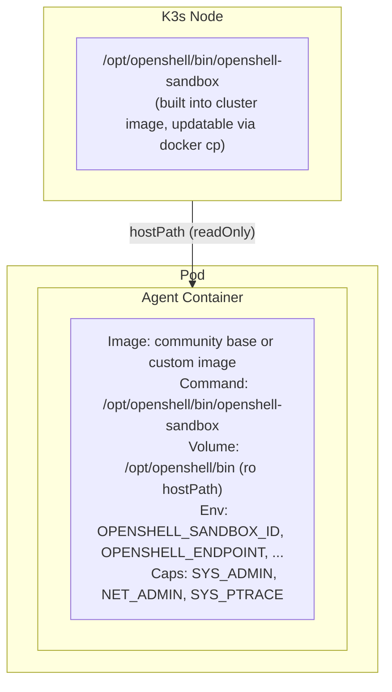

# Sandbox Custom Containers

Users can run `openshell sandbox create --from <source>` to launch a sandbox with a custom container image while keeping the `openshell-sandbox` process supervisor in control.

## The `--from` Flag

The `--from` flag accepts four kinds of input:

| Input | Example | Behavior |
|-------|---------|----------|
| **Community sandbox name** | `--from openclaw` | Resolves to `ghcr.io/nvidia/openshell-community/sandboxes/openclaw:latest` |
| **Dockerfile path** | `--from ./Dockerfile` | Builds the image, pushes it into the cluster, then creates the sandbox |
| **Directory with Dockerfile** | `--from ./my-sandbox/` | Uses the directory as the build context |
| **Full image reference** | `--from myregistry.com/img:tag` | Uses the image directly |

### Resolution heuristic

The CLI classifies the value in this order:

1. **Existing file** whose name contains "Dockerfile" (case-insensitive) — treated as a Dockerfile to build.
2. **Existing directory** containing a `Dockerfile` — treated as a build context directory.
3. **Contains `/`, `:`, or `.`** — treated as a full container image reference.
4. **Otherwise** — treated as a community sandbox name, expanded to `{OPENSHELL_COMMUNITY_REGISTRY}/{name}:latest`.

The community registry prefix defaults to `ghcr.io/nvidia/openshell-community/sandboxes` and can be overridden with the `OPENSHELL_COMMUNITY_REGISTRY` environment variable.

### GPU image-name detection

`sandbox create` also infers GPU intent from the final image name. The current rule matches when the last image name component contains `gpu` (for example `ghcr.io/nvidia/openshell-community/sandboxes/nvidia-gpu:latest` or `registry.example.com/team/my-gpu-image:latest`). When that rule matches, the sandbox request is treated the same as passing `--gpu`.

### Dockerfile build flow

When `--from` points to a Dockerfile or directory, the CLI:

1. Builds the image locally via the Docker daemon (respecting `.dockerignore`).
2. Pushes it into the cluster's containerd runtime using `docker save` / `ctr import`.
3. Creates the sandbox with the resulting image tag.

## How It Works

The supervisor binary (`openshell-sandbox`) is **always side-loaded** from the k3s node filesystem via a read-only `hostPath` volume. It is never baked into sandbox images. This applies to all sandbox pods — whether using the default community base image, a custom image, or a user-built Dockerfile.



The server applies these transforms to every sandbox pod template (`sandbox/mod.rs`):

1. Adds a `hostPath` volume named `openshell-supervisor-bin` pointing to `/opt/openshell/bin` on the node.
2. Mounts it read-only at `/opt/openshell/bin` in the agent container.
3. Overrides the agent container's `command` to `/opt/openshell/bin/openshell-sandbox`.
4. Sets `runAsUser: 0` so the supervisor has root privileges for namespace creation, proxy setup, and Landlock/seccomp.

These transforms apply to every generated pod template.

## CLI Usage

### Creating a sandbox from a community image

```bash
openshell sandbox create --from openclaw
```

### Creating a sandbox with a custom image

```bash
openshell sandbox create --from myimage:latest -- echo "hello from custom container"
```

When `--from` is set the CLI clears the default `run_as_user`/`run_as_group` policy (which expects a `sandbox` user) so that arbitrary images that lack that user can start without error.

### Building from a Dockerfile in one step

```bash
openshell sandbox create --from ./Dockerfile -- echo "built and running"
openshell sandbox create --from ./my-sandbox/  # directory with Dockerfile
```

## Supervisor Behavior in Custom Images

The `openshell-sandbox` supervisor adapts to arbitrary environments:

- **Log file fallback**: Attempts to open `/var/log/openshell.log` for append; silently falls back to stdout-only logging if the path is not writable.
- **Command resolution**: Executes the command from CLI args, then the `OPENSHELL_SANDBOX_COMMAND` env var (set to `sleep infinity` by the server), then `/bin/bash` as a last resort.
- **Network namespace**: Requires successful namespace creation for proxy isolation; startup fails in proxy mode if required capabilities (`CAP_NET_ADMIN`, `CAP_SYS_ADMIN`) or `iproute2` are unavailable. If the `iptables` package is present, the supervisor installs OUTPUT chain rules (LOG + REJECT) inside the namespace to provide fast-fail behavior (immediate `ECONNREFUSED` instead of a 30-second timeout) and diagnostic logging when processes attempt direct connections that bypass the HTTP CONNECT proxy. If `iptables` is absent, the supervisor logs a warning and continues — core network isolation still works via routing.

## Design Decisions

| Decision | Rationale |
|----------|-----------|
| Unified `--from` flag | Single entry point for community names, Dockerfiles, directories, and image refs — removes the need to know registry paths |
| Community name resolution | Bare names like `openclaw` expand to the GHCR community registry, making the common case simple |
| Auto build+push for Dockerfiles | Eliminates the two-step `image push` + `create` workflow for local development |
| `OPENSHELL_COMMUNITY_REGISTRY` env var | Allows organizations to host their own community sandbox registry |
| hostPath side-load | Supervisor binary lives on the node filesystem — no init container, no emptyDir, no extra image pull. Faster pod startup. |
| Read-only mount in agent | Supervisor binary cannot be tampered with by the workload |
| Command override | Ensures `openshell-sandbox` is the entrypoint regardless of the image's default CMD |
| Clear `run_as_user/group` for custom images | Prevents startup failure when the image lacks the default `sandbox` user |
| Non-fatal log file init | `/var/log/openshell.log` may be unwritable in arbitrary images; falls back to stdout |
| `docker save` / `ctr import` for push | Avoids requiring a registry for local dev; images land directly in the k3s containerd store |
| Optional `iptables` for bypass detection | Core network isolation works via routing alone (`iproute2`); `iptables` only adds fast-fail (`ECONNREFUSED`) and diagnostic LOG entries. Making it optional avoids hard failures in minimal images that lack `iptables` while giving better UX when it is available. |

## Limitations

- Distroless / `FROM scratch` images are not supported (the supervisor needs glibc and `/proc`)
- Missing `iproute2` (or required capabilities) blocks startup in proxy mode because namespace isolation is mandatory
- The supervisor binary must be present on the k3s node at `/opt/openshell/bin/openshell-sandbox` (embedded in the cluster image at build time)
