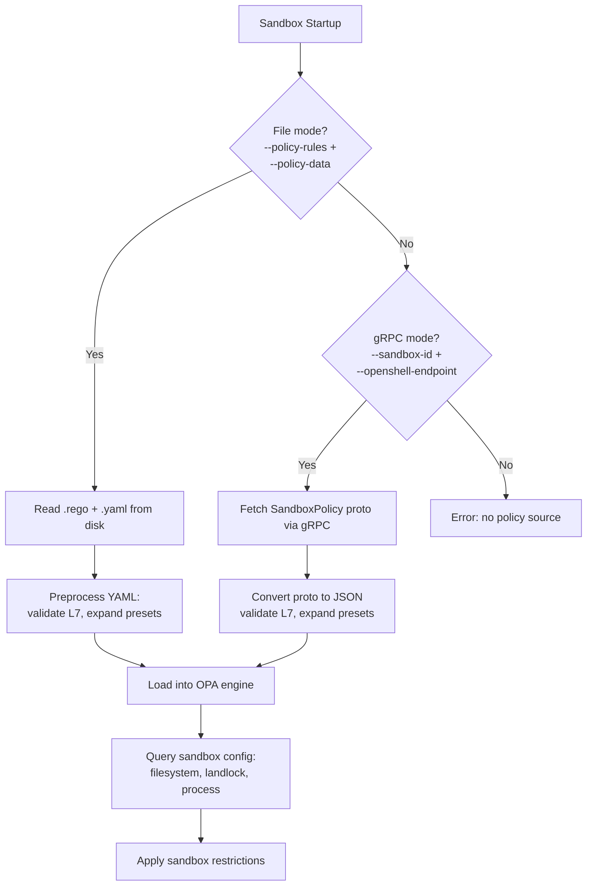
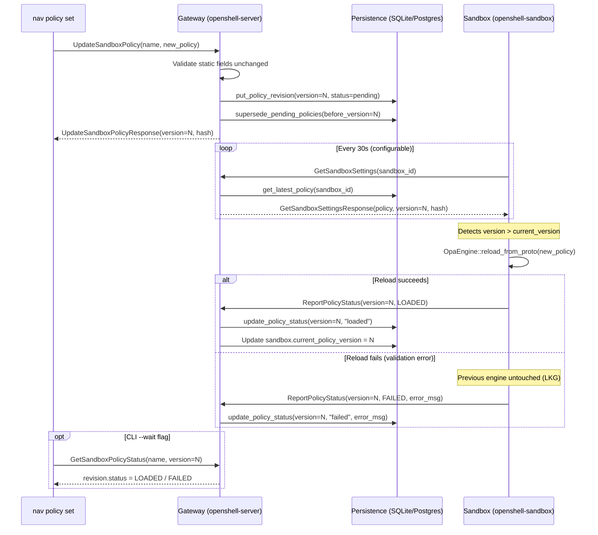
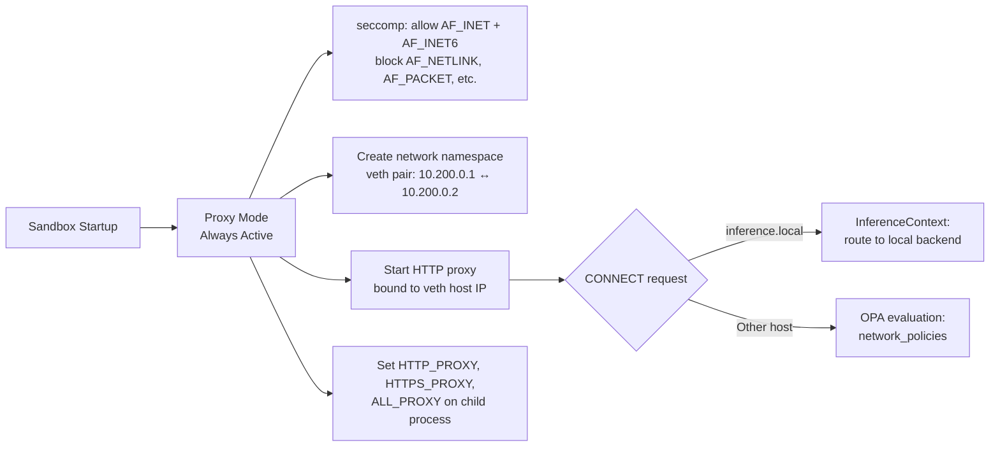
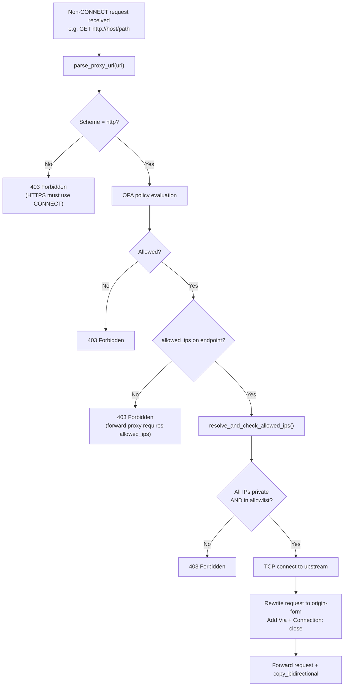
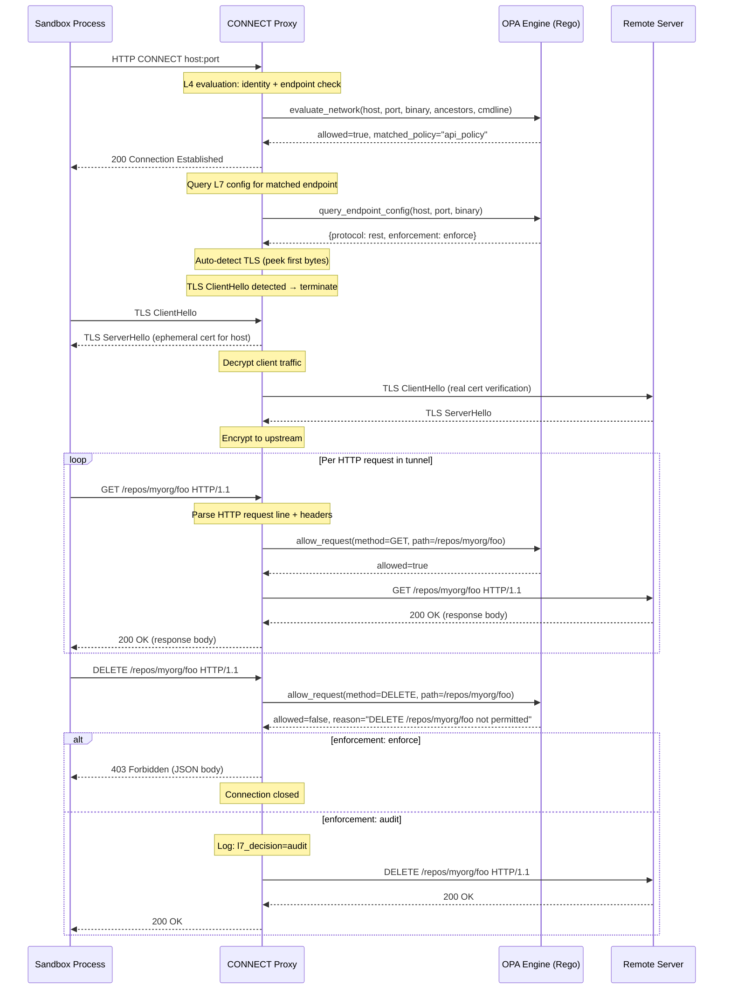
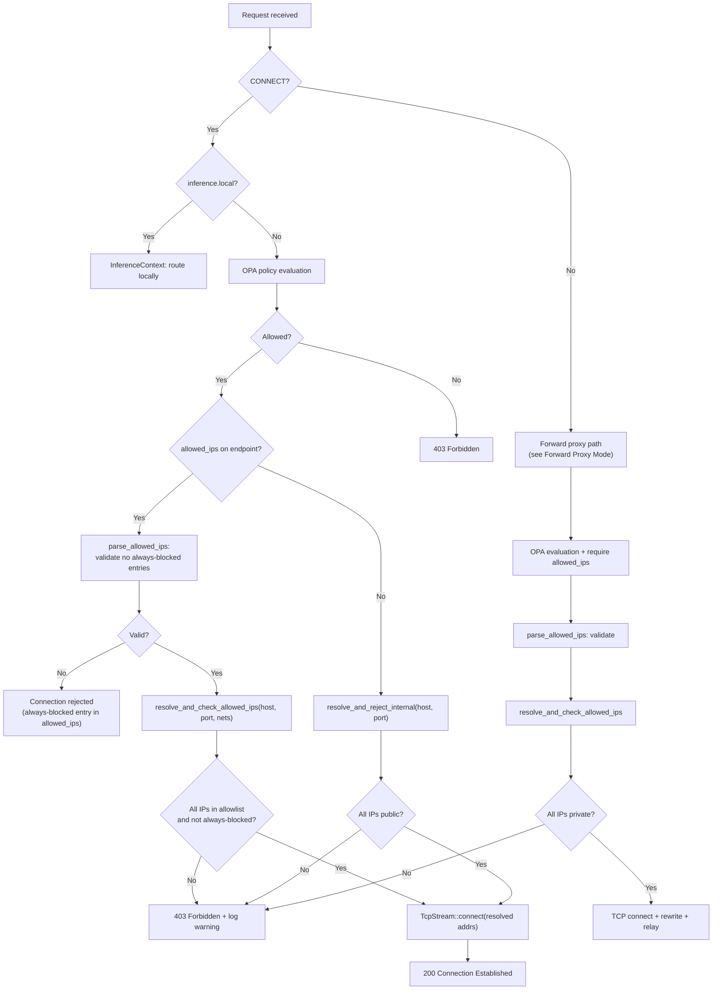

# Policy Language

The sandbox system uses a YAML-based policy language to govern sandbox behavior. This document is the definitive reference for the policy schema, how each field maps to enforcement mechanisms, and the behavioral triggers that control which enforcement layer is activated.

Policies serve two purposes:

1. **Static configuration** -- filesystem access rules, Landlock compatibility, and process privilege dropping (applied once at sandbox startup and immutable for the sandbox's lifetime).
2. **Dynamic network decisions** -- per-connection and per-request access control evaluated at runtime by the OPA engine. These fields can be updated on a running sandbox via live policy updates.

## Policy Loading

The sandbox supervisor loads policy through one of two paths, selected at startup based on available configuration.

### File Mode (Local Development)

Provide a Rego rules file and a YAML data file via CLI flags or environment variables:

```bash
openshell-sandbox \
  --policy-rules sandbox-policy.rego \
  --policy-data dev-sandbox-policy.yaml \
  -- /bin/bash
```

| Flag             | Environment Variable     | Description                                      |
| ---------------- | ------------------------ | ------------------------------------------------ |
| `--policy-rules` | `OPENSHELL_POLICY_RULES` | Path to `.rego` file containing evaluation rules |
| `--policy-data`  | `OPENSHELL_POLICY_DATA`  | Path to YAML file containing policy data         |

The YAML data file is preprocessed before loading into the OPA engine: L7 policies are validated, and `access` presets are expanded into explicit `rules` arrays. See `crates/openshell-sandbox/src/opa.rs` -- `preprocess_yaml_data()`.

### gRPC Mode (Production)

When the sandbox runs inside a managed cluster, it fetches its typed protobuf policy from the gateway:

```bash
openshell-sandbox \
  --sandbox-id abc123 \
  --openshell-endpoint https://openshell:8080 \
  -- /bin/bash
```

| Flag                     | Environment Variable   | Description                  |
| ------------------------ | ---------------------- | ---------------------------- |
| `--sandbox-id`           | `OPENSHELL_SANDBOX_ID` | Sandbox ID for policy lookup |
| `--openshell-endpoint`   | `OPENSHELL_ENDPOINT`   | Gateway gRPC endpoint        |

The gateway returns a `SandboxPolicy` protobuf message (defined in `proto/sandbox.proto`). The sandbox supervisor converts this proto into JSON, validates L7 config, expands presets, and loads it into the OPA engine using baked-in Rego rules (`sandbox-policy.rego` compiled via `include_str!`). See `crates/openshell-sandbox/src/opa.rs` -- `OpaEngine::from_proto()`.

### Policy Loading Sequence



### Priority

File mode takes precedence. If both `--policy-rules`/`--policy-data` and `--sandbox-id`/`--openshell-endpoint` are provided, file mode is used. See `crates/openshell-sandbox/src/lib.rs` -- `load_policy()`.

## Live Policy Updates

Policy can be updated on a running sandbox without restarting it. This enables operators to tighten or relax network access rules in response to changing requirements.

Live updates are only available in **gRPC mode** (production clusters). File-mode sandboxes load policy once at startup and do not poll for changes.

### Static vs. Dynamic Fields

Policy fields fall into two categories based on when they are enforced:

| Category | Fields | Enforcement Point | Updatable? |
|----------|--------|-------------------|------------|
| **Static** | `filesystem_policy`, `landlock`, `process` | Applied once in the child process `pre_exec` (after `fork()`, before `exec()`). Kernel-level Landlock rulesets and UID/GID changes cannot be reversed. | No -- immutable after sandbox creation |
| **Dynamic** | `network_policies` | Evaluated at runtime by the OPA engine on every proxy CONNECT request and L7 rule check. The OPA engine can be atomically replaced. | Yes -- via `openshell policy set` |

Attempting to change a static field in an update request returns an `INVALID_ARGUMENT` error with a message indicating which field cannot be modified. See `crates/openshell-server/src/grpc.rs` -- `validate_static_fields_unchanged()`.

### Network Mode Immutability

Proto-backed sandboxes always run with proxy networking. The proxy, network namespace, and OPA evaluation path are created at sandbox startup and stay in place for the lifetime of the sandbox.

That means `network_policies` can change freely at runtime, including transitions between an empty map (proxy-backed deny-all) and a non-empty map (proxy-backed allowlist). The immutable boundary is the proxy infrastructure itself, not whether the current policy has any rules.

### Update Flow

The update mechanism uses a poll-based model with versioned policy revisions and server-side status tracking.



### Policy Versioning

Each sandbox maintains an independent, monotonically increasing version counter for its policy revisions:

- **Version 1** is the policy from the sandbox's `spec.policy` at creation time. It is backfilled lazily on the first `GetSandboxSettings` call if no explicit revision exists in the policy history table. See `crates/openshell-server/src/grpc.rs` -- `get_sandbox_settings()`.
- Each `UpdateSandboxPolicy` call computes the next version as `latest_version + 1` and persists a new `PolicyRecord` with status `"pending"`.
- When a new version is persisted, all older revisions still in `"pending"` status are marked `"superseded"` via `supersede_pending_policies()`. This handles rapid successive updates where the sandbox has not yet picked up an intermediate version.
- The `Sandbox` protobuf object carries a `current_policy_version` field (see `proto/datamodel.proto`) that is updated when the sandbox reports a successful load.

Each revision is stored as a `PolicyRecord` containing the full serialized protobuf payload, a SHA-256 hash of that payload, a status string, and timestamps. See `crates/openshell-server/src/persistence/mod.rs` -- `PolicyRecord`.

### Deterministic Policy Hashing

Policy hashes use a deterministic function that avoids the non-determinism of protobuf's `encode_to_vec()` on `map` fields. Protobuf `map` fields are backed by `HashMap`, whose iteration order is randomized, so encoding the same logical policy twice can produce different byte sequences. The `deterministic_policy_hash()` function avoids this by hashing each top-level field individually and sorting `network_policies` map entries by key before hashing. See `crates/openshell-server/src/grpc.rs` -- `deterministic_policy_hash()`.

The hash is computed as follows:

1. Hash the `version` field as little-endian bytes.
2. Hash the `filesystem`, `landlock`, and `process` sub-messages via `encode_to_vec()` (these contain no `map` fields, so encoding is deterministic).
3. Collect `network_policies` entries, sort by map key, then hash each key (as UTF-8 bytes) followed by the value's `encode_to_vec()`.
4. Return the hex-encoded SHA-256 digest.

This guarantees that the same logical policy always produces the same hash regardless of protobuf serialization order.

**Idempotent updates**: `UpdateSandboxPolicy` compares the deterministic hash of the submitted policy against the latest stored revision's hash. If they match, the handler returns the existing version and hash without creating a new revision. The CLI detects this (the returned version equals the pre-call version) and prints `Policy unchanged` instead of `Policy version N submitted`. This makes repeated `policy set` calls safe and idempotent.

### Policy Revision Statuses

| Status | Meaning |
|--------|---------|
| `pending` | Server accepted the update; sandbox has not yet polled and loaded it |
| `loaded` | Sandbox successfully applied this version via `OpaEngine::reload_from_proto()` |
| `failed` | Sandbox attempted to load but validation failed; LKG policy remains active |
| `superseded` | A newer version was persisted before the sandbox loaded this one |

### Sandbox Poll Loop

In gRPC mode, the sandbox spawns a background task that periodically polls the gateway for policy updates. See `crates/openshell-sandbox/src/lib.rs` -- `run_policy_poll_loop()`.

| Parameter | Default | Override |
|-----------|---------|----------|
| Poll interval | 10 seconds | `OPENSHELL_POLICY_POLL_INTERVAL_SECS` environment variable |

The poll loop:

1. Connects a reusable gRPC client (`CachedOpenShellClient`) to avoid per-poll TLS handshake overhead.
2. Fetches the current policy via `GetSandboxSettings`, which returns the latest version, its policy payload, and a SHA-256 hash.
3. Compares the returned version against the locally tracked `current_version`. If the server version is not greater, the loop sleeps and retries.
4. On a new version, calls `OpaEngine::reload_from_proto()` which builds a complete new `regorus::Engine` through the same validated pipeline as the initial load (proto-to-JSON conversion, L7 validation, access preset expansion).
5. If the new engine builds successfully, it atomically replaces the inner `Mutex<regorus::Engine>`. If it fails, the previous engine is untouched.
6. Reports success or failure back to the server via `ReportPolicyStatus`.

See `crates/openshell-sandbox/src/grpc_client.rs` -- `CachedOpenShellClient`.

### Last-Known-Good (LKG) Behavior

When a new policy version fails validation during reload, the sandbox keeps the previous policy active. This provides safe rollback semantics:

- `OpaEngine::reload_from_proto()` constructs a complete new engine via `OpaEngine::from_proto()` before touching the existing one. If `from_proto()` returns an error (L7 validation failures, preset expansion errors, malformed proto data), the existing engine's `Mutex<regorus::Engine>` is never locked for replacement. See `crates/openshell-sandbox/src/opa.rs` -- `reload_from_proto()`.
- The failure error message is reported back to the server via `ReportPolicyStatus` with `PolicyStatus::FAILED` and stored in the `PolicyRecord.load_error` field.
- The CLI's `--wait` flag polls `GetSandboxPolicyStatus` and surfaces the error to the operator.

Failure scenarios that trigger LKG behavior include:

- L7 validation errors (e.g., `rules` and `access` both set on an endpoint)
- Preset expansion failures (e.g., unknown access preset value)
- Rego rule compilation failures (should not occur with baked-in rules, but guarded against)

### CLI Commands

The `openshell policy` subcommand group manages live policy updates:

```bash
# Push a new policy to a running sandbox
openshell policy set <sandbox-name> --policy updated-policy.yaml

# Push and wait for the sandbox to load it (with 60s timeout)
openshell policy set <sandbox-name> --policy updated-policy.yaml --wait

# Push and wait with a custom timeout
openshell policy set <sandbox-name> --policy updated-policy.yaml --wait --timeout 120

# Set a gateway-global policy (overrides all sandbox policies)
openshell policy set --global --policy policy.yaml --yes

# Delete the gateway-global policy (restores sandbox-level control)
openshell policy delete --global --yes

# View the current active policy and its status
openshell policy get <sandbox-name>

# Inspect a specific revision
openshell policy get <sandbox-name> --rev 3

# Print the full policy as YAML (round-trips with --policy input format)
openshell policy get <sandbox-name> --full

# Combine: inspect a specific revision's full policy
openshell policy get <sandbox-name> --rev 2 --full

# List policy revision history
openshell policy list <sandbox-name> --limit 20
```

#### Global Policy

The `--global` flag on `policy set`, `policy delete`, `policy list`, and `policy get` manages a gateway-wide policy override. When a global policy is set, all sandboxes receive it through `GetSandboxSettings` (with `policy_source: GLOBAL`) instead of their own per-sandbox policy. Global policies are versioned through the `sandbox_policies` table using the sentinel `sandbox_id = "__global__"` and delivered to sandboxes via the reserved `policy` key in the `gateway_settings` blob.

| Command | Behavior |
|---------|----------|
| `policy set --global --policy FILE` | Creates a versioned revision (marked `loaded` immediately) and stores the policy in the global settings blob. Sandboxes pick it up on their next poll (~10s). Deduplicates against the latest `loaded` revision by hash. |
| `policy delete --global` | Removes the `policy` key from global settings and supersedes all `__global__` revisions. Sandboxes revert to their per-sandbox policy on the next poll. |
| `policy list --global [--limit N]` | Lists global policy revision history (version, hash, status, timestamps). |
| `policy get --global [--rev N] [--full]` | Shows a specific global revision's metadata, or the latest. `--full` includes the full policy as YAML. |

Both `set` and `delete` require interactive confirmation (or `--yes` to bypass). The `--wait` flag is rejected for global policy updates: `"--wait is not supported for global policies; global policies are effective immediately"`.

When a global policy is active, sandbox-scoped policy mutations are blocked:
- `policy set <sandbox>` returns `FailedPrecondition: "policy is managed globally"`
- `rule approve`, `rule approve-all` return `FailedPrecondition: "cannot approve rules while a global policy is active"`
- Revoking a previously approved draft chunk is blocked (it would modify the sandbox policy)
- Rejecting pending chunks is allowed (does not modify the sandbox policy)

See [Gateway Settings Channel](gateway-settings.md#global-policy-lifecycle) for the full state machine, storage model, and implementation details.

#### `policy get` flags

| Flag | Default | Description |
|------|---------|-------------|
| `--rev N` | `0` (latest) | Retrieve a specific policy revision by version number instead of the latest. Maps to the `version` field of `GetSandboxPolicyStatusRequest` -- version `0` resolves to the latest revision server-side. |
| `--full` | off | Print the complete policy as YAML after the metadata summary. The YAML output uses the same schema as the `--policy` input file, so it round-trips: you can save it to a file and pass it back to `nav policy set --policy`. |

When `--full` is specified, the server includes the deserialized `SandboxPolicy` protobuf in the `SandboxPolicyRevision.policy` field (see `crates/openshell-server/src/grpc.rs` -- `policy_record_to_revision()` with `include_policy: true`). The CLI converts this proto back to YAML via `policy_to_yaml()`, which uses a `BTreeMap` for `network_policies` to produce deterministic key ordering. See `crates/openshell-cli/src/run.rs` -- `policy_to_yaml()`, `policy_get()`.

See `crates/openshell-cli/src/main.rs` -- `PolicyCommands` enum, `crates/openshell-cli/src/run.rs` -- `policy_set()`, `policy_get()`, `policy_list()`.

---

## Full YAML Policy Schema

The YAML data file contains top-level keys that map directly to the OPA data namespace (`data.*`). The following sections document every field.

### Top-Level Structure

```yaml
# Required version field
version: 1

# Filesystem access policy (applied at startup via Landlock)
filesystem_policy:
  include_workdir: true
  read_only: []
  read_write: []

# Landlock LSM configuration
landlock:
  compatibility: best_effort

# Process privilege configuration
process:
  run_as_user: sandbox
  run_as_group: sandbox

# Network policies (evaluated per-CONNECT request via OPA)
network_policies:
  policy_name:
    name: policy_name
    endpoints: []
    binaries: []

```

---

### `filesystem_policy`

Controls which filesystem paths the sandboxed process can access. Enforced via Linux Landlock LSM at process startup. **Static field** -- immutable after sandbox creation (see [Static vs. Dynamic Fields](#static-vs-dynamic-fields)).

| Field             | Type       | Default | Description                                                    |
| ----------------- | ---------- | ------- | -------------------------------------------------------------- |
| `include_workdir` | `bool`     | `true`  | Automatically add the working directory to the read-write list |
| `read_only`       | `string[]` | `[]`    | Paths accessible in read-only mode                             |
| `read_write`      | `string[]` | `[]`    | Paths accessible in read-write mode                            |

**Enforcement mapping**: Each path becomes a Landlock `PathBeneath` rule. Read-only paths receive `AccessFs::from_read(ABI::V2)` permissions. Read-write paths receive `AccessFs::from_all(ABI::V2)` permissions (read, write, execute, create, delete, rename). All other paths are denied by the Landlock ruleset.

**Filesystem preparation**: Before the child process spawns, the supervisor rejects symlinked `read_write` paths, creates any missing `read_write` directories, and sets ownership via `chown()` only on paths it created. Pre-existing image paths keep their existing ownership. See `crates/openshell-sandbox/src/lib.rs` -- `prepare_filesystem()`.

**Working directory**: When `include_workdir` is `true` and a `--workdir` is specified, the working directory path is appended to `read_write` if not already present. See `crates/openshell-sandbox/src/sandbox/linux/landlock.rs` -- `apply()`.

**TLS directory**: When network proxy mode is active, the directory `/etc/openshell-tls` is automatically appended to `read_only` so sandbox processes can read the ephemeral CA certificate files (used for auto-TLS termination).

```yaml
filesystem_policy:
  include_workdir: true
  read_only:
    - /usr
    - /lib
    - /proc
    - /dev/urandom
    - /app
    - /etc
  read_write:
    - /sandbox
    - /tmp
    - /dev/null
```

---

### `landlock`

Controls Landlock LSM compatibility behavior. **Static field** -- immutable after sandbox creation (see [Static vs. Dynamic Fields](#static-vs-dynamic-fields)).

| Field           | Type     | Default         | Description                           |
| --------------- | -------- | --------------- | ------------------------------------- |
| `compatibility` | `string` | `"best_effort"` | How to handle Landlock unavailability |

**Accepted values**:

| Value              | Behavior                                                                                                                    |
| ------------------ | --------------------------------------------------------------------------------------------------------------------------- |
| `best_effort`      | If Landlock is unavailable (older kernel, unprivileged container), log a warning and continue without filesystem sandboxing. Individual inaccessible paths (missing, permission denied, symlink loops) are skipped with a warning while remaining rules are still applied. If all paths fail, the sandbox continues without Landlock rather than applying an empty ruleset that would block all access. |
| `hard_requirement` | If Landlock is unavailable or any configured path cannot be opened, abort sandbox startup with an error.                    |

**Per-path error handling**: `PathFd::new()` (which wraps `open(path, O_PATH | O_CLOEXEC)`) can fail for several reasons beyond path non-existence: `EACCES` (permission denied), `ELOOP` (symlink loop), `ENAMETOOLONG`, `ENOTDIR`. Each failure is classified with a human-readable reason in logs. In `best_effort` mode, the path is skipped and ruleset construction continues. In `hard_requirement` mode, the error is fatal.

**Baseline path filtering**: The enrichment functions (`enrich_proto_baseline_paths`, `enrich_sandbox_baseline_paths`) pre-filter system-injected baseline paths (e.g., `/app`) by checking `Path::exists()` before adding them to the policy. This prevents missing baseline paths from reaching Landlock at all. User-specified paths are not pre-filtered — they are evaluated at Landlock apply time so that misconfigurations surface as warnings (`best_effort`) or errors (`hard_requirement`).

**Zero-rule safety check**: If all paths in the ruleset fail to open, `apply()` returns an error rather than calling `restrict_self()` on an empty ruleset. An empty Landlock ruleset with `restrict_self()` would block all filesystem access — the inverse of the intended degradation behavior. This error is caught by the outer `BestEffort` handler, which logs a warning and continues without Landlock.

See `crates/openshell-sandbox/src/sandbox/linux/landlock.rs` -- `compat_level()`, `try_open_path()`, `classify_path_fd_error()`, `classify_io_error()`.

```yaml
landlock:
  compatibility: best_effort
```

---

### `process`

Controls privilege dropping for the sandboxed process. **Static field** -- immutable after sandbox creation (see [Static vs. Dynamic Fields](#static-vs-dynamic-fields)).

| Field          | Type     | Default        | Description                              |
| -------------- | -------- | -------------- | ---------------------------------------- |
| `run_as_user`  | `string` | `""` (no drop) | Unix user name to switch to before exec  |
| `run_as_group` | `string` | `""` (no drop) | Unix group name to switch to before exec |

**Enforcement sequence** (in the child process `pre_exec`, before sandbox restrictions are applied):

1. `initgroups()` -- set supplementary groups for the target user
2. `setgid()` -- switch to the target group
3. Verify `getegid()` matches the target GID (defense-in-depth, CWE-250 / CERT POS37-C)
4. `setuid()` -- switch to the target user
5. Verify `geteuid()` matches the target UID
6. Verify `setuid(0)` fails -- confirms root cannot be re-acquired

This happens before Landlock and seccomp are applied because `initgroups` needs access to `/etc/group` and `/etc/passwd`, which Landlock may subsequently block. The post-condition checks (steps 3, 5, 6) are async-signal-safe and add negligible overhead while guarding against hypothetical kernel-level defects. See `crates/openshell-sandbox/src/process.rs` -- `drop_privileges()`.

```yaml
process:
  run_as_user: sandbox
  run_as_group: sandbox
```

---

### `network_policies`

A map of named network policy rules. Each rule defines which binary/endpoint pairs are allowed to make outbound network connections. This is the core of the network access control system. **Dynamic field** -- can be updated on a running sandbox via live policy updates (see [Live Policy Updates](#live-policy-updates)).

**Behavioral trigger**: The sandbox always starts in **proxy mode** regardless of whether `network_policies` is present. The proxy is required so that all egress can be evaluated by OPA and the virtual hostname `inference.local` is always addressable for inference routing. When `network_policies` is empty, the OPA engine denies all connections.

```yaml
network_policies:
  claude_code: # <-- map key (arbitrary identifier)
    name: claude_code # <-- human-readable name (used in audit logs)
    endpoints: # <-- allowed host:port pairs
      - { host: api.anthropic.com, port: 443 }
      - { host: "*.anthropic.com", ports: [443, 8443] } # glob host + multi-port
    binaries: # <-- allowed binary identities
      - { path: /usr/local/bin/claude }
```

#### Network Policy Rule

| Field       | Type                | Required | Description                                                          |
| ----------- | ------------------- | -------- | -------------------------------------------------------------------- |
| `name`      | `string`            | Yes      | Human-readable policy name (appears in proxy log lines as `policy=`) |
| `endpoints` | `NetworkEndpoint[]` | Yes      | List of allowed host:port pairs                                      |
| `binaries`  | `NetworkBinary[]`   | Yes      | List of allowed binary identities                                    |

#### `NetworkEndpoint`

Each endpoint defines a network destination and, optionally, L7 inspection behavior.

| Field         | Type        | Default         | Description                                                                                                         |
| ------------- | ----------- | --------------- | ------------------------------------------------------------------------------------------------------------------- |
| `host`         | `string`   | _(required)_    | Hostname or glob pattern to match (case-insensitive). Supports wildcards (`*.example.com`). Optional when `allowed_ips` is set (see [Hostless Endpoints](#hostless-endpoints-allowed_ips-without-host)). See [Host Wildcards](#host-wildcards). |
| `port`         | `integer`  | _(required)_    | TCP port to match. Mutually exclusive with `ports` — if both are set, `ports` takes precedence. See [Multi-Port Endpoints](#multi-port-endpoints). |
| `ports`        | `integer[]`| `[]`            | Multiple TCP ports to match. When non-empty, the endpoint covers all listed ports. Backwards compatible with `port`. See [Multi-Port Endpoints](#multi-port-endpoints). |
| `protocol`     | `string`   | `""`            | Application protocol for L7 inspection. See [Behavioral Trigger: L7 Inspection](#behavioral-trigger-l7-inspection). |
| `tls`          | `string`   | `""` (auto)      | TLS handling mode. Absent or empty: auto-detect and terminate TLS if detected. `"skip"`: bypass TLS detection entirely. `"terminate"` and `"passthrough"` are deprecated (treated as auto). See [Behavioral Trigger: TLS Handling](#behavioral-trigger-tls-handling). |
| `enforcement`  | `string`   | `"audit"`       | L7 enforcement mode: `"enforce"` or `"audit"`                                                                       |
| `access`       | `string`   | `""`            | Shorthand preset for common L7 rule sets. Mutually exclusive with `rules`.                                          |
| `rules`        | `L7Rule[]` | `[]`            | Explicit L7 allow rules. Mutually exclusive with `access`.                                                          |
| `allowed_ips`  | `string[]` | `[]`            | IP allowlist for SSRF override. Entries overlapping always-blocked ranges (loopback, link-local, unspecified) are rejected at load time. See [Private IP Access via `allowed_ips`](#private-ip-access-via-allowed_ips). |

#### `NetworkBinary`

| Field  | Type     | Required | Description                                                        |
| ------ | -------- | -------- | ------------------------------------------------------------------ |
| `path` | `string` | Yes      | Filesystem path of the binary. Supports glob patterns (`*`, `**`). |

**Binary identity matching** is evaluated in the Rego rules (`sandbox-policy.rego`) using four strategies, tried in order:

1. **Direct path match** -- `exec.path == binary.path`
2. **Ancestor match** -- any entry in `exec.ancestors` matches `binary.path`
3. **Cmdline match** -- any entry in `exec.cmdline_paths` matches `binary.path` (for script interpreters -- e.g., `/usr/bin/node` runs `/usr/local/bin/claude`, the exe is `node` but cmdline contains `claude`)
4. **Glob match** -- if `binary.path` contains `*`, all paths (direct, ancestors, cmdline) are tested via `glob.match(pattern, ["/"], path)`. The `*` wildcard does not cross `/` boundaries. Use `**` for recursive matching.

#### `L7Rule`

Each rule contains a single `allow` block. Rules are allow-only; anything not explicitly allowed is denied.

```yaml
rules:
  - allow:
      method: GET
      path: "/repos/**"
      query:
        per_page: "1*"
  - allow:
      method: POST
      path: "/repos/*/issues"
      query:
        labels:
          any: ["bug*", "p1*"]
```

#### `L7Allow`

| Field     | Type     | Description                                                                                                                  |
| --------- | -------- | ---------------------------------------------------------------------------------------------------------------------------- |
| `method`  | `string` | HTTP method: `GET`, `HEAD`, `POST`, `PUT`, `DELETE`, `PATCH`, `OPTIONS`, or `*` (any). Case-insensitive matching.            |
| `path`    | `string` | URL path glob pattern: `**` matches everything, otherwise `glob.match` with `/` delimiter.                                   |
| `command` | `string` | SQL command: `SELECT`, `INSERT`, `UPDATE`, `DELETE`, or `*` (any). Case-insensitive matching. For `protocol: sql` endpoints. |
| `query`   | `map`    | Optional REST query rules keyed by decoded query param name. Value is either a glob string (for example, `tag: "foo-*"`) or `{ any: ["foo-*", "bar-*"] }`. |

Method and command fields use `*` as wildcard for "any". Path patterns use `**` for "match everything" and standard glob patterns with `/` as a delimiter otherwise. Query matching is case-sensitive and evaluates decoded values; when duplicate keys are present in the request, every value for that key must match the configured matcher. See `sandbox-policy.rego` -- `method_matches()`, `path_matches()`, `command_matches()`, `query_params_match()`.

#### Access Presets

The `access` field provides shorthand for common rule sets. During preprocessing, presets are expanded into explicit `rules` arrays before Rego evaluation.

| Preset       | Expands To                                                         | Description                              |
| ------------ | ------------------------------------------------------------------ | ---------------------------------------- |
| `read-only`  | `GET/**`, `HEAD/**`, `OPTIONS/**`                                  | Safe read-only HTTP methods on all paths |
| `read-write` | `GET/**`, `HEAD/**`, `OPTIONS/**`, `POST/**`, `PUT/**`, `PATCH/**` | Read and write but not delete            |
| `full`       | `*/**`                                                             | All methods, all paths                   |

See `crates/openshell-sandbox/src/l7/mod.rs` -- `expand_access_presets()`.

#### Host Wildcards

The `host` field supports glob patterns for matching multiple subdomains under a common domain. Wildcards use OPA's `glob.match` function with `.` as the delimiter, consistent with TLS certificate wildcard semantics.

| Pattern | Matches | Does Not Match |
|---------|---------|----------------|
| `*.example.com` | `api.example.com`, `cdn.example.com` | `example.com`, `deep.sub.example.com` |
| `**.example.com` | `api.example.com`, `deep.sub.example.com` | `example.com` |
| `*.EXAMPLE.COM` | `api.example.com` (case-insensitive) | |

**Wildcard semantics**:

- `*` matches exactly one DNS label (does not cross `.` boundaries). `*.example.com` matches `api.example.com` but not `deep.sub.example.com`.
- `**` matches across label boundaries. `**.example.com` matches both `api.example.com` and `deep.sub.example.com`.
- Matching is case-insensitive — both the pattern and the incoming hostname are lowercased before comparison.
- The bare domain is never matched. `*.example.com` does not match `example.com` (there must be at least one label before the domain).

**Validation rules**:

- **Error**: Bare `*` or `**` (matches all hosts) is rejected. Use a specific pattern like `*.example.com`.
- **Error**: Patterns must start with `*.` or `**.` prefix. Malformed patterns like `*com` are rejected.
- **Warning**: Broad patterns like `*.com` (only two labels) trigger a warning about covering all subdomains of a TLD.

See `crates/openshell-sandbox/src/l7/mod.rs` -- `validate_l7_policies()` for validation, `sandbox-policy.rego` -- `endpoint_allowed` for the Rego glob matching rule.

**Rego implementation**: The Rego rules detect host wildcards via `contains(endpoint.host, "*")` and dispatch to `glob.match(lower(endpoint.host), ["."], lower(network.host))`. Exact-match hosts use a separate, faster `lower(endpoint.host) == lower(network.host)` rule. See `crates/openshell-sandbox/data/sandbox-policy.rego`.

**Example**: Allow any subdomain of `example.com` on port 443:

```yaml
network_policies:
  example_wildcard:
    name: example_wildcard
    endpoints:
      - host: "*.example.com"
        port: 443
    binaries:
      - { path: /usr/bin/curl }
```

Host wildcards compose with all other endpoint features — L7 inspection, auto-TLS termination, multi-port, and `allowed_ips`:

```yaml
network_policies:
  wildcard_l7:
    name: wildcard_l7
    endpoints:
      - host: "*.example.com"
        port: 8080
        protocol: rest
        enforcement: enforce
        rules:
          - allow:
              method: GET
              path: "/api/**"
    binaries:
      - { path: /usr/bin/curl }
```

#### Multi-Port Endpoints

The `ports` field allows a single endpoint entry to cover multiple TCP ports. This avoids duplicating endpoint definitions that differ only in port number.

**Normalization**: Both YAML loading paths (file mode and gRPC mode) normalize `port` and `ports` before the data reaches the OPA engine:

- If `ports` is non-empty, it takes precedence. `port` is ignored.
- If `ports` is empty and `port` is set, the scalar is promoted to `ports: [port]`.
- The scalar `port` field is removed from the JSON fed to OPA. Rego rules always reference `endpoint.ports[_]`.

This normalization happens in `crates/openshell-sandbox/src/opa.rs` -- `normalize_endpoint_ports()` (YAML path) and `proto_to_opa_data_json()` (proto path).

**Backwards compatibility**: Existing policies using `port: 443` continue to work without changes. The scalar is silently promoted to `ports: [443]` at load time.

**YAML serialization**: When serializing policy back to YAML (e.g., `nav policy get --full`), a single-element `ports` array is emitted as the compact `port: N` scalar form. Multi-element arrays are emitted as `ports: [N, M]`. See `crates/openshell-policy/src/lib.rs` -- `from_proto()`.

**Example**: Allow both standard HTTPS and a custom TLS port:

```yaml
network_policies:
  multi_port:
    name: multi_port
    endpoints:
      - host: api.example.com
        ports:
          - 443
          - 8443
    binaries:
      - { path: /usr/bin/curl }
```

This is equivalent to two separate endpoint entries:

```yaml
    endpoints:
      - { host: api.example.com, port: 443 }
      - { host: api.example.com, port: 8443 }
```

Multi-port endpoints compose with host wildcards, L7 rules, and all other endpoint fields:

```yaml
network_policies:
  wildcard_multi_port:
    name: wildcard_multi_port
    endpoints:
      - host: "*.example.com"
        ports: [443, 8443]
        protocol: rest
        enforcement: enforce
        access: read-only
    binaries:
      - { path: /usr/bin/curl }
```

Hostless endpoints also support multi-port:

```yaml
network_policies:
  private_multi:
    name: private_multi
    endpoints:
      - ports: [80, 443]
        allowed_ips: ["10.0.0.0/8"]
    binaries:
      - { path: /usr/bin/curl }
```

---

### Inference Routing

Inference routing to `inference.local` is handled by the proxy's `InferenceContext`, not by the OPA policy engine or an `inference` block in the policy YAML. The proxy intercepts HTTPS CONNECT requests to `inference.local` and routes matching inference API requests (e.g., `POST /v1/chat/completions`, `POST /v1/messages`) through the sandbox-local `openshell-router`. See [Inference Routing](inference-routing.md) for details on route configuration and the router architecture.

The proxy always runs in proxy mode so that `inference.local` is addressable from within the sandbox's network namespace. Inference route sources are configured separately from policy: via `--inference-routes` (file mode) or fetched from the gateway's inference bundle (cluster mode). See `crates/openshell-sandbox/src/proxy.rs` -- `InferenceContext`, `crates/openshell-sandbox/src/l7/inference.rs`.

---

## Behavioral Triggers

Several policy fields trigger fundamentally different enforcement behavior. Understanding these triggers is critical for writing correct policies.

### Network Mode: Always Proxy

The sandbox always runs in **proxy mode**. Both file mode and gRPC mode set `NetworkMode::Proxy` unconditionally. This ensures all egress is evaluated by OPA and the virtual hostname `inference.local` is always addressable for inference routing. See `crates/openshell-sandbox/src/lib.rs` -- `load_policy()`, `crates/openshell-sandbox/src/policy.rs` -- `TryFrom<ProtoSandboxPolicy>`.

In proxy mode:

- Seccomp allows `AF_INET` and `AF_INET6` sockets (but blocks `AF_NETLINK`, `AF_PACKET`, `AF_BLUETOOTH`, `AF_VSOCK`).
- An HTTP CONNECT proxy starts, bound to the host side of a veth pair.
- A network namespace with a veth pair isolates the sandbox process.
- `HTTP_PROXY`/`HTTPS_PROXY`/`ALL_PROXY` environment variables are set on the child process.

When `network_policies` is empty, the OPA engine denies all outbound connections (except `inference.local` which is handled separately by the proxy before OPA evaluation).

The gateway validates that static fields stay unchanged across live policy updates, then persists a new policy revision for the supervisor to load. Empty and non-empty `network_policies` revisions follow the same live-update path.

**Proxy sub-modes**: In proxy mode, the proxy handles two distinct request types:

| Client sends | Proxy behavior | Typical use case |
|---|---|---|
| `CONNECT host:port` | CONNECT tunnel (bidirectional TCP relay or L7 inspection) | HTTPS to any destination, HTTP through an opaque tunnel |
| `GET http://host/path HTTP/1.1` (absolute-form) | **Forward proxy** — rewrites to origin-form & relays | Plain HTTP to private IP endpoints |

See [Behavioral Trigger: Forward Proxy Mode](#behavioral-trigger-forward-proxy-mode) for full details on the forward proxy path.



### Behavioral Trigger: L7 Inspection

**Trigger**: The `protocol` field on a `NetworkEndpoint`.

| Condition                  | Enforcement Layer                | Behavior                                                                                                                                                                 |
| -------------------------- | -------------------------------- | ------------------------------------------------------------------------------------------------------------------------------------------------------------------------ |
| `protocol` absent or empty | **L4 (transport)**               | The proxy performs a raw `copy_bidirectional` after the CONNECT handshake. No application-layer inspection occurs. Only the host:port and binary identity are checked.   |
| `protocol: rest`           | **L7 (application)**             | The proxy parses each HTTP/1.1 request within the tunnel, evaluates method+path against the endpoint's `rules`, and either forwards or denies each request individually. |
| `protocol: sql`            | **L7 (application, audit-only)** | Reserved for SQL protocol inspection. Currently falls through to passthrough with a warning. `enforcement: enforce` is rejected at validation time for SQL endpoints.    |

This is the single most important behavioral trigger in the policy language. An endpoint with no `protocol` field passes traffic opaquely after the L4 (CONNECT) check. Adding `protocol: rest` activates per-request HTTP parsing and policy evaluation inside the proxy.

**Implementation path**: After L4 CONNECT is allowed, the proxy calls `query_l7_config()` which evaluates the Rego rule `data.openshell.sandbox.matched_endpoint_config`. This rule only matches endpoints that have a `protocol` field set (see `sandbox-policy.rego` line `ep.protocol`). If a config is returned, the proxy enters `relay_with_inspection()` instead of `copy_bidirectional()`. See `crates/openshell-sandbox/src/proxy.rs` -- `handle_tcp_connection()`.

**Validation requirement**: When `protocol` is set, either `rules` or `access` must also be present. An endpoint with `protocol` but no rules/access is rejected at validation time because it would deny all traffic (no allow rules means nothing matches). See `crates/openshell-sandbox/src/l7/mod.rs` -- `validate_l7_policies()`.

### Behavioral Trigger: Forward Proxy Mode

**Trigger**: A non-CONNECT HTTP method with an absolute-form URI (e.g., `GET http://host:port/path HTTP/1.1`).

When a client sets `HTTP_PROXY` and makes a plain `http://` request, standard HTTP libraries send a **forward proxy request** instead of a CONNECT tunnel. The proxy handles these requests via the forward proxy path rather than the CONNECT path.

**Security constraint**: Forward proxy mode is restricted to **private IP endpoints** that are explicitly allowed by policy. Plain HTTP traffic never reaches the public internet. All three conditions must be true:

1. OPA policy explicitly allows the destination (`action=allow`)
2. The matched endpoint has `allowed_ips` configured
3. All resolved IP addresses are RFC 1918 private (`10/8`, `172.16/12`, `192.168/16`)

If any condition fails, the proxy returns `403 Forbidden`.

| Condition | Forward proxy | CONNECT |
|---|---|---|
| Public IP, no `allowed_ips` | 403 | Allowed (standard SSRF check) |
| Public IP, with `allowed_ips` | 403 (private-IP gate) | Allowed if IP in allowlist |
| Private IP, no `allowed_ips` | 403 | 403 (SSRF block) |
| Private IP, with `allowed_ips` | **Allowed** | Allowed |
| `https://` scheme | 403 (must use CONNECT) | N/A |

**Request processing**: When a forward proxy request is accepted, the proxy:

1. Parses the absolute-form URI to extract scheme, host, port, and path (`parse_proxy_uri`)
2. Rejects `https://` — clients must use CONNECT for TLS
3. Evaluates OPA policy (same `evaluate_opa_tcp` as CONNECT)
4. Requires `allowed_ips` on the matched endpoint
5. Resolves DNS and validates all IPs are private and within `allowed_ips`
6. Connects to upstream
7. Rewrites the request: absolute-form → origin-form (`GET /path HTTP/1.1`), strips hop-by-hop headers, adds `Via: 1.1 openshell-sandbox` and `Connection: close`
8. Forwards the rewritten request, then relays bidirectionally using `tokio::io::copy_bidirectional` (supports chunked transfer, SSE streams, and other long-lived responses with no idle timeout)

**V1 simplifications**: Forward proxy v1 injects `Connection: close` (no keep-alive). Every forward proxy connection handles exactly one request-response exchange. When an endpoint has L7 rules configured, the forward proxy evaluates the single request's method and path against L7 policy before forwarding.

**Implementation**: See `crates/openshell-sandbox/src/proxy.rs` -- `handle_forward_proxy()`, `parse_proxy_uri()`, `rewrite_forward_request()`.

**Logging**: Forward proxy requests are logged distinctly from CONNECT:

```
FORWARD method=GET dst_host=10.86.8.223 dst_port=8000 path=/screenshot/ action=allow policy=computer-control
```



#### Example: Forward Proxy Policy

The same policy that enables CONNECT to a private endpoint also enables forward proxy access. No new policy fields are needed:

```yaml
network_policies:
  computer_control:
    name: computer-control
    endpoints:
      - host: 10.86.8.223
        port: 8000
        allowed_ips:
          - "10.86.8.223/32"
    binaries:
      - { path: /usr/local/bin/python3.13 }
```

With this policy, both work:

```python
# CONNECT tunnel (httpx with HTTPS, or explicit tunnel code)
# Forward proxy (httpx with HTTP_PROXY set for http:// URLs)
import httpx
resp = httpx.get("http://10.86.8.223:8000/screenshot/",
                 proxy="http://10.200.0.1:3128")
```

### Behavioral Trigger: TLS Handling

**Trigger**: The `tls` field on a `NetworkEndpoint`.

TLS termination is automatic. The proxy peeks the first bytes of every CONNECT tunnel and terminates TLS whenever a ClientHello is detected. This removes the need for explicit `tls: terminate` in policy — all HTTPS connections are automatically terminated for credential injection and (when configured) L7 inspection.

| Condition                       | Behavior                                                                                                                                                                                                                                                            |
| ------------------------------- | ------------------------------------------------------------------------------------------------------------------------------------------------------------------------------------------------------------------------------------------------------------------- |
| `tls` absent or `""` (default)  | **Auto-detect**: The proxy peeks the first bytes of the tunnel. If TLS is detected (ClientHello pattern), the proxy terminates TLS transparently (MITM), enabling credential injection and L7 inspection. If plaintext HTTP is detected, the proxy inspects directly. If neither, traffic is relayed raw. |
| `tls: "skip"`                   | **Explicit opt-out**: No TLS detection, no termination, no credential injection. The tunnel is a raw `copy_bidirectional` relay. Use for client-cert mTLS to upstream or non-standard binary protocols. |
| `tls: "terminate"` *(deprecated)* | Treated as auto-detect. Emits a deprecation warning: "TLS termination is now automatic. Use `tls: skip` to explicitly disable." |
| `tls: "passthrough"` *(deprecated)* | Treated as auto-detect. Emits the same deprecation warning. |

**Prerequisites for TLS termination (auto-detect path)**:

- The sandbox supervisor generates an ephemeral CA at startup (`SandboxCa::generate()`) and writes it to `/etc/openshell-tls/`.
- Trust store environment variables are set on the child process: `NODE_EXTRA_CA_CERTS`, `SSL_CERT_FILE`, `REQUESTS_CA_BUNDLE`, `CURL_CA_BUNDLE`.
- A combined CA bundle (system CAs + sandbox CA) is written to `/etc/openshell-tls/ca-bundle.pem` so `SSL_CERT_FILE` replaces the default trust store while still trusting real CAs.

**Certificate caching**: Per-hostname leaf certificates are cached (up to 256 entries, then the entire cache is cleared). See `crates/openshell-sandbox/src/l7/tls.rs` -- `CertCache`.

**Credential injection**: When TLS is auto-terminated but no L7 policy is configured (no `protocol` field), the proxy enters a passthrough relay that rewrites credential placeholders in HTTP headers (via `SecretResolver`) and logs requests for observability, but does not evaluate L7 OPA rules. This means credential injection works on all HTTPS endpoints automatically.

**Validation warnings**:
- `tls: terminate` or `tls: passthrough`: deprecated, emits a warning.
- `tls: skip` with `protocol: rest` on port 443: emits a warning ("L7 inspection cannot work on encrypted traffic").

### Behavioral Trigger: Enforcement Mode

**Trigger**: The `enforcement` field on a `NetworkEndpoint` with L7 inspection enabled.

| Value             | Behavior                                                                                                                                                                                |
| ----------------- | --------------------------------------------------------------------------------------------------------------------------------------------------------------------------------------- |
| `audit` (default) | L7 rule violations are logged as `l7_decision=audit` but traffic is forwarded to upstream. This is the safe migration path for introducing L7 rules without breaking existing behavior. |
| `enforce`         | L7 rule violations result in a `403 Forbidden` JSON response sent to the client. The connection is closed after the deny response. Traffic never reaches upstream.                      |

**Enforce-mode deny response format**:

```json
{
  "error": "policy_denied",
  "policy": "internal_api",
  "rule": "DELETE /api/v1/data",
  "detail": "DELETE /api/v1/data not permitted by policy"
}
```

The response includes an `X-OpenShell-Policy` header and `Connection: close`. See `crates/openshell-sandbox/src/l7/rest.rs` -- `send_deny_response()`.

**SQL restriction**: `protocol: sql` + `enforcement: enforce` is rejected at validation time because full SQL parsing is not available in v1. SQL endpoints must use `enforcement: audit`.

### Behavioral Trigger: Access Presets vs. Explicit Rules

**Trigger**: The `access` and `rules` fields on a `NetworkEndpoint`.

| Condition                               | Behavior                                                                                              |
| --------------------------------------- | ----------------------------------------------------------------------------------------------------- |
| Neither `access` nor `rules`            | Valid only if `protocol` is also absent (L4-only endpoint). If `protocol` is set, validation rejects. |
| `access` only                           | Expanded to explicit `rules` during preprocessing.                                                    |
| `rules` only                            | Used directly.                                                                                        |
| Both `access` and `rules`               | Rejected at validation time ("rules and access are mutually exclusive").                              |
| `rules` present but empty (`rules: []`) | Rejected at validation time ("rules list cannot be empty -- would deny all traffic").                 |

---

## Seccomp Filter Details

The seccomp filter uses a default-allow policy (`SeccompAction::Allow`) with targeted rules that return `EPERM`. It provides three layers of protection: socket domain blocks, unconditional syscall blocks, and conditional syscall blocks. See `crates/openshell-sandbox/src/sandbox/linux/seccomp.rs`.

### Blocked socket domains

Regardless of network mode, certain socket domains are always blocked:

| Domain         | Constant | Reason                                                                          |
| -------------- | -------- | ------------------------------------------------------------------------------- |
| `AF_NETLINK`   | 16       | Prevents manipulation of routing tables, firewall rules, and network interfaces |
| `AF_PACKET`    | 17       | Prevents raw packet capture and injection                                       |
| `AF_BLUETOOTH` | 31       | Prevents Bluetooth access                                                       |
| `AF_VSOCK`     | 40       | Prevents VM socket communication                                                |

In proxy mode (which is always active), `AF_INET` (2) and `AF_INET6` (10) are allowed so the sandbox process can reach the proxy.

### Blocked syscalls

These syscalls are blocked unconditionally (EPERM for any invocation):

| Syscall | NR (x86-64) | Reason |
|---------|-------------|--------|
| `memfd_create` | 319 | Fileless binary execution bypasses Landlock filesystem restrictions |
| `ptrace` | 101 | Cross-process memory inspection and code injection |
| `bpf` | 321 | Kernel BPF program loading |
| `process_vm_readv` | 310 | Cross-process memory read |
| `io_uring_setup` | 425 | Async I/O subsystem with extensive CVE history |
| `mount` | 165 | Filesystem mount could subvert Landlock or overlay writable paths |

### Conditionally blocked syscalls

These syscalls are blocked only when specific flag patterns are present in their arguments:

| Syscall | NR (x86-64) | Condition | Reason |
|---------|-------------|-----------|--------|
| `execveat` | 322 | `AT_EMPTY_PATH` (0x1000) set in flags (arg4) | Fileless execution from an anonymous fd |
| `unshare` | 272 | `CLONE_NEWUSER` (0x10000000) set in flags (arg0) | User namespace creation enables privilege escalation |
| `seccomp` | 317 | operation == `SECCOMP_SET_MODE_FILTER` (1) in arg0 | Prevents sandboxed code from replacing the active filter |

Flag checks use `MaskedEq` (`(arg & mask) == mask`) to detect the flag bit regardless of other bits. The `seccomp` syscall check uses `Eq` for exact value comparison on the operation argument.

---

## Network Namespace Isolation

When proxy mode is active (on Linux), the sandbox creates an isolated network namespace:

| Component       | Value             | Description                                    |
| --------------- | ----------------- | ---------------------------------------------- |
| Namespace name  | `sandbox-{uuid8}` | 8-character UUID prefix                        |
| Host veth IP    | `10.200.0.1/24`   | Proxy binds here                               |
| Sandbox veth IP | `10.200.0.2/24`   | Child process operates here                    |
| Default route   | via `10.200.0.1`  | All sandbox traffic goes through the host veth |
| Proxy port      | `3128` (default)  | Configurable                                   |

The child process enters the namespace via `setns(fd, CLONE_NEWNET)` in `pre_exec`. This provides hard network isolation -- even if a process ignores proxy environment variables, it can only reach the host veth IP, where the proxy listens. See `crates/openshell-sandbox/src/sandbox/linux/netns.rs`.

---

## Identity Binding

The proxy identifies which binary initiated each CONNECT request using Linux `/proc` introspection:

1. **Socket lookup**: `/proc/net/tcp` maps the client's source port to an inode, then scans `/proc/{pid}/fd/` under the entrypoint process tree to find which PID owns that socket.
2. **Binary resolution**: `/proc/{pid}/exe` resolves the actual binary path.
3. **Ancestor walk**: `/proc/{pid}/status` PPid field is followed upward to build the ancestor binary chain.
4. **Cmdline extraction**: `/proc/{pid}/cmdline` is parsed for absolute paths to capture script names (e.g., when `node` runs `/usr/local/bin/claude`).
5. **TOFU verification**: SHA256 hash of each binary is computed on first use and cached. Subsequent requests from the same binary path must match the cached hash. A mismatch (binary replaced mid-sandbox) triggers an immediate deny.

See `crates/openshell-sandbox/src/procfs.rs`, `crates/openshell-sandbox/src/identity.rs`.

---

## L7 Request Evaluation Flow

When an endpoint has L7 inspection enabled, each HTTP request within the CONNECT tunnel follows this evaluation path:



---

## Validation Rules

The following validation rules are enforced during policy loading (both file mode and gRPC mode). Errors prevent sandbox startup; warnings are logged but do not block.

### Errors (Block Startup)

| Condition                                      | Error Message                                                                              |
| ---------------------------------------------- | ------------------------------------------------------------------------------------------ |
| Both `rules` and `access` on the same endpoint | `rules and access are mutually exclusive`                                                  |
| `protocol` set without `rules` or `access`     | `protocol requires rules or access to define allowed traffic`                              |
| `protocol: sql` with `enforcement: enforce`    | `SQL enforcement requires full SQL parsing (not available in v1). Use enforcement: audit.` |
| `rules: []` (empty list)                       | `rules list cannot be empty (would deny all traffic). Use access: full or remove rules.`   |
| Host wildcard is bare `*` or `**`              | `host wildcard '*' matches all hosts; use specific patterns like '*.example.com'`          |
| Host wildcard does not start with `*.` or `**.`| `host wildcard must start with '*.' or '**.' (e.g., '*.example.com'), got '{host}'`        |
| `allowed_ips` entry overlaps always-blocked range | `allowed_ips entry {entry} falls within always-blocked range (loopback/link-local/unspecified)` |
| Invalid HTTP method in REST rules              | _(warning, not error)_                                                                     |

### Errors (Live Update Rejection)

These errors are returned by the gateway's `UpdateSandboxPolicy` handler and reject the update before it is persisted. See `crates/openshell-server/src/grpc.rs`.

| Condition | Error Message |
|-----------|---------------|
| `filesystem_policy` differs from version 1 | `filesystem policy cannot be changed on a live sandbox (applied at startup)` |
| `landlock` differs from version 1 | `landlock policy cannot be changed on a live sandbox (applied at startup)` |
| `process` differs from version 1 | `process policy cannot be changed on a live sandbox (applied at startup)` |

### Errors (Rule Merge Rejection)

These errors are returned by the gateway's `merge_chunk_into_policy` when approving proposed rules. See `crates/openshell-server/src/grpc/policy.rs` -- `validate_rule_not_always_blocked()`.

| Condition | Error Message |
|-----------|---------------|
| Proposed endpoint host is a literal always-blocked IP | `proposed rule endpoint host '{host}' is an always-blocked address (loopback/link-local/unspecified)` |
| Proposed endpoint host is `localhost` | `proposed rule endpoint host 'localhost' is always blocked` |
| Proposed `allowed_ips` entry overlaps always-blocked range | `proposed rule contains always-blocked allowed_ips entry '{entry}'` |

### Warnings (Log Only)

| Condition                                                                    | Warning Message                                                                                   |
| ---------------------------------------------------------------------------- | ------------------------------------------------------------------------------------------------- |
| `tls: terminate` or `tls: passthrough` on any endpoint                       | `'tls: {value}' is deprecated; TLS termination is now automatic. Use 'tls: skip' to disable.`    |
| `tls: skip` with L7 rules on port 443                                       | `'tls: skip' with L7 rules on port 443 — L7 inspection cannot work on encrypted traffic`         |
| Host wildcard with ≤2 labels (e.g., `*.com`)                                | `host wildcard '*.com' is very broad (covers all subdomains of a TLD)`                            |
| Unknown HTTP method in rules (not GET/HEAD/POST/PUT/DELETE/PATCH/OPTIONS/\*) | `Unknown HTTP method '{method}'. Standard methods: GET, HEAD, POST, PUT, DELETE, PATCH, OPTIONS.` |

See `crates/openshell-sandbox/src/l7/mod.rs` -- `validate_l7_policies()`.

---

## SSRF Protection (Internal IP Rejection)

As a defense-in-depth measure, the proxy resolves DNS before connecting to upstream hosts and rejects any connection where the resolved IP address falls within an internal range. This prevents Server-Side Request Forgery (SSRF) attacks where a misconfigured or overly permissive OPA policy could allow connections to infrastructure endpoints such as cloud metadata services (`169.254.169.254`), localhost, or RFC 1918 private addresses.

The check runs after OPA policy allows the connection but before the TCP connection to the upstream is established. Even if an attacker controls a DNS record that maps an allowed hostname to an internal IP, the proxy blocks the connection.

### Always-Blocked IP Ranges

These IP ranges are **always blocked**, even when `allowed_ips` is configured on an endpoint:

| Range | Description | Reason |
|-------|-------------|--------|
| `127.0.0.0/8` | IPv4 loopback | Prevents proxy bypass via localhost |
| `169.254.0.0/16` | IPv4 link-local | Prevents cloud metadata SSRF (`169.254.169.254`) |
| `0.0.0.0` | IPv4 unspecified | Prevents binding/connecting to all interfaces |
| `::1` | IPv6 loopback | Prevents proxy bypass via IPv6 localhost |
| `::` | IPv6 unspecified | Prevents binding/connecting to all interfaces |
| `fe80::/10` | IPv6 link-local | Prevents IPv6 link-local access |
| `::ffff:0:0/96` (mapped) | IPv4-mapped IPv6 addresses are unwrapped and checked as IPv4 | |

These ranges are enforced at multiple layers: load-time validation rejects `allowed_ips` entries that overlap these ranges (see [`parse_allowed_ips`](#implementation)), the server rejects proposed rules targeting them (see [Server-Side Defense-in-Depth](#server-side-defense-in-depth)), and the proxy runtime blocks resolved IPs that fall within them.

### Default-Blocked IP Ranges (Private)

These ranges are blocked by default but can be selectively allowed via the `allowed_ips` field on an endpoint:

| Range | Description |
|-------|-------------|
| `10.0.0.0/8` | RFC 1918 private (Class A) |
| `172.16.0.0/12` | RFC 1918 private (Class B) |
| `192.168.0.0/16` | RFC 1918 private (Class C) |
| `fc00::/7` | IPv6 Unique Local Address (ULA) private space |

### Implementation

IP classification helpers live in `crates/openshell-core/src/net.rs` and are shared across the sandbox proxy, the mechanistic mapper, and the gateway server:

- **`is_always_blocked_ip(ip: IpAddr) -> bool`**: Checks if an IP is always blocked regardless of policy — loopback (`127.0.0.0/8`), link-local (`169.254.0.0/16`), and unspecified (`0.0.0.0`). For IPv6, unwraps IPv4-mapped addresses (`::ffff:x.x.x.x`) via `to_ipv4_mapped()` and applies IPv4 checks. Used in the `allowed_ips` code path and by `implicit_allowed_ips_for_ip_host` to enforce the hard block even when private IPs are permitted.

- **`is_always_blocked_net(net: IpNet) -> bool`**: Checks if a CIDR network overlaps any always-blocked range. Returns `true` if the network contains or overlaps loopback, link-local, or unspecified addresses. A CIDR like `0.0.0.0/0` is rejected because it contains always-blocked addresses. Used at policy load time by `parse_allowed_ips` and at server-side approval time by `validate_rule_not_always_blocked`.

- **`is_internal_ip(ip: IpAddr) -> bool`**: Classifies an IP address as internal or public. Broader than `is_always_blocked_ip` — also includes RFC 1918 private ranges (`10/8`, `172.16/12`, `192.168/16`) and IPv6 ULA (`fc00::/7`). Used in the default (no `allowed_ips`) SSRF code path and by the mechanistic mapper to detect when `allowed_ips` should be populated in proposals.

Runtime resolution and enforcement functions remain in `crates/openshell-sandbox/src/proxy.rs`:

- **`resolve_and_reject_internal(host, port) -> Result<Vec<SocketAddr>, String>`**: Default SSRF check. Resolves DNS via `tokio::net::lookup_host()`, then checks every resolved address against `is_internal_ip()`. If any address is internal, the entire connection is rejected.

- **`resolve_and_check_allowed_ips(host, port, allowed_ips) -> Result<Vec<SocketAddr>, String>`**: Allowlist-based SSRF check. Resolves DNS, rejects any always-blocked IPs, then verifies every resolved address matches at least one entry in the `allowed_ips` list.

- **`parse_allowed_ips(raw) -> Result<Vec<IpNet>, String>`**: Parses CIDR/IP strings into typed `IpNet` values. **Rejects entries at load time** that overlap always-blocked ranges (loopback, link-local, unspecified) via `is_always_blocked_net`. Accepts both CIDR notation (`10.0.5.0/24`) and bare IPs (`10.0.5.20`, treated as `/32`). This prevents confusing UX where an entry is accepted in policy but silently denied at runtime.

- **`implicit_allowed_ips_for_ip_host(host) -> Vec<String>`**: When a policy endpoint has a literal IP address as its host (e.g., `10.0.5.20`), synthesizes an `allowed_ips` entry so the allowlist-validation path is used instead of blanket internal-IP rejection. **Skips always-blocked addresses** — if the host is loopback, link-local, or unspecified, returns empty and logs a warning instead of synthesizing an un-enforceable entry.

### Server-Side Defense-in-Depth

The gateway server provides an additional validation layer when merging proposed rules into a sandbox's active policy. Before `merge_chunk_into_policy` applies a proposed rule, it calls `validate_rule_not_always_blocked` (in `crates/openshell-server/src/grpc/policy.rs`) which:

1. Checks if the proposed endpoint host is a literal always-blocked IP (via `is_always_blocked_ip`) or `localhost`.
2. Checks each `allowed_ips` entry for overlap with always-blocked ranges (via `is_always_blocked_net`).

If either check fails, the merge returns `INVALID_ARGUMENT` and the proposed rule is not applied. This prevents always-blocked destinations from entering the active policy even if the sandbox's mechanistic mapper or an older sandbox version did not filter them.

### Placement in Proxy Flow

The SSRF check applies to both CONNECT and forward proxy requests. For forward proxy, an additional private-IP gate requires all resolved IPs to be RFC 1918 private.



### Private IP Access via `allowed_ips`

The `allowed_ips` field on a `NetworkEndpoint` enables controlled access to private IP space. When present, the default SSRF internal-IP rejection is replaced by an allowlist check: resolved IPs must match at least one entry in `allowed_ips`, and always-blocked ranges (loopback, link-local, unspecified) are still rejected.

**Load-time validation**: `parse_allowed_ips` rejects entries that overlap always-blocked ranges with a hard error at policy load time. This catches misconfigurations early — an entry like `127.0.0.0/8` or `0.0.0.0/0` in `allowed_ips` would be silently un-enforceable at runtime, so it is rejected before the policy is applied. The same validation runs in both file mode (sandbox startup) and gRPC mode (live policy updates via `OpaEngine::reload_from_proto`).

**Implicit `allowed_ips` for IP hosts**: When a policy endpoint has a literal IP address as its host (e.g., `host: 10.0.5.20`), the proxy synthesizes an `allowed_ips` entry automatically via `implicit_allowed_ips_for_ip_host`. If the host is an always-blocked address (e.g., `127.0.0.1`, `169.254.169.254`, `0.0.0.0`), the function returns empty and logs a warning — no `allowed_ips` entry is synthesized, so the standard SSRF rejection applies.

This supports three usage modes:

| Mode | Endpoint Configuration | Behavior |
|------|----------------------|----------|
| **Default** | `host` only, no `allowed_ips` | Standard SSRF protection: all private IPs blocked |
| **Host + allowlist** | `host` + `allowed_ips` | Domain must match `host` AND resolve to an IP in `allowed_ips` |
| **Hostless allowlist** | `allowed_ips` only (no `host`) | Any domain allowed on the specified `port`, as long as it resolves to an IP in `allowed_ips` |

#### `allowed_ips` Format

Entries can be:
- **CIDR notation**: `10.0.5.0/24`, `172.16.0.0/12`, `192.168.1.0/24`
- **Exact IP**: `10.0.5.20` (treated as `/32` for IPv4 or `/128` for IPv6)

Entries that overlap always-blocked ranges — loopback (`127.0.0.0/8`), link-local (`169.254.0.0/16`), or unspecified (`0.0.0.0`) — are rejected at load time with a hard error. Broad CIDRs that contain always-blocked addresses (e.g., `0.0.0.0/0`) are also rejected.

#### Hostless Endpoints (`allowed_ips` without `host`)

When an endpoint has `allowed_ips` but no `host`, it matches **any hostname** on the specified port. This is useful for allowing access to a range of internal services without enumerating every hostname. The resolved IP must still fall within the allowlist.

**OPA behavior**: The Rego `endpoint_allowed` rule has a clause that matches hostless endpoints by port only. The `matched_endpoint_config` rule includes these endpoints via `endpoint_has_extended_config`. Well-authored policies should ensure hostless endpoints use different ports than host-based endpoints to avoid OPA complete-rule conflicts.

#### Example: Host + Allowlist (Mode 2)

```yaml
network_policies:
  internal_api:
    name: internal_api
    endpoints:
      - host: api.internal.corp
        port: 8080
        allowed_ips:
          - "10.0.5.0/24"
    binaries:
      - { path: /usr/bin/curl }
```

The sandbox can connect to `api.internal.corp:8080` only if DNS resolves to an IP within `10.0.5.0/24`. Connections to any other host, or to `api.internal.corp` resolving outside the allowlist, are blocked.

#### Example: Hostless Allowlist (Mode 3)

```yaml
network_policies:
  private_network:
    name: private_network
    endpoints:
      - port: 8080
        allowed_ips:
          - "10.0.5.0/24"
          - "10.0.6.0/24"
    binaries:
      - { path: /usr/bin/curl }
```

Any hostname on port 8080 is allowed, provided DNS resolves to an IP within `10.0.5.0/24` or `10.0.6.0/24`. This allows access to multiple internal services without listing each hostname.

### DNS Resolution Failure

If DNS resolution fails (no addresses returned or lookup error), the connection is rejected with a descriptive error. This prevents connections to hosts that cannot be validated.

---

## Complete Example: Mixed L4 and L7 Policy

This example demonstrates all policy features in a single file.

```yaml
version: 1

filesystem_policy:
  include_workdir: true
  read_only:
    - /usr
    - /lib
    - /proc
    - /dev/urandom
    - /app
    - /etc
  read_write:
    - /sandbox
    - /tmp
    - /dev/null

landlock:
  compatibility: best_effort

process:
  run_as_user: sandbox
  run_as_group: sandbox

network_policies:
  # L4-only: Claude Code can reach Anthropic APIs (no L7 inspection)
  claude_code:
    name: claude_code
    endpoints:
      - { host: api.anthropic.com, port: 443 }
      - { host: statsig.anthropic.com, port: 443 }
      - { host: sentry.io, port: 443 }
    binaries:
      - { path: /usr/local/bin/claude }

  # L7 + auto-TLS: Full access with HTTPS inspection (TLS terminated automatically)
  claude_code_inspected:
    name: claude_code_inspected
    endpoints:
      - host: api.anthropic.com
        port: 443
        protocol: rest
        enforcement: enforce
        access: full
    binaries:
      - { path: /usr/local/bin/claude }

  # L7 with access preset: Read-only API access (GET, HEAD, OPTIONS)
  github_readonly:
    name: github_readonly
    endpoints:
      - host: api.github.com
        port: 8080
        protocol: rest
        enforcement: audit
        access: read-only
    binaries:
      - { path: /usr/bin/curl }

  # L7 with explicit rules: Fine-grained method+path control
  internal_api:
    name: internal_api
    endpoints:
      - host: api.internal.svc
        port: 8080
        protocol: rest
        enforcement: enforce
        rules:
          - allow:
              method: GET
              path: "/api/v1/**"
          - allow:
              method: POST
              path: "/api/v1/data"
    binaries:
      - { path: /usr/bin/curl }

  # L4-only: Git operations via glab CLI
  gitlab:
    name: gitlab
    endpoints:
      - { host: gitlab.com, port: 443 }
    binaries:
      - { path: /usr/bin/glab }

  # Glob binary pattern: Any binary in /usr/bin/ can reach this endpoint
  monitoring:
    name: monitoring
    endpoints:
      - { host: metrics.internal, port: 9090 }
    binaries:
      - { path: "/usr/bin/*" }

  # Private IP access: host + allowed_ips (SSRF allowlist)
  internal_database:
    name: internal_database
    endpoints:
      - host: db.internal.corp
        port: 5432
        allowed_ips:
          - "10.0.5.0/24"
    binaries:
      - { path: /usr/bin/curl }

  # Hostless private IP access: any hostname on port 8080 within the allowlist
  private_services:
    name: private_services
    endpoints:
      - port: 8080
        allowed_ips:
          - "10.0.5.0/24"
          - "10.0.6.0/24"
    binaries:
      - { path: /usr/bin/curl }

  # Host wildcard: allow any subdomain of example.com on dual ports
  example_apis:
    name: example_apis
    endpoints:
      - host: "*.example.com"
        ports:
          - 443
          - 8443
    binaries:
      - { path: /usr/bin/curl }

  # Multi-port with L7: same L7 rules applied across two ports (TLS auto-terminated)
  multi_port_l7:
    name: multi_port_l7
    endpoints:
      - host: api.internal.svc
        ports: [8080, 9090]
        protocol: rest
        enforcement: enforce
        access: read-only
    binaries:
      - { path: /usr/bin/curl }

  # Forward proxy + CONNECT: private service accessible via plain HTTP or tunnel
  # With allowed_ips set and the destination being a private IP, both
  # `http://10.86.8.223:8000/path` (forward proxy) and
  # `CONNECT 10.86.8.223:8000` (tunnel) work.
  computer_control:
    name: computer-control
    endpoints:
      - host: 10.86.8.223
        port: 8000
        allowed_ips:
          - "10.86.8.223/32"
    binaries:
      - { path: /usr/local/bin/python3.13 }

```

---

## Proto-to-YAML Field Mapping

When the gateway delivers policy via gRPC, the protobuf `SandboxPolicy` message fields map to YAML keys as follows:

| Proto Message       | Proto Field                                                         | YAML Key                                    |
| ------------------- | ------------------------------------------------------------------- | ------------------------------------------- |
| `SandboxPolicy`     | `filesystem`                                                        | `filesystem_policy`                         |
| `SandboxPolicy`     | `landlock`                                                          | `landlock`                                  |
| `SandboxPolicy`     | `process`                                                           | `process`                                   |
| `SandboxPolicy`     | `network_policies`                                                  | `network_policies`                          |
| `FilesystemPolicy`  | `include_workdir`                                                   | `filesystem_policy.include_workdir`         |
| `FilesystemPolicy`  | `read_only`                                                         | `filesystem_policy.read_only`               |
| `FilesystemPolicy`  | `read_write`                                                        | `filesystem_policy.read_write`              |
| `LandlockPolicy`    | `compatibility`                                                     | `landlock.compatibility`                    |
| `ProcessPolicy`     | `run_as_user`                                                       | `process.run_as_user`                       |
| `ProcessPolicy`     | `run_as_group`                                                      | `process.run_as_group`                      |
| `NetworkPolicyRule` | `name`                                                              | `network_policies.<key>.name`               |
| `NetworkPolicyRule` | `endpoints`                                                         | `network_policies.<key>.endpoints`          |
| `NetworkPolicyRule` | `binaries`                                                          | `network_policies.<key>.binaries`           |
| `NetworkEndpoint`   | `host`, `port`, `ports`, `protocol`, `tls`, `enforcement`, `access`, `rules`, `allowed_ips` | Same field names. `port`/`ports` normalized during loading (see [Multi-Port Endpoints](#multi-port-endpoints)). |
| `L7Rule`            | `allow`                                                             | `rules[].allow`                             |
| `L7Allow`           | `method`, `path`, `command`                                         | `rules[].allow.method`, `.path`, `.command` |

The conversion is performed in `crates/openshell-sandbox/src/opa.rs` -- `proto_to_opa_data_json()`.

---

## Enforcement Application Order

The sandbox supervisor applies enforcement mechanisms in a specific order during the child process `pre_exec` (after `fork()`, before `exec()`):

1. **Network namespace entry** -- `setns(fd, CLONE_NEWNET)` places the child in the isolated namespace
2. **Privilege drop** -- `initgroups()` + `setgid()` + `setuid()` switch to the sandbox user
3. **Landlock** -- Filesystem access rules are applied
4. **Seccomp** -- Socket domain restrictions are applied

This ordering is intentional: privilege dropping needs `/etc/group` and `/etc/passwd` access, which Landlock may subsequently restrict. Network namespace entry must happen before any network operations. See `crates/openshell-sandbox/src/process.rs` -- `spawn_impl()`.

---

## Rego Rule Architecture

The OPA engine evaluates two categories of rules:

### L4 Rules (per-connection)

Evaluated on every CONNECT request and every forward proxy request. The same OPA input is used in both cases.

| Rule                      | Signature                                                                                                         | Returns                                                                                       |
| ------------------------- | ----------------------------------------------------------------------------------------------------------------- | --------------------------------------------------------------------------------------------- |
| `allow_network`           | `input.network.host`, `input.network.port`, `input.exec.path`, `input.exec.ancestors`, `input.exec.cmdline_paths` | `true` if any policy matches both endpoint and binary                                         |
| `network_action`          | Same input                                                                                                        | `"allow"` if endpoint + binary matched, `"deny"` otherwise                                    |
| `deny_reason`             | Same input                                                                                                        | Human-readable string explaining why access was denied                                        |
| `matched_network_policy`  | Same input                                                                                                        | Name of the matched policy (for audit logging)                                                |
| `matched_endpoint_config` | Same input                                                                                                        | Raw endpoint object for L7 config extraction (returned if endpoint has `protocol` or `allowed_ips` field) |

### L7 Rules (per-request within tunnel)

| Rule                  | Signature                                                                       | Returns                                                        |
| --------------------- | ------------------------------------------------------------------------------- | -------------------------------------------------------------- |
| `allow_request`       | `input.network.*`, `input.exec.*`, `input.request.method`, `input.request.path` | `true` if the request matches any rule in the matched endpoint |
| `request_deny_reason` | Same input                                                                      | Human-readable deny message                                    |

See `sandbox-policy.rego` for the full Rego implementation.

---

## Sandbox Log Filtering

The `nav logs` command retrieves log lines from the gateway's in-memory log buffer. Two server-side filters narrow the output before logs are sent to the CLI.

### Source Filter (`--source`)

Log lines carry a `source` field identifying their origin. The `--source` flag filters by this field.

| Value | Description |
|-------|-------------|
| `all` | Show logs from all sources (default). Translates to an empty filter list server-side. |
| `gateway` | Show only server-side logs (reconciler events, gRPC handler traces). Logs with an empty `source` field are treated as `gateway` for backward compatibility. |
| `sandbox` | Show only supervisor logs (proxy decisions, OPA evaluations, identity checks). These are pushed from the sandbox to the gateway via `PushSandboxLogs`. |

Multiple sources can be specified: `--source gateway --source sandbox` is equivalent to `--source all`.

```bash
# Show only proxy/OPA logs from the sandbox supervisor
nav logs my-sandbox --source sandbox

# Show only gateway-side reconciler logs
nav logs my-sandbox --source gateway
```

The filter applies to both one-shot mode (`GetSandboxLogs` RPC) and streaming mode (`--tail`, via `WatchSandbox` RPC). In both cases, the server evaluates `source_matches()` before sending each log line to the client. See `crates/openshell-server/src/grpc.rs` -- `source_matches()`, `get_sandbox_logs()`.

### Level Filter (`--level`)

The `--level` flag sets a minimum log severity. Only lines at or above the specified level are returned.

| Level | Numeric | Passes when `--level` is |
|-------|---------|--------------------------|
| `ERROR` | 0 | error, warn, info, debug, trace |
| `WARN` | 1 | warn, info, debug, trace |
| `INFO` | 2 | info, debug, trace |
| `DEBUG` | 3 | debug, trace |
| `TRACE` | 4 | trace |

The default (empty string) disables level filtering -- all levels pass. An unrecognized level string is assigned numeric value 5, so it always passes.

```bash
# Show only WARN and ERROR logs
nav logs my-sandbox --level warn

# Combine with source filter: only sandbox ERROR logs
nav logs my-sandbox --source sandbox --level error
```

The filter is applied server-side via `level_matches()` in both one-shot and streaming modes. See `crates/openshell-server/src/grpc.rs` -- `level_matches()`.

### Proto Messages

The source and level filters are carried in both log-related RPC messages:

| RPC | Proto Message | Source Field | Level Field |
|-----|---------------|--------------|-------------|
| `GetSandboxLogs` | `GetSandboxLogsRequest` | `repeated string sources` | `string min_level` |
| `WatchSandbox` | `WatchSandboxRequest` | `repeated string log_sources` | `string log_min_level` |

An empty `sources`/`log_sources` list means no source filtering (all sources pass). An empty `min_level`/`log_min_level` string means no level filtering (all levels pass). See `proto/openshell.proto`.

---

## Cross-References

- [Sandbox Architecture](sandbox.md) -- Full sandbox lifecycle, enforcement mechanisms, and component interaction
- [Gateway Architecture](gateway.md) -- How the gateway stores and delivers policies via gRPC
- [Gateway Settings Channel](gateway-settings.md) -- Runtime settings channel, global policy override, CLI/TUI settings commands
- [Inference Routing](inference-routing.md) -- How `inference.local` requests are routed to model backends
- [Overview](README.md) -- System-level context for how policies fit into the platform
- [Plain HTTP Forward Proxy Plan](plans/plain-http-forward-proxy.md) -- Design document for the forward proxy feature
