# OpenShell System Architecture

```mermaid
graph TB
    %% ============================================================
    %% USER'S MACHINE
    %% ============================================================
    subgraph UserMachine["User's Machine"]
        CLI["OpenShell CLI<br/>(openshell)"]
        TUI["OpenShell TUI<br/>(openshell term)"]
        SDK["Python SDK<br/>(openshell)"]
        LocalConfig["~/.config/openshell/<br/>clusters, mTLS certs,<br/>active_cluster"]
    end

    %% ============================================================
    %% KUBERNETES CLUSTER (single Docker container)
    %% ============================================================
    subgraph Cluster["OpenShell Cluster Container (Docker)"]

        subgraph K3s["k3s (v1.35.2-k3s1)"]
            KubeAPI["Kubernetes API<br/>:6443"]
            HelmController["Helm Controller"]
            LocalPathProv["local-path-provisioner"]
        end

        subgraph NSNamespace["openshell namespace"]

            subgraph GatewayPod["Gateway StatefulSet"]
                Gateway["openshell-server<br/>:8080<br/>(gRPC + HTTP, mTLS)"]
                SQLite[("SQLite DB<br/>/var/openshell/<br/>openshell.db")]
                SandboxWatcher["Sandbox Watcher"]
                KubeEventTailer["Kube Event Tailer"]
                WatchBus["SandboxWatchBus<br/>(in-memory broadcast)"]
                LogBus["TracingLogBus<br/>(in-memory broadcast)"]
            end

            subgraph SandboxPod["Sandbox Pod (1 per sandbox)"]

                subgraph Supervisor["Sandbox Supervisor<br/>(privileged user)"]
                    SSHServer["Embedded SSH<br/>Server (russh)<br/>:2222"]
                    Proxy["HTTP CONNECT<br/>Proxy<br/>10.200.0.1:3128"]
                    OPA["OPA Policy Engine<br/>(regorus, in-process)"]
                    InferenceRouter["Inference Router<br/>(openshell-router)"]
                    CertCache["TLS MITM<br/>Cert Cache"]
                end

                subgraph AgentProcess["Agent Process (restricted user)"]
                    Agent["AI Agent<br/>(Claude / OpenCode /<br/>Codex / Openclaw)"]
                    Landlock["Landlock FS<br/>Isolation"]
                    Seccomp["Seccomp BPF<br/>Filtering"]
                end

                NetNS["Network Namespace<br/>(veth pair:<br/>10.200.0.1 <-> 10.200.0.2)"]
            end
        end

        subgraph ASNamespace["agent-sandbox-system namespace"]
            CRDController["Agent Sandbox<br/>CRD Controller"]
        end

    end

    %% ============================================================
    %% EXTERNAL SYSTEMS
    %% ============================================================
    subgraph ExternalAI["AI Provider APIs"]
        Anthropic["Anthropic API<br/>api.anthropic.com:443"]
        OpenAI["OpenAI API<br/>api.openai.com:443"]
        NVIDIA_API["NVIDIA NIM<br/>integrate.api.nvidia.com:443"]
    end

    subgraph CodeHosting["Code Hosting"]
        GitHub["GitHub<br/>github.com:443<br/>api.github.com:443"]
        GitLab["GitLab<br/>gitlab.com:443"]
    end

    subgraph InferenceBackends["Self-Hosted Inference"]
        LMStudio["LM Studio"]
        VLLM["vLLM"]
    end

    subgraph PackageRegistries["Package Registries"]
        PyPI["PyPI<br/>pypi.org:443"]
        NPM["npm Registry<br/>registry.npmjs.org:443"]
    end

    subgraph ContainerRegistry["Container Registry"]
        GHCR["GitHub Container Registry<br/>ghcr.io"]
    end

    %% ============================================================
    %% CONNECTIONS: User Machine --> Cluster
    %% ============================================================
    CLI -- "gRPC over HTTPS (mTLS)<br/>:30051 NodePort" --> Gateway
    TUI -- "gRPC polling (mTLS)<br/>every 2s" --> Gateway
    SDK -- "gRPC over HTTPS (mTLS)" --> Gateway
    CLI -- "HTTP CONNECT upgrade<br/>/connect/ssh (mTLS)" --> Gateway
    CLI -. "reads mTLS certs" .-> LocalConfig

    %% ============================================================
    %% CONNECTIONS: Gateway internals
    %% ============================================================
    Gateway --> SQLite
    Gateway -- "Watch + CRUD<br/>Sandbox CRDs" --> KubeAPI
    SandboxWatcher -- "status changes" --> WatchBus
    KubeEventTailer -- "K8s events" --> Gateway
    Gateway -- "NSSH1 handshake<br/>(HMAC-SHA256) + SSH<br/>:2222" --> SSHServer

    %% ============================================================
    %% CONNECTIONS: CRD Controller
    %% ============================================================
    CRDController -- "manages Sandbox<br/>custom resources" --> KubeAPI

    %% ============================================================
    %% CONNECTIONS: Sandbox internals
    %% ============================================================
    Agent -- "all traffic via<br/>HTTP CONNECT" --> NetNS
    NetNS -- "proxied traffic" --> Proxy
    Proxy -- "policy evaluation" --> OPA
    Proxy -- "inference requests" --> InferenceRouter
    Proxy -- "Auto TLS termination<br/>+ optional L7 inspection" --> CertCache

    %% ============================================================
    %% CONNECTIONS: Sandbox --> Gateway (control plane)
    %% ============================================================
    Supervisor -- "gRPC (mTLS):<br/>GetSandboxSettings<br/>(policy + settings),<br/>GetProviderEnvironment,<br/>GetInferenceBundle,<br/>PushSandboxLogs" --> Gateway

    %% ============================================================
    %% CONNECTIONS: Sandbox --> External (via proxy)
    %% ============================================================
    Proxy -- "HTTPS<br/>(auto TLS termination)" --> Anthropic
    Proxy -- "HTTPS" --> OpenAI
    Proxy -- "HTTPS" --> NVIDIA_API
    Proxy -- "HTTPS" --> GitHub
    Proxy -- "HTTPS" --> GitLab
    Proxy -- "HTTPS" --> PyPI
    Proxy -- "HTTPS" --> NPM
    InferenceRouter -- "HTTP/HTTPS<br/>(model ID + auth<br/>rewritten)" --> LMStudio
    InferenceRouter -- "HTTP/HTTPS" --> VLLM
    InferenceRouter -- "HTTPS" --> NVIDIA_API

    %% ============================================================
    %% CONNECTIONS: Cluster bootstrap
    %% ============================================================
    K3s -- "pulls images<br/>at runtime" --> GHCR

    %% ============================================================
    %% FILE SYNC
    %% ============================================================
    CLI -- "tar-over-SSH<br/>(file sync)" --> SSHServer

    %% ============================================================
    %% STYLES
    %% ============================================================
    classDef userComponent fill:#4A90D9,stroke:#2C5F8A,color:#fff
    classDef gateway fill:#E8A838,stroke:#B07D28,color:#fff
    classDef sandbox fill:#7CB342,stroke:#558B2F,color:#fff
    classDef sandboxInternal fill:#81C784,stroke:#4CAF50,color:#fff
    classDef agent fill:#AB47BC,stroke:#7B1FA2,color:#fff
    classDef security fill:#EF5350,stroke:#C62828,color:#fff
    classDef datastore fill:#5C6BC0,stroke:#3949AB,color:#fff
    classDef external fill:#78909C,stroke:#546E7A,color:#fff
    classDef k8s fill:#326CE5,stroke:#1A4DB5,color:#fff
    classDef config fill:#90A4AE,stroke:#607D8B,color:#fff

    class CLI,TUI,SDK userComponent
    class Gateway,SandboxWatcher,KubeEventTailer,WatchBus,LogBus gateway
    class SSHServer,Proxy,OPA,InferenceRouter,CertCache sandbox
    class Agent,Landlock,Seccomp,NetNS agent
    class SQLite datastore
    class Anthropic,OpenAI,NVIDIA_API,GitHub,GitLab,PyPI,NPM,LMStudio,VLLM,GHCR external
    class KubeAPI,HelmController,LocalPathProv,CRDController k8s
    class LocalConfig config
```

## Component Legend

| Color | Category | Examples |
|-------|----------|---------|
| Blue | User-side components | OpenShell CLI, OpenShell TUI, Python SDK |
| Orange | Gateway / Control plane | openshell-server, watch bus, log bus |
| Green | Sandbox supervisor | SSH server, HTTP CONNECT proxy, OPA engine, inference router |
| Purple | Agent process & isolation | AI agent, Landlock, Seccomp, network namespace |
| Indigo | Data stores | SQLite database |
| Dark blue | Kubernetes infrastructure | K8s API, Helm controller, CRD controller |
| Gray | External systems | AI APIs, code hosting, package registries, inference backends |

## Key Communication Flows

1. **CLI/SDK to Gateway**: All control-plane traffic uses gRPC over HTTPS with mutual TLS (mTLS). Single multiplexed port (8080 inside cluster, 30051 NodePort).

2. **SSH Access**: CLI connects via HTTP CONNECT upgrade at `/connect/ssh`. Gateway authenticates with session token, then bridges to sandbox SSH (port 2222) using NSSH1 HMAC-SHA256 handshake.

3. **File Sync**: tar archives streamed over the SSH tunnel (no rsync dependency).

4. **Sandbox to External**: All agent outbound traffic is forced through the HTTP CONNECT proxy (10.200.0.1:3128) via a network namespace veth pair. OPA/Rego policies evaluate every connection. TLS is automatically detected and terminated for credential injection; endpoints with `protocol` configured also get L7 request-level inspection.

5. **Inference Routing**: Inference requests are handled inside the sandbox by the openshell-router (not through the gateway). The gateway provides route configuration and credentials via gRPC; the sandbox executes HTTP requests directly to inference backends.

6. **Sandbox to Gateway**: The sandbox supervisor uses gRPC (mTLS) to fetch policies and runtime settings (via `GetSandboxSettings`), provider credentials, inference bundles, and to push logs back to the gateway. The settings channel delivers typed key-value pairs alongside policy through a unified poll loop.
