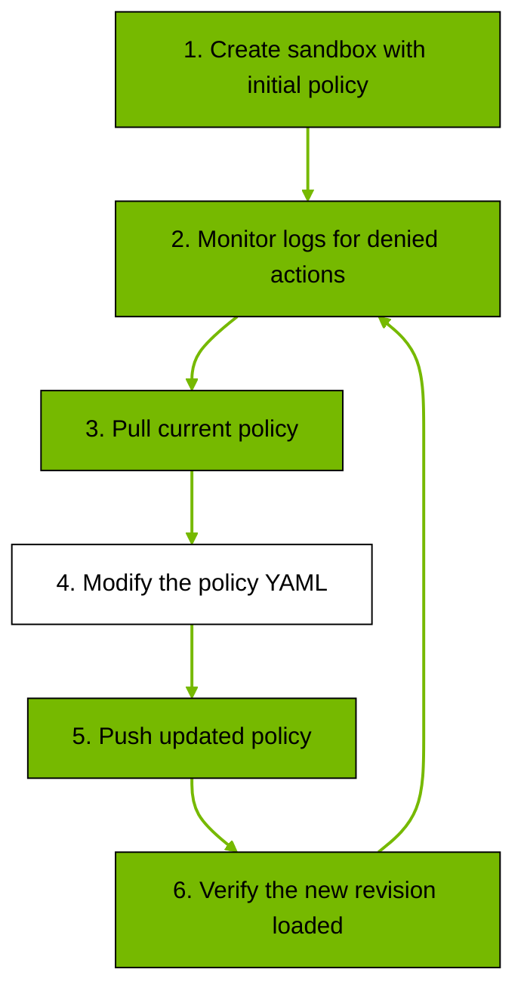

Use this page to apply and iterate policy changes on running sandboxes. For a full field-by-field YAML definition, use the [Policy Schema Reference](/reference/policy-schema).

## Policy Structure

A policy has static sections `filesystem_policy`, `landlock`, and `process` that are locked at sandbox creation, and a dynamic section `network_policies` that is hot-reloadable on a running sandbox.

```yaml wordWrap showLineNumbers={false}
version: 1

# Static: locked at sandbox creation. Paths the agent can read vs read/write.
filesystem_policy:
  read_only: [/usr, /lib, /etc]
  read_write: [/sandbox, /tmp]

# Static: Landlock LSM kernel enforcement. best_effort uses highest ABI the host supports.
landlock:
  compatibility: best_effort

# Static: Unprivileged user/group the agent process runs as.
process:
  run_as_user: sandbox
  run_as_group: sandbox

# Dynamic: hot-reloadable. Named blocks of endpoints + binaries allowed to reach them.
network_policies:
  my_api:
    name: my-api
    endpoints:
      - host: api.example.com
        port: 443
        protocol: rest
        enforcement: enforce
        access: full
    binaries:
      - path: /usr/bin/curl

```

Static sections are locked at sandbox creation. Changing them requires destroying and recreating the sandbox.
Dynamic sections can be updated on a running sandbox with `openshell policy set` and take effect without restarting.

| Section | Type | Description |
|---|---|---|
| `filesystem_policy` | Static | Controls which directories the agent can access on disk. Paths are split into `read_only` and `read_write` lists. Any path not listed in either list is inaccessible. Set `include_workdir: true` to automatically add the agent's working directory to `read_write`. [Landlock LSM](https://docs.kernel.org/security/landlock.html) enforces these restrictions at the kernel level. |
| `landlock` | Static | Configures Landlock LSM enforcement behavior. Set `compatibility` to `best_effort` (skip individual inaccessible paths while applying remaining rules) or `hard_requirement` (fail if any path is inaccessible or the required kernel ABI is unavailable). See the [Policy Schema Reference](/reference/policy-schema#landlock) for the full behavior table. |
| `process` | Static | Sets the OS-level identity for the agent process. `run_as_user` and `run_as_group` default to `sandbox`. Root (`root` or `0`) is rejected. The agent also runs with seccomp filters that block dangerous system calls. |
| `network_policies` | Dynamic | Controls network access for ordinary outbound traffic from the sandbox. Each block has a name, a list of endpoints (host, port, protocol, and optional rules), and a list of binaries allowed to use those endpoints. <br />Every outbound connection except `https://inference.local` goes through the proxy, which queries the [policy engine](/about/architecture) with the destination and calling binary. A connection is allowed only when both match an entry in the same policy block. <br />For endpoints with `protocol: rest`, the proxy auto-detects TLS and terminates it so each HTTP request is checked against that endpoint's `rules` (method and path). <br />Endpoints without `protocol` allow the TCP stream through without inspecting payloads. <br />If no endpoint matches, the connection is denied. Configure managed inference separately through [Configure](/inference/configure). |

## Baseline Filesystem Paths

When a sandbox runs in proxy mode (the default), OpenShell automatically adds baseline filesystem paths required for the sandbox child process to function: `/usr`, `/lib`, `/etc`, `/var/log` (read-only) and `/sandbox`, `/tmp` (read-write). Paths like `/app` are included in the baseline set but are only added if they exist in the container image.

This filtering prevents a missing baseline path from degrading Landlock enforcement. Without it, a single missing path could cause the entire Landlock ruleset to fail, leaving the sandbox with no filesystem restrictions at all.

User-specified paths in your policy YAML are not pre-filtered. If you list a path that does not exist:

- In `best_effort` mode, the path is skipped with a warning and remaining rules are still applied.
- In `hard_requirement` mode, sandbox startup fails immediately.

This distinction means baseline system paths degrade gracefully while user-specified paths surface configuration errors.

## Apply a Custom Policy

Pass a policy YAML file when creating the sandbox:

```shell
openshell sandbox create --policy ./my-policy.yaml -- claude
```

`openshell sandbox create` keeps the sandbox running after the initial command exits, which is useful when you plan to iterate on the policy. Add `--no-keep` if you want the sandbox deleted automatically instead.

To avoid passing `--policy` every time, set a default policy with an environment variable:

```shell
export OPENSHELL_SANDBOX_POLICY=./my-policy.yaml
openshell sandbox create -- claude
```

The CLI uses the policy from `OPENSHELL_SANDBOX_POLICY` whenever `--policy` is not explicitly provided.

## Iterate on a Running Sandbox

To change what the sandbox can access, pull the current policy, edit the YAML, and push the update. The workflow is iterative: create the sandbox, monitor logs for denied actions, pull the policy, modify it, push, and verify.



The following steps outline the hot-reload policy update workflow.

1. Create the sandbox with your initial policy by following [Apply a Custom Policy](#apply-a-custom-policy) above (or set `OPENSHELL_SANDBOX_POLICY`).

2. Monitor denials. Each log entry shows host, port, binary, and reason. Alternatively, use `openshell term` for a live dashboard.

   ```shell
   openshell logs <name> --tail --source sandbox
   ```

3. Pull the current policy. Strip the metadata header (Version, Hash, Status) before reusing the file.

   ```shell
   openshell policy get <name> --full > current-policy.yaml
   ```

4. Edit the YAML: add or adjust `network_policies` entries, binaries, `access`, or `rules`.

5. Push the updated policy. Exit codes: 0 = loaded, 1 = validation failed, 124 = timeout.

   ```shell
   openshell policy set <name> --policy current-policy.yaml --wait
   ```

6. Verify the new revision. If status is `loaded`, repeat from step 2 as needed; if `failed`, fix the policy and repeat from step 4.

   ```shell
   openshell policy list <name>
   ```

## Global Policy Override

Use a global policy when you want one policy payload to apply to every sandbox.

```shell
openshell policy set --global --policy ./global-policy.yaml
```

When a global policy is configured:

- The global payload is applied in full for all sandboxes.
- Sandbox-level policy updates are rejected until the global policy is removed.

To restore sandbox-level policy control, delete the global policy setting:

```shell
openshell policy delete --global
```

You can inspect a sandbox's effective settings and policy source with:

```shell
openshell settings get <name>
```

## Debug Denied Requests

Check `openshell logs <name> --tail --source sandbox` for the denied host, path, and binary.

When triaging denied requests, check:

- Destination host and port to confirm which endpoint is missing.
- Calling binary path to confirm which `binaries` entry needs to be added or adjusted.
- HTTP method and path (for REST endpoints) to confirm which `rules` entry needs to be added or adjusted.

Then push the updated policy as described above.

## Examples

Add these blocks to the `network_policies` section of your sandbox policy. Apply with `openshell policy set <name> --policy <file> --wait`.
Use **Simple endpoint** for host-level allowlists and **Granular rules** for method/path control.

<Tabs>
<Tab title="Simple endpoint">
Allow `pip install` and `uv pip install` to reach PyPI:

```yaml showLineNumbers={false}
  pypi:
    name: pypi
    endpoints:
      - host: pypi.org
        port: 443
      - host: files.pythonhosted.org
        port: 443
    binaries:
      - { path: /usr/bin/pip }
      - { path: /usr/local/bin/uv }
```

Endpoints without `protocol` use TCP passthrough, where the proxy allows the stream without inspecting payloads.
</Tab>

<Tab title="Granular rules">
Allow Claude and the GitHub CLI to reach `api.github.com` with per-path rules: read-only (GET, HEAD, OPTIONS) and GraphQL (POST) for all paths; full write access for `alpha-repo`; and create/edit issues only for `bravo-repo`. Replace `<org_name>` with your GitHub org or username.

<Tip>
For an end-to-end walkthrough that combines this policy with a GitHub credential provider and sandbox creation, refer to [Github Sandbox](/tutorials/github-sandbox).

</Tip>

```yaml showLineNumbers={false}
  github_repos:
    name: github_repos
    endpoints:
      - host: api.github.com
        port: 443
        protocol: rest
        enforcement: enforce
        rules:
          - allow:
              method: GET
              path: "/**"
          - allow:
              method: HEAD
              path: "/**"
          - allow:
              method: OPTIONS
              path: "/**"
          - allow:
              method: POST
              path: "/graphql"
          - allow:
              method: "*"
              path: "/repos/<org_name>/alpha-repo/**"
          - allow:
              method: POST
              path: "/repos/<org_name>/bravo-repo/issues"
          - allow:
              method: PATCH
              path: "/repos/<org_name>/bravo-repo/issues/*"
    binaries:
      - { path: /usr/local/bin/claude }
      - { path: /usr/bin/gh }
```

Endpoints with `protocol: rest` enable HTTP request inspection. The proxy auto-detects TLS on HTTPS endpoints, terminates it, and checks each HTTP request against the `rules` list.
</Tab>

</Tabs>

### Query parameter matching

REST rules can also constrain query parameter values:

```yaml showLineNumbers={false}
  download_api:
    name: download_api
    endpoints:
      - host: api.example.com
        port: 443
        protocol: rest
        enforcement: enforce
        rules:
          - allow:
              method: GET
              path: "/api/v1/download"
              query:
                slug: "skill-*"
                version:
                  any: ["1.*", "2.*"]
    binaries:
      - { path: /usr/bin/curl }
```

`query` matchers are case-sensitive and run on decoded values. If a request has duplicate keys (for example, `tag=a&tag=b`), every value for that key must match the configured glob(s).

## Next Steps

Explore related topics:

- To learn about network access rules and sandbox isolation layers, refer to [Index](/sandboxes/about).
- To view the full field-by-field YAML definition, refer to the [Policy Schema Reference](/reference/policy-schema).
- To review the default policy breakdown, refer to [Default Policy](/reference/default-policy).
