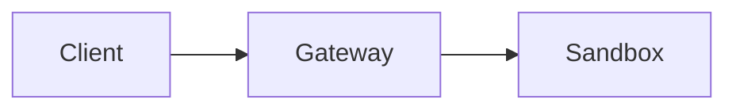

# OpenShell RFCs

Substantial changes to OpenShell should be proposed in writing before implementation begins. An RFC provides a consistent way to propose an idea, collect feedback from the community, build consensus, and document the decision for future contributors. Not every change needs an RFC — bug fixes, small features, and routine maintenance go through normal pull requests. RFCs are for the changes that are cross-cutting, potentially controversial, or significant enough that stakeholders should weigh in before code is written.

## Start with a GitHub Discussion

Before writing an RFC, consider opening a [GitHub Discussion](https://github.com/NVIDIA/OpenShell/discussions) to gauge interest and get early feedback. This helps:

- Validate that the problem is worth solving
- Surface potential concerns early
- Build consensus before investing in a detailed proposal
- Identify the right reviewers and stakeholders

If the discussion shows sufficient interest and the idea has merit, then it's time to write an RFC to detail the plan and technical approach.

## RFCs vs other artifacts

OpenShell has several places where design information lives. Use this guide to pick the right one:

| Artifact | Purpose | When to use |
|----------|---------|-------------|
| **GitHub Discussion** | Gauge interest in a rough idea | You have a thought but aren't sure it's worth a proposal yet |
| **Spike issue** (`create-spike`) | Investigate implementation feasibility for a scoped change | You need to explore the codebase and produce a buildable issue for a specific component or feature |
| **RFC** | Propose a cross-cutting decision that needs broad consensus | Architectural changes, API contracts, process changes, or anything that spans multiple components or teams |
| **Architecture doc** (`architecture/`) | Document how things work today | Living reference material — updated as the system evolves |

The key distinction: **spikes investigate whether and how something can be done; RFCs propose that we should do it and seek agreement on the approach.** A spike may precede an RFC (to gather data) or follow one (to flesh out implementation details). When an RFC reaches `implemented`, its relevant content should be folded into the appropriate `architecture/` docs so the living reference stays current.

## When to use an RFC

The following are examples of when an RFC is appropriate:

- An architectural or design decision for the platform
- Change to an API or command-line tool
- Change to an internal API or tool
- Add or change a company or team process
- A design for testing

RFCs don't only apply to technical ideas but overall project ideas and processes as well. If you have an idea to improve the way something is being done, you have the power to make your voice heard.

## When NOT to use an RFC

Not everything needs an RFC. Skip the RFC process for:

- Bug fixes
- Small feature additions scoped to a single component (use a spike instead)
- Documentation changes
- Dependency updates
- Refactoring that doesn't change public interfaces

If a change doesn't require cross-team consensus, a spike issue is the right vehicle.

## RFC metadata and state

At the start of every RFC document, we include a brief amount of metadata in YAML front matter:

```yaml
---
authors:
  - "@username"
state: draft
links:
  - https://github.com/NVIDIA/OpenShell/pull/123
  - https://github.com/NVIDIA/OpenShell/discussions/456
---
```

We track the following metadata:

- **authors**: The authors (and therefore owners) of an RFC. Listed as GitHub usernames.
- **state**: Must be one of the states discussed below.
- **links**: Related PRs, discussions, or issues. Add entries as the RFC progresses.
- **superseded_by**: *(optional)* For RFCs in the `superseded` state, the RFC number that replaces this one (e.g., `0005`).

An RFC can be in one of the following states:

| State | Description |
|-------|-------------|
| `draft` | The RFC is being written and is not yet ready for formal review. |
| `review` | Under active discussion in a pull request. |
| `accepted` | The proposal has been accepted and is ready for implementation. |
| `rejected` | The proposal was reviewed and declined. |
| `implemented` | The idea has been entirely implemented. Changes would be infrequent. |
| `superseded` | Replaced by a newer RFC. The `superseded_by` field should reference the replacement. |

## RFC lifecycle

### 1. Reserve an RFC number

Look at the existing RFC folders in this directory and choose the next available number. If two authors happen to pick the same number on separate branches, the conflict is resolved during PR review — the later PR simply picks the next available number.

### 2. Create your RFC

Each RFC lives in its own folder:

```
rfc/NNNN-my-feature/
    README.md
    (optional: diagrams, images, supporting files)
```

Where `NNNN` is your RFC number (zero-padded to 4 digits) and `my-feature` is a short descriptive name. The main proposal goes in `README.md` so GitHub renders it when browsing the folder.

To start a new RFC, copy the template folder:

```shell
cp -r rfc/0000-template rfc/NNNN-my-feature
```

Fill in the metadata and start writing. The state should be `draft` while you're iterating.

### 3. Open a pull request

When you're ready for feedback, update the state to `review` and open a pull request. Add the PR link to the `pr` field in the metadata.

The PR is where discussion happens. Anyone subscribed to the repo will get a notification and can read your RFC and provide feedback.

### 4. Iterate and build consensus

The comments you choose to accept are up to you as the owner of the RFC, but you should remain empathetic in how you engage. For those giving feedback, be sure that all feedback is constructive.

RFCs rarely go through this process unchanged. Make edits as new commits to the PR and leave comments explaining your changes.

### 5. Merge the pull request

After there has been time for folks to comment, the RFC author requests merge and a maintainer approves and merges. The state should be updated from `review` to `accepted`. If the proposal is declined, the state should be set to `rejected`. The timing is left to the author's discretion. As a guideline, a few business days seems reasonable, but circumstances may dictate a different timeline.

In general, RFCs shouldn't be merged if no one else has read or commented on it. If no one is reading your RFC, it's time to explicitly ask someone to give it a read!

### 6. Implementation

Once an RFC has been entirely implemented, its state should be moved to `implemented`. This represents ideas that have been fully developed. While discussion on implemented RFCs is permitted, changes would be expected to be infrequent.

## Diagrams

When an RFC needs diagrams to illustrate architecture, data flow, or component interactions, use [Mermaid](https://mermaid.js.org/) diagrams embedded directly in the Markdown. Mermaid renders natively on GitHub and keeps diagrams version-controlled alongside the text.

````markdown

````

Prefer Mermaid over external image files whenever possible. If a diagram is too complex for Mermaid (e.g., detailed UI mockups), commit the image to the RFC's folder alongside its `README.md` and reference it with a relative path.

## Making changes to an RFC

After your RFC has been merged, there is always opportunity to make changes. Open a pull request with the change you would like to make. If you are not the original author, be sure to @ the original authors to make sure they see and approve of the changes.

## RFC postponement

Some RFCs are marked `rejected` when the proposal is declined or when we want neither to think about evaluating the proposal nor about implementing it until some time in the future. Rejected RFCs may be revisited when the time is right.
